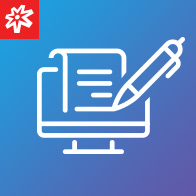
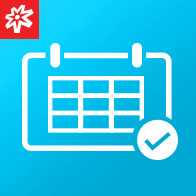
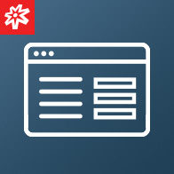
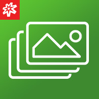
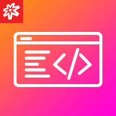

<link rel="stylesheet" href="/static/custom.css">

Pre-built modules you can install in a few clicks instead of designing a schema from scratch. Each one is a real, downloadable package &mdash; see its page for the full step-by-step setup guide.

  
  <h2 style="margin-top: 2rem; font-size: 1.4rem;"><a href="/modules/catalog/alert/">Alert</a></h2>
  
Boost user engagement with eye-catching, personalized alert notifications.

  
<a href="/modules/catalog/alert/" class="btn-blue-lg" style="padding: .6rem 2.5rem; font-size: .9rem;">INSTALL</a>

  
  <h2 style="margin-top: 2rem; font-size: 1.4rem;"><a href="/modules/catalog/blog/">Blog</a></h2>
  
Write, draft, edit, and publish content that keeps your customers coming back.

  
<a href="/modules/catalog/blog/" class="btn-blue-lg" style="padding: .6rem 2.5rem; font-size: .9rem;">INSTALL</a>

  
  <h2 style="margin-top: 2rem; font-size: 1.4rem;"><a href="/modules/catalog/calendar/">Calendar</a></h2>
  
Schedule events, give prominent descriptions, and add location services in one place.

  
<a href="/modules/catalog/calendar/" class="btn-blue-lg" style="padding: .6rem 2.5rem; font-size: .9rem;">INSTALL</a>

  
  <h2 style="margin-top: 2rem; font-size: 1.4rem;"><a href="/modules/catalog/contact/">Contact</a></h2>
  
Capture leads and inquiries with a fully customizable contact form.

  
<a href="/modules/catalog/contact/" class="btn-blue-lg" style="padding: .6rem 2.5rem; font-size: .9rem;">INSTALL</a>

  
  <h2 style="margin-top: 2rem; font-size: 1.4rem;"><a href="/modules/catalog/news/">News</a></h2>
  
Keep your users informed about your company happenings or press releases with News.

  
<a href="/modules/catalog/news/" class="btn-blue-lg" style="padding: .6rem 2.5rem; font-size: .9rem;">INSTALL</a>

  
  <h2 style="margin-top: 2rem; font-size: 1.4rem;"><a href="/modules/catalog/slider/">Slider</a></h2>
  
Showcase products, workspace, or other important aspects of your organization.

  
<a href="/modules/catalog/slider/" class="btn-blue-lg" style="padding: .6rem 2.5rem; font-size: .9rem;">INSTALL</a>

  
  <h2 style="margin-top: 2rem; font-size: 1.4rem;"><a href="/modules/catalog/quick-links/">Quick Links</a></h2>
  
Convenient shortcuts to allow users to access important information with just one click.

  
<a href="/modules/catalog/quick-links/" class="btn-blue-lg" style="padding: .6rem 2.5rem; font-size: .9rem;">INSTALL</a>

