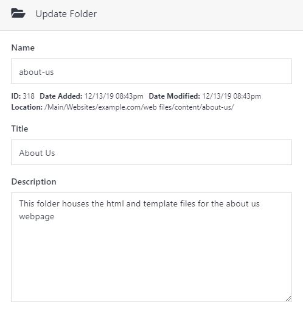
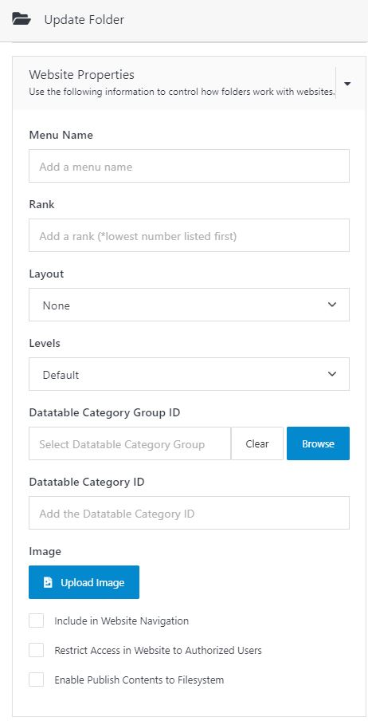

# Documents 

Solodev documents serves as a collaborative repository for files and folders destined for the web or that can be used for a company intranet. This document will show you how to create and modify files and folders in Solodev and harness the power of file groups to manage your content[^1].

---

## Folders

Folders are built in a nested tree hierarchy and serve as containers of all Solodev resources including files and folders to your website(s). You can modify and customize folders to suit your needs. A folder can be used as a document repository for a company intranet or used to store HTML, TPL, and STML files destined for the web. This scetion will discuss creating and modifying a folder in Solodev.

 

The following fields are frequently encountered when adding, updating, and modifying a folder.

| Field | Description |
| ----------- | ----------- |
| Folder Name | Name for the folder displayed on the back end. This field is required. Solodev recommends that the folder name should be lowercase, devoid of spaces and special characters. Use dashes and underscores to represent spaces. | 
| Title | Name of the folder displayed on the front end. |
| Description | A description of the contents or purpose of the folder.  | 
| Website Properties | To access this fireld after creating a folder, open the desired folder in the navigation tree and click the Update Folder button. Use this field to set folder properties and control how it works with websites. |
| Menu Name | Name of a folder in a menu navigation. Access this field via Website Properties. | 
| Rank | Rank order of the folder when displayed in the menu navigation. This field is accessible via Website Properties. |
| Layout | The way the contents of a folder will be displayed in the navigation based on predefined templates. Access this field via Website Properties. |
| Levels | How deep the elements in the folder will be displayed in the navigation. This field is accessible via Website Properties. | 
| Datatable Category Group ID | The ID for a group of categories. Users can access this field via Website Properties. |
| Datatable Category ID | The ID for a specific category. Access this field via Website Properties. |
| Upload Image | Adds an image to the folder. Allows users to query the image associated with the folder. This field is accessible via Website properties. | 
| Include in Website Navigation | Structures folder to display in navigation menus. This field is accessible via Website Properties. |
| Restrict Access in Website to Authorized Users | Allows access to the folder ad contents to be password protected for website visitors. Access this field via Website Properties. |

**Creating a Folder**

Before adding files to the Documents workspace, you must add a folder to host the files in the Documents workspace. If adding folders to the website workspace, Solodev recommends adding folders that contain HTML content and TPL template files in the web files -> content directory. Folders that contain STML web pages should be added to www directory. Folders are added to either workspace by executing the steps below.

 

- On the Solodev Dashboard, click Documents.

- Click Add Folder.

- In the Add Folder modal, enter the Name, Title and Description of the folder. Solodev recommends using the naming conventions for naming and titling a folder listed in the description of folder properties above.

- Click Submit. 

**Updating a Folder** 

This example shows the user how to update the previously created folder. 

- On the Solodev Dashboard, click Documents.

- Click the newly created folder to open it. 

- Click Update Folder. 

- Users can update the folder’s Name, Title, Description, and Website Properties in the form that appears on the right side of the screen. 

- Once the desired changes are made click Submit.

**Note:** Solodev CMS does not allow users to update multiple folders. The update action modifies the folder that is currently open.

**Modifying a Folder**

Copy, move, and delete folders created in the Solodev CMS system. We will perform these actions using the previously created folder as an example. The copy, move, and delete actions can be performed on multiple folders. 

***Moving a Folder***

- On the Solodev Dashboard, click Documents.

- Click the newly created folder to open it. 

- Click the checkbox next to the folder. 

- Click Move to bring up the modal window. 

- Expand your preferred directory.

- Click your desired target folder. 

- Click Submit. 

- From the Solodev Dashboard, click Filesystem. 

- Click the target folder to access the folder that was moved.

***Copying a Folder***

- On the Solodev Dashboard, click Documents.

- Click the newly created folder to open it. 

- Click the checkbox next to the folder. 

- Click Copy to bring up the modal window.

- Expand your preferred directory.

- Click your desired target folder. 

- Click Submit. 

- From the Solodev Dashboard, click Filesystem. 

- Click the target folder to access the folder that was moved.

***Deleting a Folder***

- On the Solodev Dashboard, click Documents.

- Click the newly created folder to open it. 

- Click the checkbox next to the folder. 

- Click Delete. 

- Click Submit. 

**Note:** Use the steps outlined above to create, modify, and update folders in the websites workspace.  

## Files

Files serve many purposes in the CMS. Examples of a file includes simple text documents, spreadsheets, PDFs, images, or HTML files. Files are stored in folders and have a different Resource View depending on their file type. Solodev CMS supports four primary file types. 

--- 

**Supported File Types**

***HTML***

Hypertext Markup Language (HTML) is the markup language used to create the foundation of any web page. In addition to uploading html files to Solodev CMS, you can create and edit html files natively via Solodev’s WYSIWYG or code editor. HTML files can be inserted into STMLs using Dynamic Div Technology.

| File Extension | Description |
| ----------- | ----------- |
| .html | An acronym for hyper-text-markup-language and the extension for web pages. | 
| .htm | An abbreviation for an HTML file. |

In Solodev CMS, HTML files are not web pages. HTML pages serve as content blocks that can be organized and embedded into STML pages via Solodev’s Dynamic Div technology. 

***Template Files (.tpl)***

Template files allow you to reuse blocks HTML code for each section or page of your website. Template files give you the additional ability to harness the power of nested layouts and create drop zones with Dynamic Div technology that can be embedded into STML pages. With templates you can utilize more complex html syntax than is possible with the WYSIWYG editor. For more information about template files, please refer to the articles and sections listed below:

 

- Create components based upon sections of your HTML

- Create a Base Template

- Create an Interior Template

- Create a Sectional Template

***Images***

Solodev gives you the power to place and specify the display and design of several different types of images throughout your websites. Commonly used formats on the Web include PNG, JPEG, GIF and JPG. Utilize images to create dynamic photo galleries, sliders, carousels and much more using Solodev Modules. Solodev supports the image formats listed below. 

| File Extension | Description |
| ----------- | ----------- |
| .png | Portable Network Graphics. |
| .jpg | Joint Photographic Group. |
| .jpeg | Joint Photographic Expert Group. |
| .gif | Graphics Interchange Format. |
| .bmp | Bitmap.|

***Text***

Solodev’s text editor supports a wide range for file types for use. Solodev supports the following ANSCII-based file types. 

| File Extension | Description |
| ----------- | ----------- |
| .js | JavaScript. To use javascript files across all pages, reference the file path of the script in the Global Header Insert found in the Update Website Window . |
| .css | Cascading Style Sheets. To use css files across all pages, reference the file path in the Global Header Insert found in the Update Website Window. |
| .php | Hypertext Preprocessor. |
| .xml files | Extensible Markup Language. Users can leverage xml files to create sitemaps. |
| .json | JavaScript Object Notation. |

**Creating a file**

- On the Solodev Dashboard, click Documents.

- Click the desired folder to open it. 

- Click the Add File button to bring up the Add File modal window. 

- Enter the Name and Title

- Choose the file type. 

- Click Submit to create and open the file for editing.

**Note:** As mentioned, Solodev supports a variety of file types. If a file type mentioned is not listed in the select box, users can override the default selection by selecting 'Code' from the select box and append the file extension at the end of the filename (e.g. filename.php).

**Uploading files from a local machine** 

In addition to creating files within the CMS, you can upload files from your local machine. Solodev CMS allows you to upload four primary file types(HTML, Text, Image, and Document). To upload a file follow the steps below. 

- On the Solodev Dashboard, click Documents.

- Click the desired folder to open it. 

- Click the upload button to bring up the upload modal window. 

- Upload one or more files by clicking the browse button or dragging the files into the box.

- Once the files are selected, you can upload the files using a variety options (Upload + Save, Upload + Stage, and Upload). Click Upload.

**Note:**To upload and save files without publishing them users can choose the Upload + Save option. To save the file and publish it to a staging server users can choose the Upload + Stage option. To save the file and push it to the live site users can choose the Upload option.

**File Actions**

Opening a file presents you with a text-editor and an Actions Menu that you can use to edit and update file properties. The available options in the Actions menu are listed below.

| Actions | Description |
| ----------- | ----------- |
| Draft | Saves a file on the backend without publishing it to the front end. |
| Stage | Saves the file and publish it to the staging server (if one is being used). |
| Publish | Saves the file and pushes the file to the live website. |
| Copy | Creates a duplicate of a file. |
| Move | Moves the file to a new location. |
| Delete | Removes a file permanently from the CMS. |
| Add to Group | Adds a file to a file group. |
| History | A directory of previous versions of a file that can be used to roll back changes. |

**Meta Information**

All Solodev files contain a Meta option in the Actions Menu. The Meta option defines meta attributes for each file. Optimize your site’s visibility in search engine results with meta keywords and meta data.

| Field | Description |
| ----------- | ----------- |
| Title | The title of the file that will be displayed on both the back and front end. |
| Description | A description of the contents of the file. |
| Rank | The ranking of your file (1, 2, 3) relative to the other files. |
| Meta Description | A description of the file that will help improve SEO. |
| Meta Keywords | Keywords attached to the file that will help improve SEO. |
| Publish Date | The date you should like the file to be published. |
| Expire Date | The date you would like the file to be pulled from your website. |

**Modifying Files**

***Copying a File***

- On the Solodev Dashboard, click Documents.

- Click the desired folder to open it.

- Click the newly created file. 

- Click Copy.

- Expand the relevant directories and highlight the destination folder to select it.

- Click Submit. The copied file is listed under the destination folder in the directory tree.

***Moving a File***

- On the Solodev Dashboard, click Documents.

- Click the desired folder to open it.

- Click the newly created file. 

- Click Move.

- Expand the relevant directories and highlight the destination folder to select it.

- Click Submit. The copied file is listed under the destination folder in the directory tree.

***Deleting a File***

- On the Solodev Dashboard, click Documents.

- Click the desired folder to open it.

- Click the newly created file. 

- Click the Delete button to bring up the delete window.

- Click Submit. 

**Note:** Deleted Files can be retrieved via the Archive History. 

***Copying, Moving, and Deleting Files in Bulk***

- On the Solodev Dashboard, click Documents.

- Click the desired folder to open it.

- Click the checkboxes to select the desired files. 

- Select **Copy/Move/Delete.**

- Select a destination folder to copy or moves.

- Click Submit.

**File Groups**

File Groups are a resource for managing and displaying groups of related files (images, documents, etc) on a Web page. Leverage file groups to categorize and display files based on certain criteria or similarity. Administrators commonly use File Groups to display a document list with set permissions that grant users access to files in the File Group. Authorized users can add or edit files in the File Group without accessing the web page directly. 

A file group can be used to: 

- Display a list of files of a file group and their content on the front-end of a website.

- Create an internal document repository where users can upload and share an array of file types grouped by type, category, relevance, date, etc.

***Add Group***

- Click documents located in the workspace section of the Solodev Dashboard.

- Open the desired folder. 

- Click Add Group to bring up the Add Group modal.

- Enter the Name, Title, and Description of the File Group.

- Click Submit. 

***Modifying a File Group***

- Click documents located in the workspace section of the Solodev Dashboard.

- Open the desired folder. 

- Click on the file group to open it. 

- Click Modify to bring up the window the Modify modal. 

- Enter the desired changes for the Name, Title, and Description.

- Once the desired changes are made, click Submit. 

***Delete A File Group***

- Click documents located in the workspace section of the Solodev Dashboard.

- Open the desired folder. 

- Click the checkbox next to the marketing docs file group. 

- Click Delete to bring up the Delete modal. 

- Review the warning and click Submit. 

***Adding a File Group Entry***

- Click documents located in the workspace section of the Solodev Dashboard.

- Open the desired folder. 

- Click on the file group to open it. 

- Click the Add Entry button. 

- From the add entry modal window, expand the appropriate directory and select a file from the workspace by clicking the checkbox.

- Select a date for publication. 

- Select a date for removal.

- Click Submit.

- The file(s) selected will populate in the file group.

***Deleting a File Group Entry***

- Click documents located in the workspace section of the Solodev Dashboard.

- Open the desired folder. 

- Click on the file group to open it. 

- Click the Delete button. 

- Review the warning in the delete window and click Submit.

## Archive History

Archive History allows users to revert a file to a previous version. Solodev CMS keeps unlimited file versions so that users don’t lose previous work. 

 

**Versioning**

Each time a file is saved, Solodev CMS archives a new version. Solodev allows users to see which version of the file is open, when it was last modified and by whom.

**Accessing Archive History**

- Click documents located in the workspace section of the Solodev Dashboard.

- Open the desired folder. 

- Open the desired file. 

- Click the History button to bring up a window with the modal window with the file’s filename, version, date created, and author. 

- Review the information and click Ok to close the window. 

**Reverting Files to Previous Versions** 

- Click documents located in the workspace section of the Solodev Dashboard.

- Open the desired folder. 

- Open the desired file. 

- Click the History button to bring up a window with the modal window with the file’s filename, version, date created, and author. 

- Click the Compare button associated with the desired version. 

- Review the comparison below and click Save as current version.

- The user will be prompted to overwrite the file. 

- Review the prompt and click the OK button.

[^1]: The instructions listed here apply to managing files within the Websites workspace. 