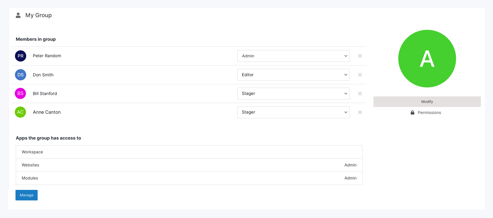
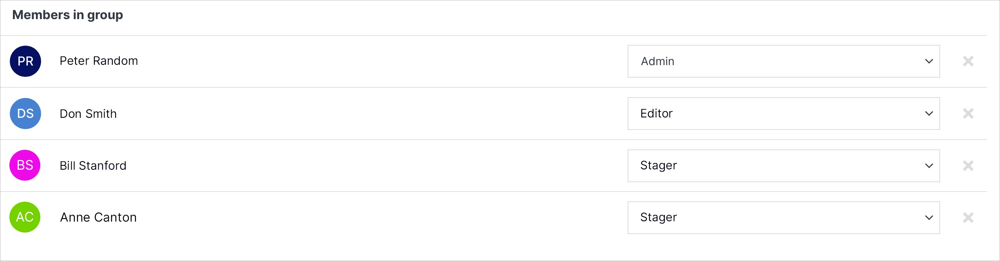

# Group Overview

Thanks to a group overview page you are able to manage and modify group, define access level of the members of a group, assign apps to which a given group has an access to, as well as manage the app permissions.

></a>

---

## Manage Group 

In this section you can modify basic settings of your group like: name, purpose or team image. You can also delete the group and assign the permissions.

></a>

### Actions

**Name** | **Description** 
:--- | ---
Modify | Here you will be able to manage the basic properties of your group. Please read <a href="/workspace/websites-overview/delete-website">modify group</a> for more information.
Permissions | Here you will be able to assign the level access of the group to given folders containing your website.

---

## Members in group

In this section you can assign a roles to the individual members of your group as well as remove the member.

></a>

### Actions

**Name** | **Description** 
:--- | ---
Delete | You can remove an individual member from the group by clicking "x" button next to his/her name. 

### Fields

**Name** | **Description** 
:--- | ---
Role | You can assign a role of an individual member of the group by selecting the appriopiate level nedx to his/her name.

!!!
Tip:
While selecting the role you would like to apply to the chosen group member you will have four options with the following access levels:

- **View:** The view role will only allow the chosen user or group the ability to see items.
- **Stager:** The stager role will only allow to edit a files but the change will not show on the live site. It first has to be reviewed by someone with higher privileges before the change can be published.
- **Editor:** The editor role will enables the chosen user or group the ability to see and edit items.
- **Admin:** The admin role enables the chosen user or group the ability to see, edit and manage items. This permission allows the ability to add or remove users and groups as well as the ability to modify or delete the entity.
!!!

## Apps the group has access to

In this section you can you can check the apps that the given group has an access to, level of the access as well as manage those apps permissions.

></a>

### Actions

**Name** | **Description** 
:--- | ---
Manage | You can manage the apps the group has aceess to as well as the level of permissions by clocking "Manage" button. 

#### Manage Apps permissions

Here you can manage the apps that a group has an access to as well as level of this access. After clicking "Manage" button the modal will appear.

></a>

##### Actions

**Name** | **Description** 
:--- | ---
Allow access | You can assign assign group with an access to a given items/apps by clicking check-box next to item/app name. 

##### Fields

**Name** | **Description** 
:--- | ---
Role | You can assign a role of the group by selecting the appriopiate level next to item name.

!!!
Tip:
While selecting the role you would like to assign chosen group with you will have four options with the following access levels:

- **View:** The view role will only allow the chosen user or group the ability to see items.
- **Stager:** The stager role will only allow to edit a files but the change will not show on the live site. It first has to be reviewed by someone with higher privileges before the change can be published.
- **Editor:** The editor role will enables the chosen user or group the ability to see and edit items.
- **Admin:** The admin role enables the chosen user or group the ability to see, edit and manage items. This permission allows the ability to add or remove users and groups as well as the ability to modify or delete the entity.
!!!

#### Confirm

Click the blue "Submit" button at the bottom right to apply your changes.