# Groups

Harness the power of granular permissions by creating and assigning users to groups based on specific criteria. With groups, you can provide departments access and functionality specific to your team member's jobs. 

---

## Creating User Groups

- Click Groups located under the Organization section of the Solodev Dashboard.

- Click Add Group to bring up the modal window. 

- Enter the Name and the Purpose of the group.

- Click Submit.

## Removing User Groups

- Click Groups located under the Organization section of the Solodev Dashboard.

- Select the desired group.

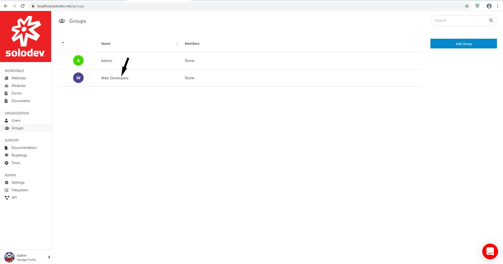

- Click Modify to bring up the modal window.

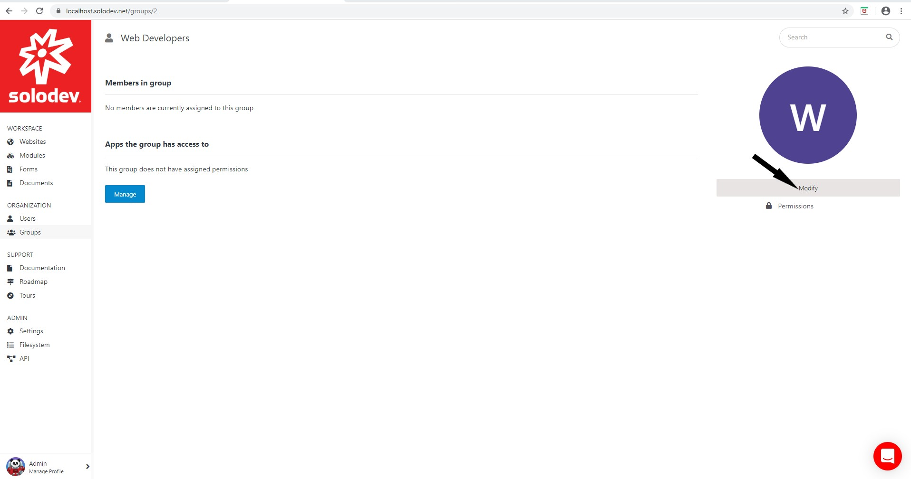

- Click the arrow to expand the Advanced section and display the advanced options.
 
- Type ‘DELETE’ in the text box and click the Delete button.

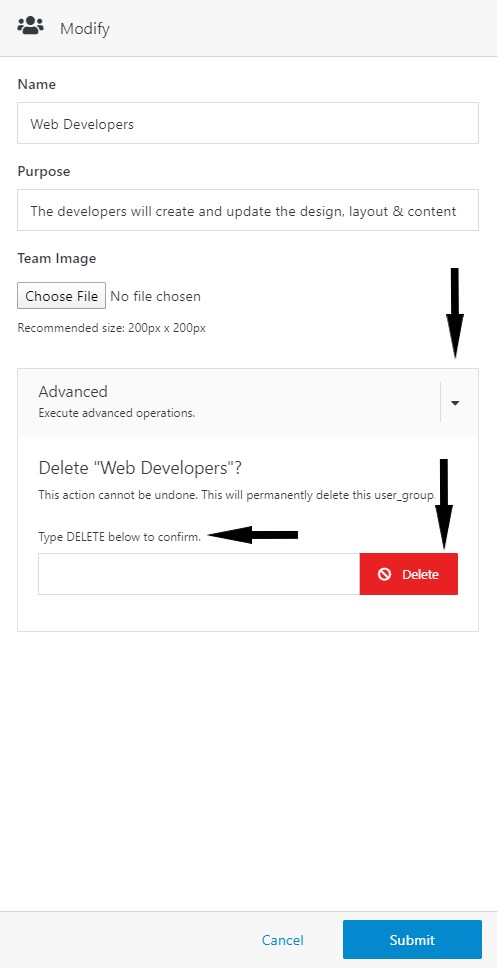

## Assinging Groups to Objects

Solodev supports granular permissions that facilitates the creation of sophisticated permission systems – assigning users and groups to specific objects. Use the steps below to assign permissions to groups globally or assign groups to specific ‘Actions’ and ‘Resources’. 

**Globally assigning resources and actions to groups**

- Sign into Solodev CMS with administrator credentials.

- Click Groups under the Organization section of the dashboard.

- Select the desired group.

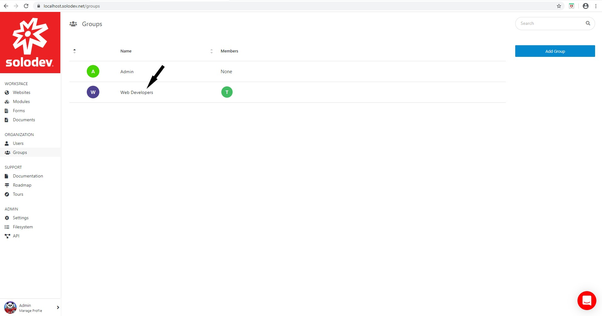

- Click Manage located below ‘Apps the group has access to’ to display the permissions modal window.

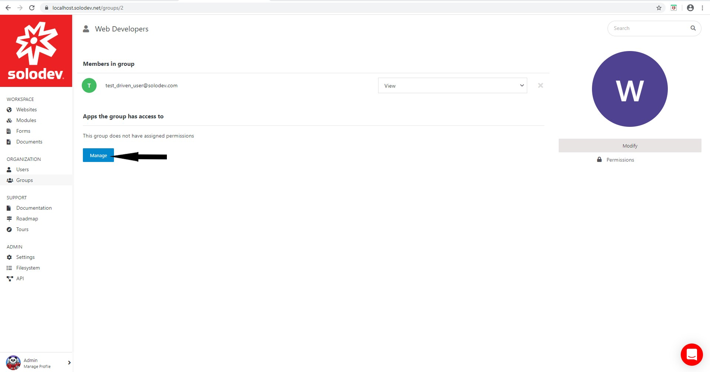

- Select the desired resources and the associated roles.

- Click Submit.

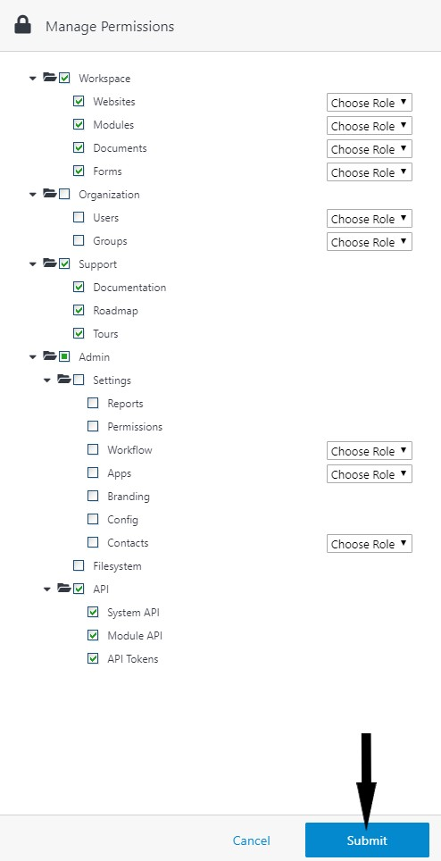

- Refresh the page to view the list of resources made accessible to the group.

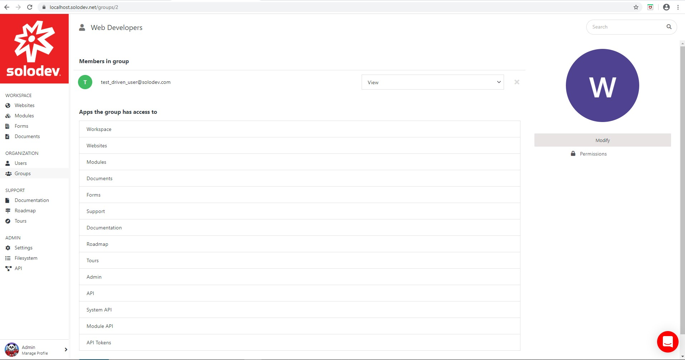

- Add user(s) to the group.

**Step 2: Adding Groups to Specific Actions or Resources**

- Select Websites located below the Workspace section. 

- Select the row in the members column associated with the desired website to bring up the permissions modal window.

- Enter the Name of the group and select the Role.

- Click the + button to add the group.

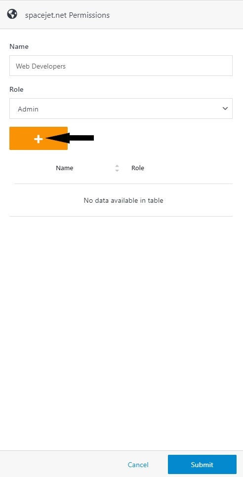

- Click Submit.

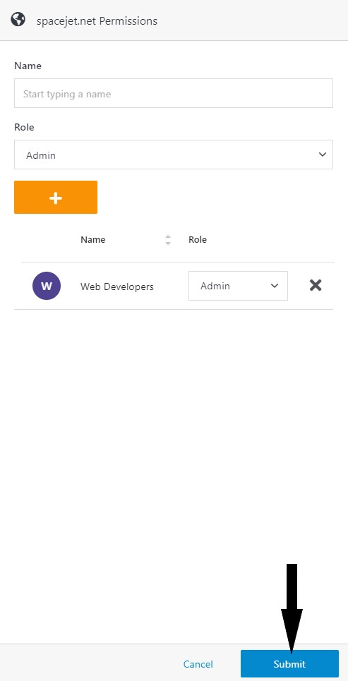

- The group(s) appear in the row of the members column associated with the selected website. 

**Step 3: Removing Groups from Specific Actions or Resources**

- Select Websites located below the Workspace section. 

- Select the row containing the group to be removed.

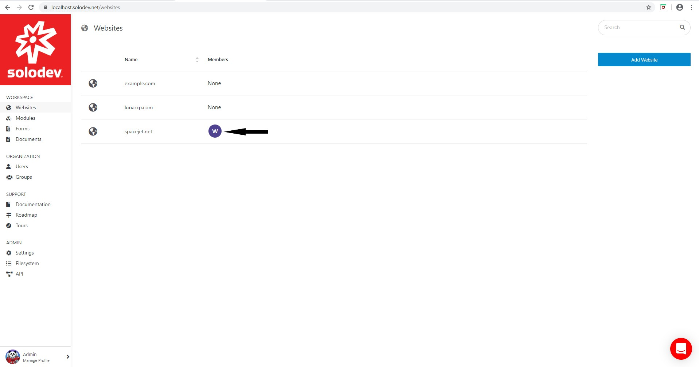

- Click the X to the right of the group name.

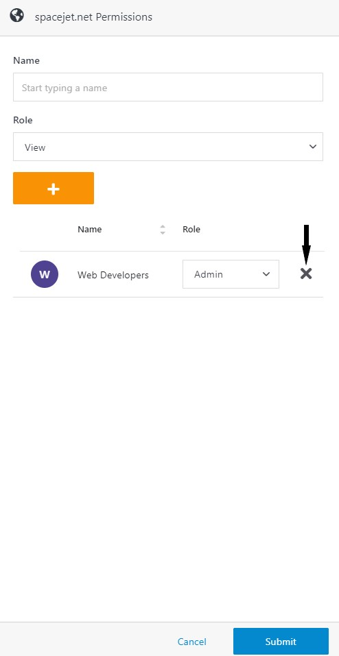

- Click Submit.

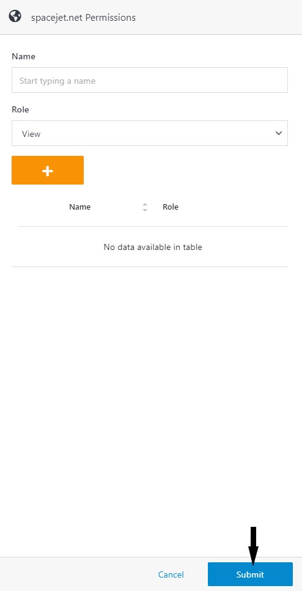

- The group(s) no longer appear in the row of the members column associated with the selected website. 

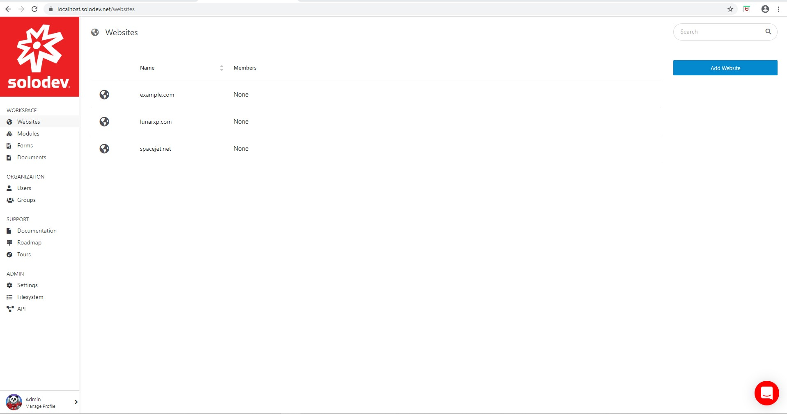