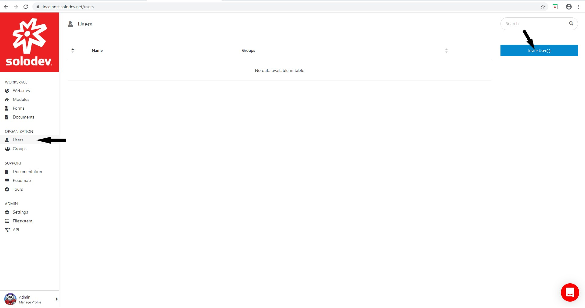
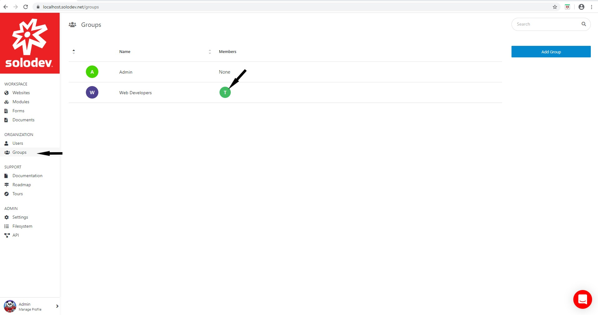
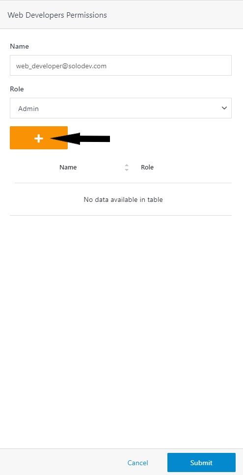
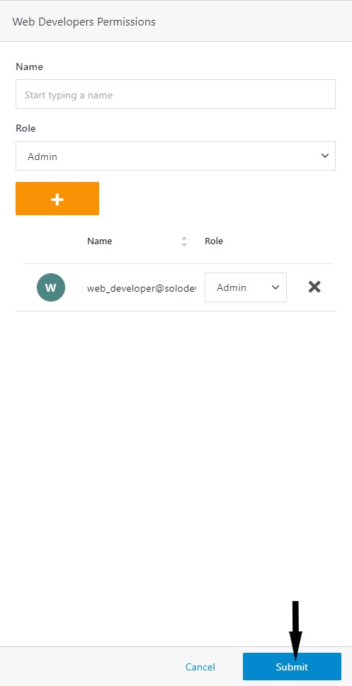
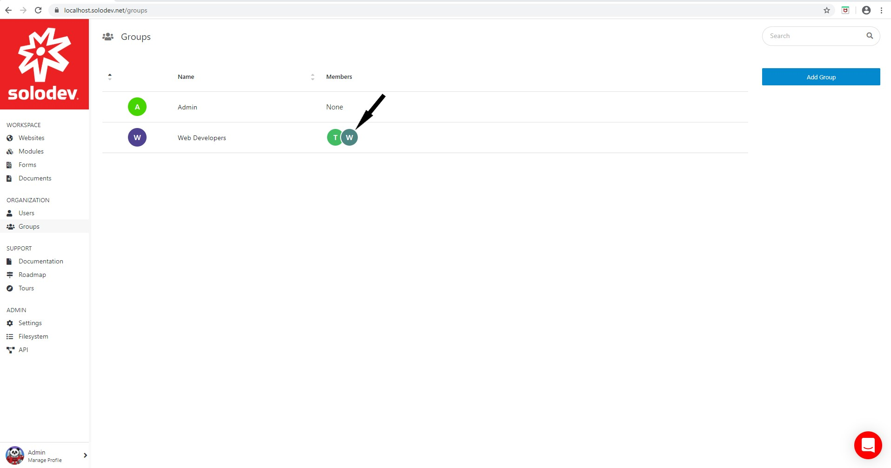
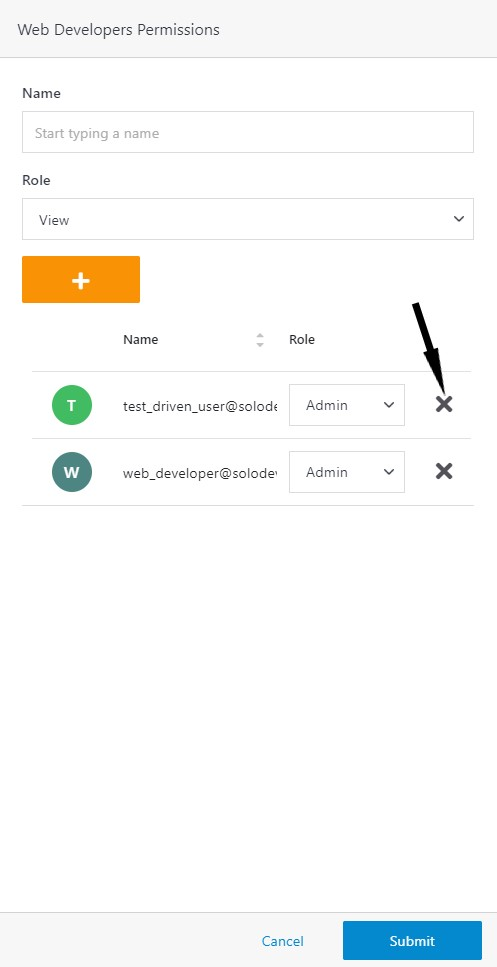
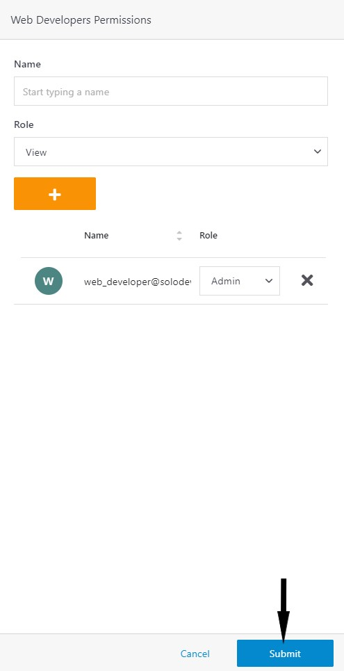
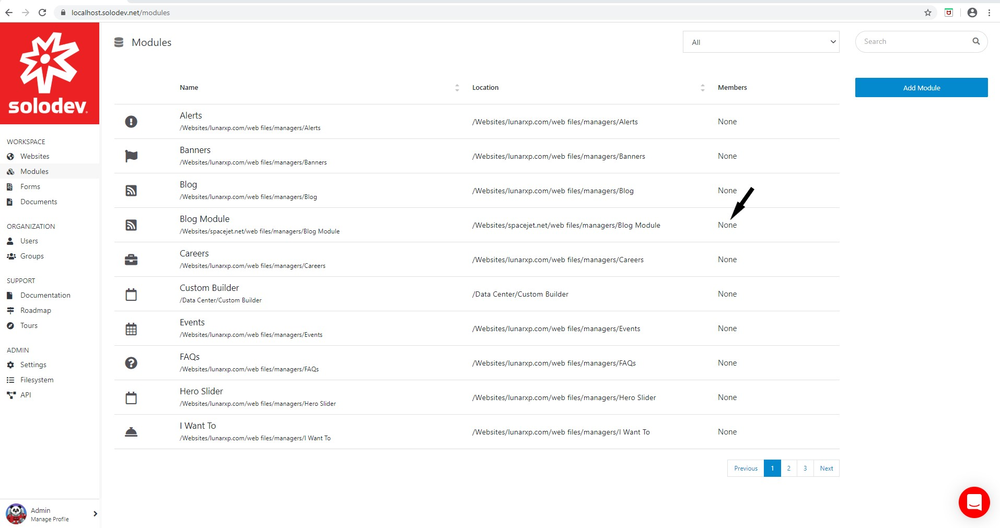
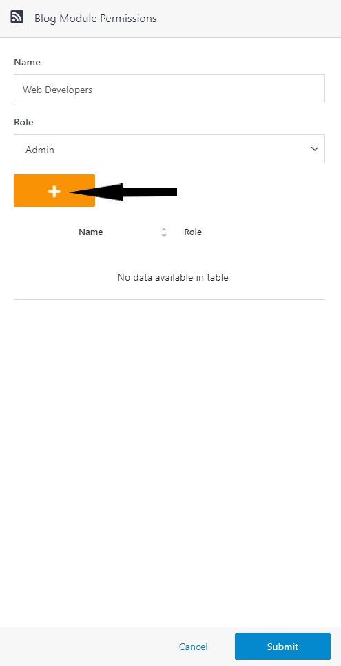
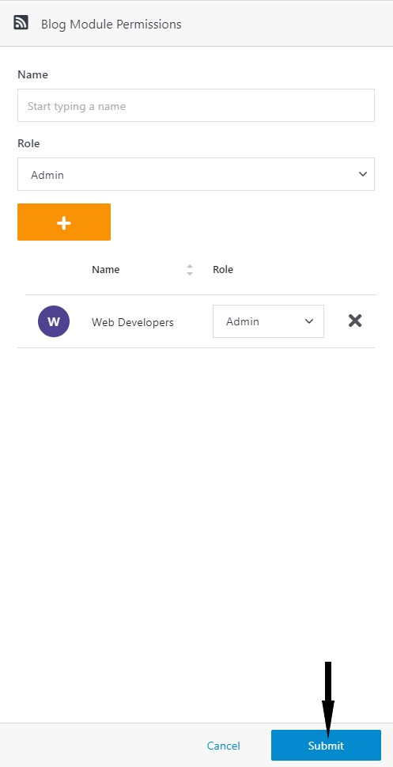

# Permissions

## Introduction

Solodev recommends using Groups to manage user permissions. Groups should reflect an administrator’s organizational structure. Users who perform similar tasks should be assigned to groups sharing the same criteria. Solodev recommends creating groups and setting group permissions before inviting users to the Solodev CMS system. Solodev does not recommend assigning individual users to resources or setting permissions for individual users. This article will outline the process for creating a group, inviting a user to Solodev CMS, adding a user to a group, and assigning groups to specific actions and resources.

## Creating User Groups

- Click Groups located under the Organization section of the Solodev Dashboard.

- Click Add Group to bring up the Add Group window. 

- Enter the Name and the Purpose of the group.

- Click Submit.

## Adding a user 

- Click Users located under the Organization section of the Solodev Dashboard.

- Click Invite User(s) to bring up the Invite User(s) window.

- Enter the Email Address and Group in their respective fields (press the tab button after entering each email address and group name).

- Enter the message and click Submit.

## Managing User Permissions via Groups

Groups allow Solodev administrators to replicate existing organizational structures and create custom permissions to provide users with appropriate access to information and resources. 

### Step 1 -- Adding a User to a Group

- Click Groups located under the Organization section of the Solodev Dashboard.

- Select the row in the members column associated with the group to bring up the permissions window for the group. 

- Enter the name of the user and select the group Role.

- Click the + button to add the user.

- Press the Submit button.

- The member field for the group will be updated to reflect the change. 

### Step 2 -- Removing a User from a Group

- Click Groups located under the Organization section of the Solodev Dashboard.

- Select the row in the members column that contains the user to bring up the permissions window.

- Click X to the right of the username. 

- Click Submit.

- The member field for the group will be updated to reflect the change. 

### Step 3 -- Adding Groups to Specific Actions or Resources

- Select Modules located below the Workspace section. 

- Select the row in the members column associated with the desired module to bring up the permissions column.

- Enter the Name of the group and select the Role.

- Click the + button to add the group.

- Click Submit. 

- The group(s) appear in the row of the members column associated with the selected module.

**Note:** When adding groups or users to specific actions or resources, administrators can choose from a list of pre-defined roles to define the scope of actions members of various groups can perform on resources. The roles consist of **View**, **Editor**, and **Admin**. **View** permissions allow members of the group to view the resources; **Editor** allows the users to view add and make changes to various resources; and **Admin** allows the user to create, edit, and delete resources.