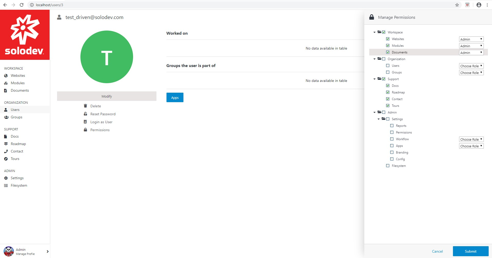
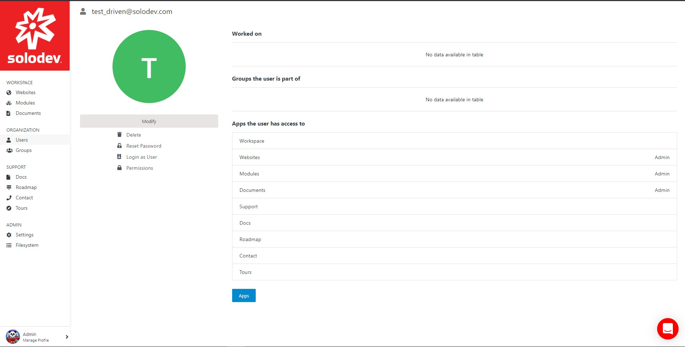
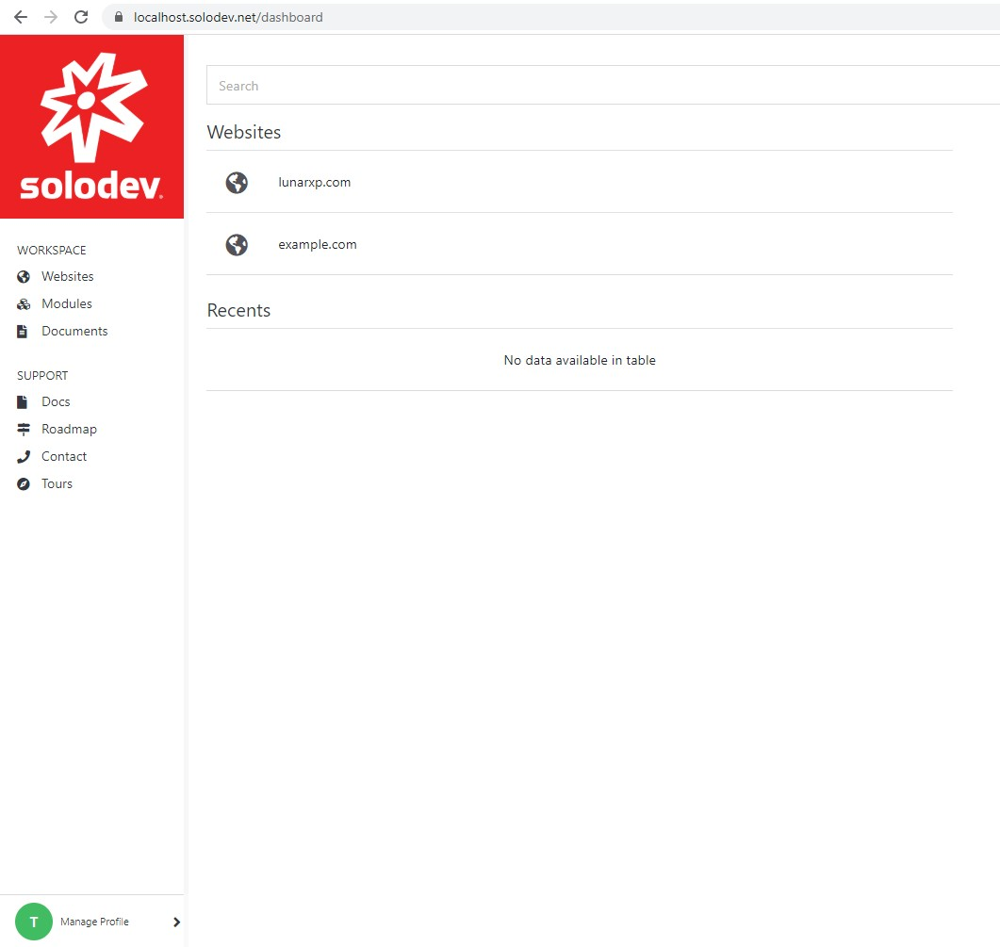
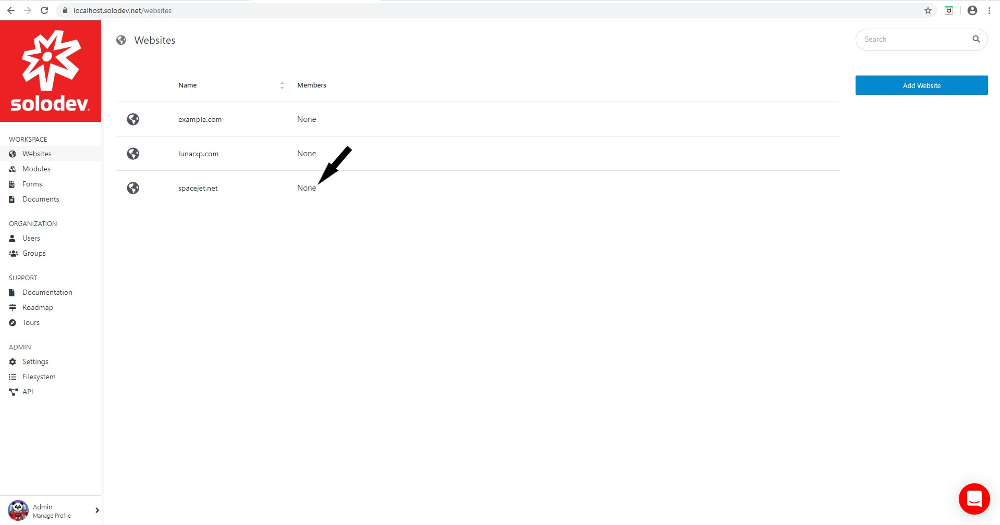
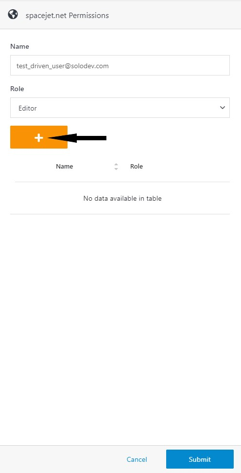
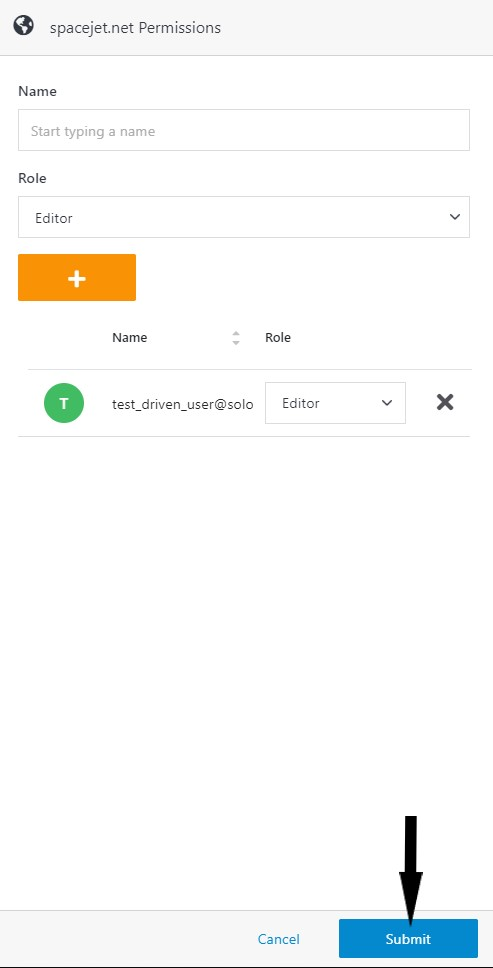
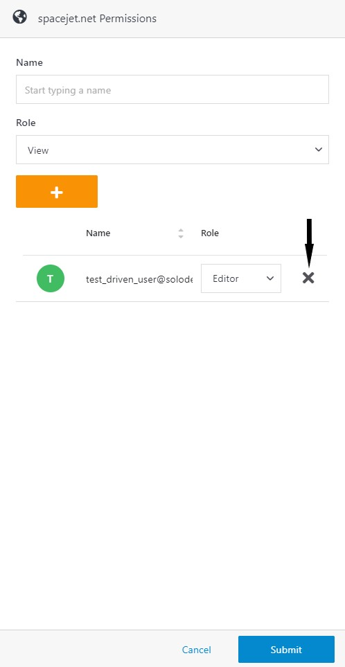
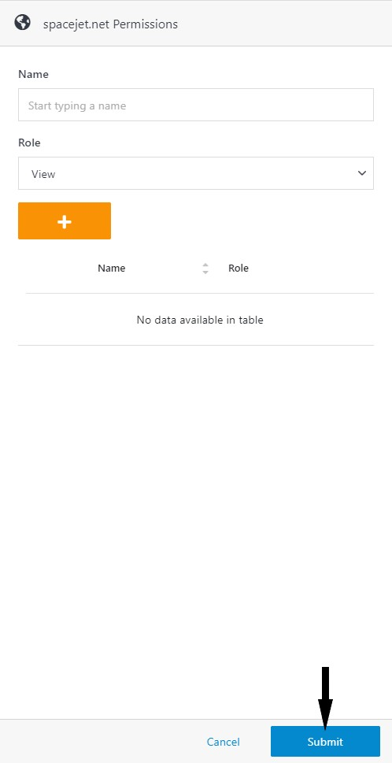
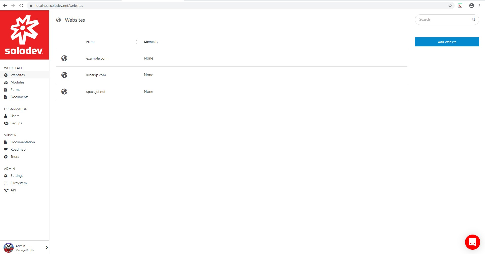

# Solodev Users

*Learn how to manage access to Solodev resources with users and groups.*

Solodev features an enterprise permissions management system that allows administrators to specify the ‘Actions’ and ‘Resources’ available to specific users and groups. Solodev supports granular permissions so that administrators can create a permission system as broad or as specific as needed.

---

## What are Users?

Users are the people who have the authorization to access and interact with Solodev’s resources. Administrators can assign users to groups based on specific criteria – harnessing the power of granular permissions.  

Note: Administrators can mimic their organization’s structure by utilizing user groups to provide departments access and functionality specific to their jobs. 

Administrators will encounter the following fields when modifying a user.

| Fields | Description |
| ----------- | ----------- |
| First Name | User's first name |
| Last Name | User's last name |
| Title | User's position within the company |
| Company | Company Name |
| Timezone | User's timezone |  

Administrators can use the following actions to manage users. 

| Actions | Description |
| ----------- | ----------- |
| Modify | Edit a user's name, title, company, and timezone |
| Delete | Delete a user |
| Reset Password | Reset a user's password |
| Login as User | Allows an adiministrator to login as the user for troubleshooting purposes |
| Permissions | View a user's group and objective permissions |
| Apps | Set user permissions to objects in the Solodev dashboard |

 

## User permissions in Action

### A user and their permissions

In the examples above, the user has been given administrative permissions for Websites, Modules, and Documents as well as view permissions for all Support objects.

 

As a result, the user will have access to the following Dashboard that allows them to access Websites, Modules, Documents and all Support objects.

Permissions can be assigned to either users or groups directly. The instructions to assign permissions to users, please refer to the Managing users section of this document.  

## Managing users

Administrators or “super users” in Solodev can add users and assign permissions, providing them access to certain areas of the Solodev dashboard. Administrators can leverage granular permissions by specifying the actions that users can perform in Solodev.  

 

This article shows administrators how to add and remove users from Solodev CMS and reset their passwords. 

 

### Step 1 – Adding a user to Solodev CMS

- Click Users located under the Organization section of the Solodev Dashboard.

- Click Invite User(s) to bring up the Invite User(s) window.

- Enter the Email Address and Group in their respective fields (press the tab button after entering each email address and group name).

- Enter the message and click Submit.

### Step 2 – Resetting a user's password
- Under the Organization section located in the Solodev dashboard, click Users.

- Choose the user whose password needs to be reset.

- Click Reset Password located underneath the user’s profile photo. 

- In the Reset Password modal window, type 'RESET' in the text box. 

- Click Submit.

### Step 3 – Removing a user from Solodev CMS

- Click Users located under the Organization section of the Solodev Dashboard.

- Select the desired User.

- Click the Delete button to bring up the Delete window.

- Type ‘DELETE’ in text box below and click the Delete button to the right of the text box.

## Assigning users to objects

Solodev supports granular permissions that allows administrators to create a permission system – assigning users and groups to specific objects. This document will show the administrator how to assign users to specific actions and resources. 

### Step 1 -- Assigning users to specific actions or resources

- Select Websites located below the Workspace section. 

- Select the row in the members column associated with the desired website to bring up the permissions column.

- Enter the Name of the user and select the Role.

- Click the + button to add the user. 

- Click Submit. 

- The user(s) appear in the row of the members column associated with the selected website. 

.jpg)

### Step 2 -- Removing Users from Specific Actions or Resources

- Select Websites located below the Workspace section. 

- Select the row containing the member to be removed.

.jpg)

- Click the X to the right of the username.

- Click Submit.

