# Resources

From shortcodes to shortcuts, find quick tips and tricks to improve your content operations.

---


:::
## Advanced Development
:::

### Website Settings

Website Settings applies to specific websites in the CMS system. Administrators can configure/change their primary URL here, set a domain for staging, add aliases, generate sitemaps and much more. This article provides an overview of Website Settings and their configurable fields.

To access website settings: 

- Click the desired Website from the list of websites from the dashboard.

- Click Settings.


**Primary URL:** The primary domain name for your website.

**Editing the Primary URL**

- Click the desired Website from the list of websites from the dashboard.

- Enter the new domain name in the Primary URL text box.

- Click Submit. 

**Domain Information:** Enter staging address, alias, and custom rules to the domain host file in this section.

**Staging website address:** The domain name for your staging site used for testing.

**Adding/Editing staging website address**

- Click the desired Website from the list of websites from the dashboard.

- Click Settings.

- Under the Domain Information accordion, enter the new domain name in the Staging website address text box.

- Click Submit.

**Origin website address:** The domain name(s) for the non-cached version of your production website. 

**Adding/Editing origin website address**

- Click the desired Website from the list of websites from the dashboard.

- Click Settings.

- Under the Domain Information accordion, enter the new domain name in the Origin website address textbox. 

- Click Submit.

**Host settings:** add custom rules to the domain hosts file. 

**Add custom rules**

- Click the desired Website from the list of websites from the dashboard.

- Click Settings. 

- Under the Domain Information accordion, enter the custom rules in the Host Settings textarea.

- Click Submit.

**Domain redirects:** Domain redirects allow you to re-use the same asset using various copies of the original domain under different aliases.

**Adding a domain redirect**

- Click the desired Website from the list of websites from the dashboard.

- Click Settings.

- Under the Domain Redirect section in the settings modal, enter the domain name in the Add Redirect textbox. 

- Click on the **Add+** button.

- The domain name appears below with an option to remove it. 

- Click Submit button at the bottom of the Settings modal window to add the alternate domain name.


**Deleting a domain redirect**

- Click the desired Website from the list of websites from the dashboard.

- Click Settings.

- Click the Remove button next to the redirect to be removed. 

- Review the warning.

- Click OK. 

- Click Submit to delete the alternate domain. 

**Sitemap:** Developers can generate a sitemap in this section. The file is in the www folder of your website.

**Generating a sitemap**

- Click the desired Website from the list of websites from the dashboard.

- Click Settings.

- Click the Generate Sitemap button under the Sitemap accordion.

- The sitemap can be found in the www folder. 

**CDN Information:** Configure your website to use a Content Delivery Network. 

**Adding a CDN origin**

- Click the desired Website from the list of websites from the dashboard.

- Click Settings.

- Under the CDN Information accordion, click the Enable CDN checkbox.

- Add the CDN website address/origin URL.

- Choose a provider.

- Click Submit.

**SSL Information:** (Secure Sockets Layer) is the standard security technology for establishing an encrypted link between a web server and a browser. This link ensures that all data passed between the web server and browsers remain private and integral.

SSL Properties | Description 
--- | ---
| SSL Website address | The SSL domain name that establishes an HTTPS connection to your website. |
| SSL Certificate | The certificate for your domain obtained from a Certificate Authority. |
| SSL Key | The information from the SSL key file goes here |
| SSL Chain certificate | The ordered list of certificates containing an SSL Certificate and Certificate Authority Certificates goes here. |

**Adding SSL Information**

- Click the desired Website from the list of websites from the dashboard.

- Click Settings.

- Enter the SSL domain name for your website.

- Check the Sitewide SSL checkbox to establish an HTTPS connection across all pages.

- Enter the SSL Certificate.

- Enter the SSL Key.

- Enter the SSL Chain Certificate.

- Click Submit. 

**Advanced** 

Developers can upload shortcode files, export packages, and adjust the timezone in this section.

***Timezone:*** Adjust the website’s timezone here.

***Configuring the Timezone***

- Click the desired Website from the list of websites from the dashboard.

- Click Settings.

- Under the Advanced accordion, select the Timezone from the select box.

- Click Submit.

***Custom Shortcodes File:*** Upload a custom shortcodes file here.

***Uploading a custom shortcodes file***

- Click the desired Website from the list of websites from the dashboard.

- Click Settings.

- In the Advanced section next to the Custom Shortcodes File textbox, click Browse.

- Choose the Shortcodes file.  

- Click Submit.

### 301 redirects

URL/page redirects can help direct users away from pages that no longer exist or to more preferred locations. 

Solodev supports URL redirects with 301 redirects and an .htaccess file.  

Note: Solodev recommends that administrators exercise extreme caution when modifying an .htaccess file. One error in the .htaccess code can temporarily disable the website. 

Solodev creates an .htaccess file with the creation of each website. This document will show the user how to add a 301 redirect to the .htaccess file. 

**Adding a 301 redirect to a website**

- Click Websites under the Workspace section of the Solodev Dashboard. 

- Click on the Website to open it. 

- Click Redirects located under the Update Website button. 

- If the administrator has created and customized their error 404 document, enter the following lines of code to direct the browser to the error document:

```
RewriteEngine On

RewriteBase /

### .htaccess file ###

ErrorDocument 404 /404.stml

```

- Enter the 301 redirect in the following format: 

`Redirect 301 /old-page.stml http://www.mydomain.com/new-page.stml`

- The administrator can add additional 301 redirects by placing each redirect on its own line in the .htaccess file. 

- Click Submit. 

**Note:** In the redirect, the old-page.stml should use a relative path and reference the page that should be redirected. The http://www.mydomain.com/new-page.stml should use an absolute path and reference the new page. 


### Packages

Packages allows users to create a fully functional website and deploy to any Solodev installation. Packages can be used for a base starting point on a new project, testing purposes, project deployment, and several applications. Before building packages, users should have a finalized design and a clear sitemap.

 

All packages are a collection of folders, template files and content that are placed in the web files folder in Solodev. Packages also contain a “config.json” file that installs themes, web pages and modules. 

Packages are zip files that can be uploaded to Solodev during the first step of adding a website in Solodev CMS. With packages, users can import a fully functional website to any specified domain. 

**Creating a package**

***Prerequisites:*** Before building packages, users should have a finalized design and a clear sitemap. To learn more, please review the Building a custom website section in the Solodev documentation. 

To create a package: 

- Create a website. 

- In the modal window click the Advanced tab to access the advanced options.

- Click Export Package. 

- The user is directed to a modal window that provides options to customize the export. 

- Click the checkbox to Include manager entries in export. 

- Click Continue Export. 

- The user is directed to modal window to download the package. 

- Click Download Package. 

- The zip file will be found in the folder that is assigned to Downloads in the web browser.

**Deploying Packages**

- Click Websites under the Workspace section of the dashboard. 

- Click Add Website. 

- In the Blank Website box, click the arrow in the select box and choose Import Package.

- In the textbox located below the select box, click Choose .zip.

- Locate and Select the .zip file and click Next. 

- Enter the domain and Select a time zone based on the organization’s location. 

- Click Next. The user will be directed to a loading page.

- Click “Start Managing Your Website” to open the website with the installed packages. 

---


### Deleting a website

Solodev allows users to manage certain pieces of information related to their domain and Solodev instance. When domains are properly configured for Solodev, users can add domain aliases, add a staging version of the site, modify global meta information and more. This section will show you how to delete a website. 

To delete a website, perform the steps listed below: 

- Click Websites under the Workspace section of the Solodev Dashboard. 

- Click on the Website to open it. 

- Click Settings to bring up the modal window. 

- Click the arrow to expand the Advanced tab. 

- Under the prompt “Delete “domain.com”?”, type ‘DELETE’ in the text box. 

- Click the Delete button. 


:::
## ALT tags
:::

The term "ALT tag" is a common shorthand term used to refer to the ALT attribute within in the IMG tag. Any time you use an image, be sure to include an ALT tag or ALT text within the IMG tag. Doing so will provide a clear text alternative of the image for screen reader users. ALT tags also provide a keyword association with a specific image, meaning an image is more likely to appear in search engine results for that particular keyword. The following steps demonstrate how to add alt tags to your images in Solodev using the WYSIWYG and Code editor.

**Adding an ALT Attribute to an Image using the WYSIWYG**

- Double click on the image in your WYSIWYG editor.

- Add your ALT text to the Alternative Text field. Click Ok.


**Adding an ALT Attribute to an Image using the Code Editor**

- Open the desired html file and click on the Source button.

- Add an ALT attribute to your image with the value containing relevant text describing the image.

```html


```

- Click Publish.


---

## AWS Marketplace


**Choosing and installing a Solodev stack**

Solodev allows users to choose from a wide range of Solodev CMS products to meet their project requirements. From the non-technical marketer to the robust developer, Solodev lets everyone work together -- building enterprise-grade websites or complex API-driven applications such as eCommerce shopping carts. Learn more about choosing a stack from the AWS Marketplace and configuring your stack with detailed installation instructions from our github repository. 

*Subscribing to a stack*

Before subscribing to a desired stack, Solodev recommends that customers have: 

- Created an AWS account. 

- Reviewed the description of Solodev stacks. 

To subscribe to a Solodev stack: 

- Sign into your AWS account.

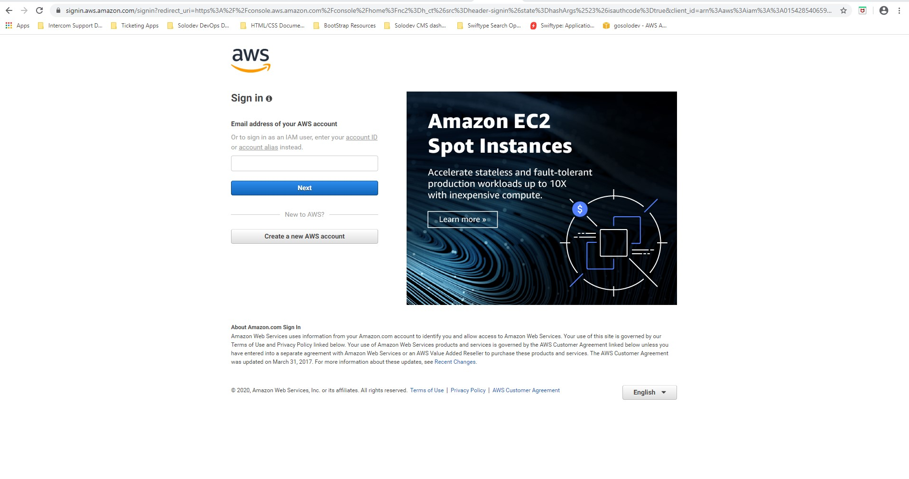

- Go to Solodev’s AWS github page. 


- Scroll down to access to the summarily described Solodev stacks. 

- Once the desired stack is found, click the Quick Launch: AWS Marketplace link at the end of the short description.

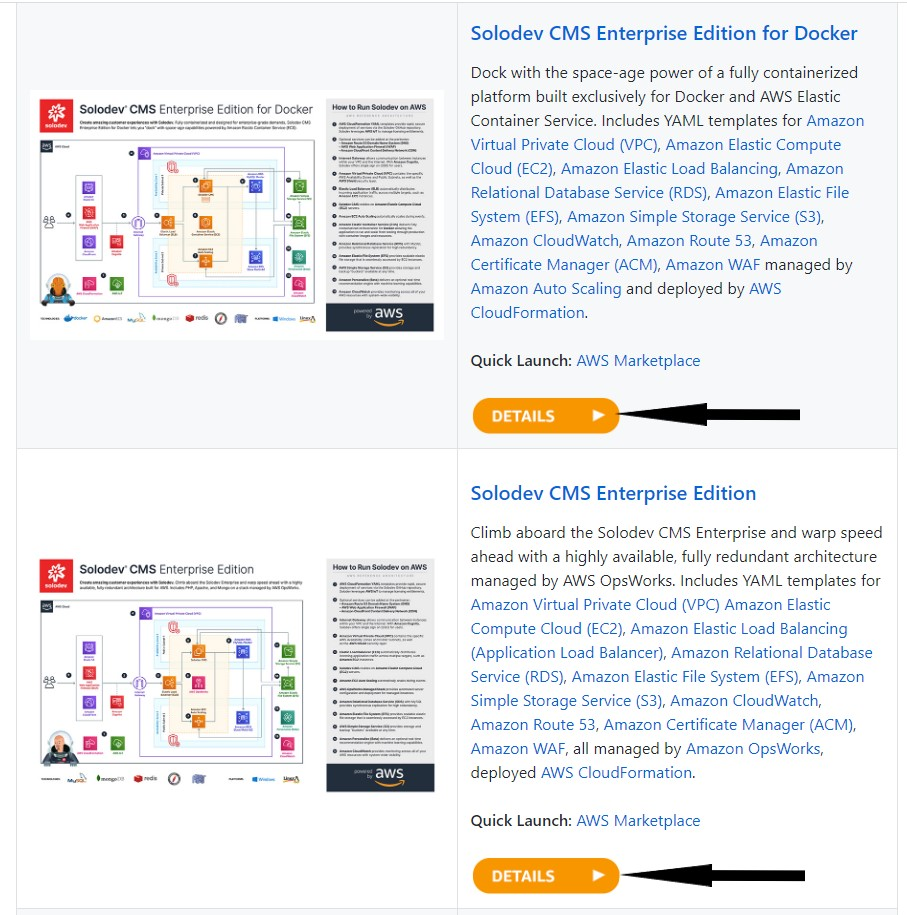

- The user is directed to the Solodev product page on AWS where they can see product overviews, reviews, and request support. 

- Click Continue to Subscribe. 

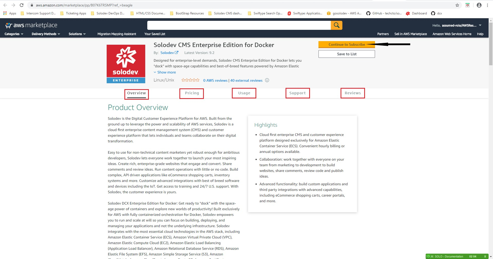

- Click Accept Terms to complete the subscription process. 

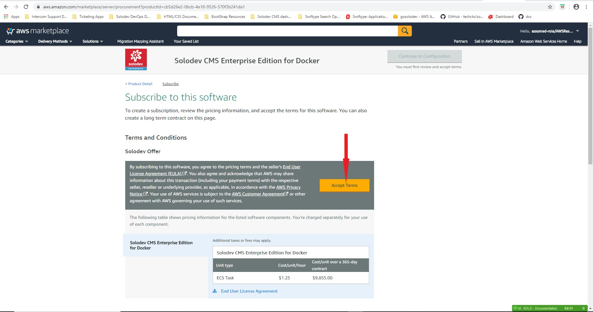

- Wait until the subscription is processed. 

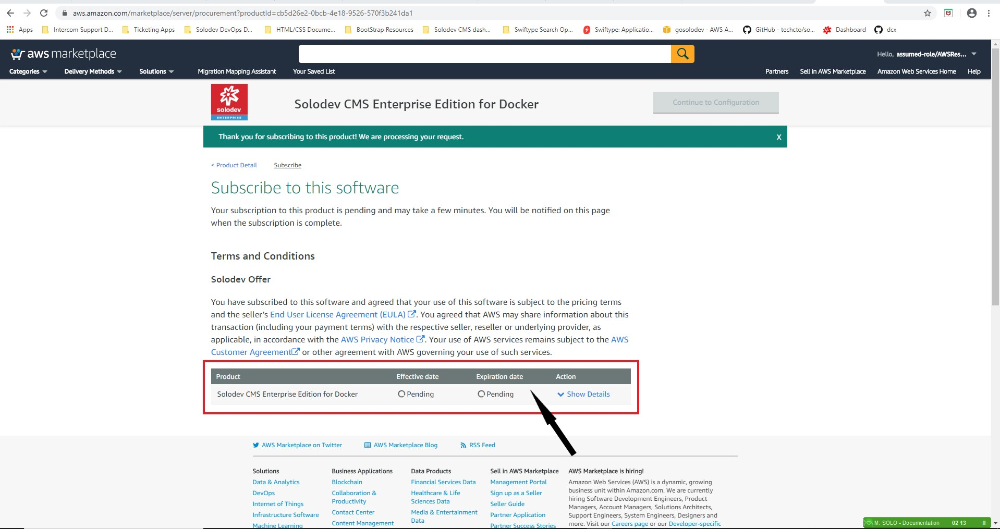

- Once the subscription is processed, click Continue to Configuration and follow the installation instructions for your specific stack.

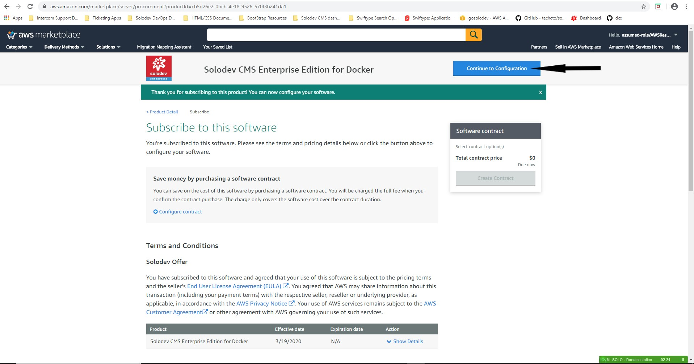 

*Choosing a stack*

Since the stacks offered by Solodev tend to differ in technical complexity, Solodev recommends that users choose their stacks based on project requirements and their scale. For example, if a customer and their organization would like to make a lifestyle blog to accompany their brand, Solodev CMS Professional Edition is an optimal solution for their needs. Descriptions of the Solodev stacks and links to detailed installation instructions from our github repository are provided below.

Before installing a desired stack, we recommend that you: 

 
- Create an AWS account.

- [Subscribe to a Solodev stack on the AWS Marketplace](https://aws.amazon.com/marketplace/seller-profile?id=8e11c912-6253-41b8-b065-bf32bd27911b). 

- Configured your [VPC](https://docs.aws.amazon.com/vpc/latest/userguide/what-is-amazon-vpc.html) and [EC2](https://docs.aws.amazon.com/AWSEC2/latest/UserGuide/concepts.html) Key Pair. 


*Solodev stacks and installation instructions*


A brief description of each Solodev stack and installation instructions are provided below.

 

- ***[Solodev CMS Lite Edition](https://github.com/solodev/aws/blob/master/pages/solodev-cms-lite.md):*** Ideal for small development projects. Solodev CMS Lite Edition provides users with advanced features and capabilities on a single web server. Available with convenient hourly billing or annual options. 

 

- ***[Solodev CMS Professional Edition](https://github.com/solodev/aws/blob/master/pages/solodev-cms-pro.md):*** Users are able to build a professional-grade website, app or portal with the power of Solodev, backed by PHP, Apache Mongo and more -- all on a single web server with an external Amazon RDS MySQL database.

 

- ***[Solodev CMS Enterprise Edition](https://github.com/solodev/aws/blob/master/pages/solodev-cms-enterprise-opsworks.md):*** Quickly and easily deploy Solodev Enterprise to build websites portal or applications that can handle any amount of traffic, leveraging multiple geographic data centers for unmatched redundancy, security and scalability. 

 

- ***[Solodev CMS Enterprise Edition for Docker](https://github.com/solodev/aws/blob/master/pages/solodev-cms-enterprise-docker.md):*** Fully containerized and designed for enterprise grade demands, Solodev CMS Enterprise Edition for Docker is powered by Amazon Elastic Container Service (ECS).

 

- ***[Solodev Content Management (CMS) for Kubernetes](https://github.com/solodev/aws/blob/master/pages/solodev-cms-enterprise-kubernetes.md):*** Designed for enterprise level demands and built on a secure architecture managed by Amazon EKS, Solodev CMS Enterprise Edition for Kubernetes allows users to focus on building, deploying and managing their applications without worrying about the underlying infrastructure.

---


:::

## Configure Amazon Simple Email Service (SES) in Solodev

:::

Solodev CMS supports integration with Amazon SES – a service that allows users to send and receive email using their own email addresses and domains. You can leverage this feature to develop email autoresponders, newsletters, or transactional emails. This article documents adding Amazon SES credentials to Solodev.

Before adding Amazon SES credentials to the CMS you should have completed the following tasks:

- [Sign up for AWS](https://docs.aws.amazon.com/ses/latest/dg/setting-up.html#setting-up-aws-sign-up).

- [Obtain their AWS access keys](https://docs.aws.amazon.com/ses/latest/dg/setting-up.html#get-aws-keys).

- [Download an AWS SDK](https://docs.aws.amazon.com/ses/latest/dg/setting-up.html#download-aws-sdk).

- [Verify your domain](https://docs.aws.amazon.com/ses/latest/dg/send-email-getting-started-migrate.html#send-email-getting-started-migrate-verify-domain).

- [Verify an email address with Amazon SES](https://docs.aws.amazon.com/ses/latest/dg/setting-up.html#quick-start-verify-email-addresses).

- [Obtain Amazon SES SMTP credentials](https://docs.aws.amazon.com/ses/latest/dg/smtp-credentials.html).

- [Connect to an Amazon SES SMTP endpoint](https://docs.aws.amazon.com/ses/latest/dg/smtp-connect.html).

- Obtain the SMTP interface port number.

To review the pre-requisites in more detail, please refer to the [Amazon Simple Email Service Developer Guide](https://docs.aws.amazon.com/ses/latest/dg/Welcome.html). For additional assistance with configuring Amazon Simple Email Service please contact our [support team](mailto:help@solodev.com). 

**Adding Amazon SES credentials to Solodev CMS**

- From the CMS dashboard, click Settings. 

- In the Settings dashboard, click Config.

- Enter the Email From Address. 

- Enter the SMTP Host. 

- Enter the SMTP Port. 

- Enter the SMTP Username. 

- Enter the SMTP Password. 

- Click Submit. 

---


## fileparse.php

Solodev includes several built-in scripts which accomplish more extended functionality and help developers get the most out of the Solodev CMS system. This document will discuss fileparse.php script. This script acquires the file path of a resource on the Solodev filesystem for use on the frontend of the site. Generally used in relation to images stored in the web files folder, fileparse.php is used to construct source URLs for `<a>`, ``, `<script>`, and `<link>` tags.

**Constructing a source URL for `` tags**

When a user uploads an image using the WYSIWYG editor, Solodev automatically places the image in an _Assets folder that is a peer to a specific page.

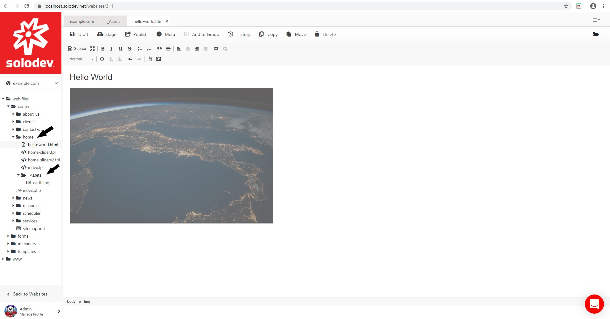

The source for each image tag includes a reference to "fileparse.php". The source of this image in the above screenshot is "/core/fileparse.php/549/urlt/earth.jpg”. The source of the image can be found by opening the html file that contains the uploaded image, right clicking the image, and clicking Image Properties. 

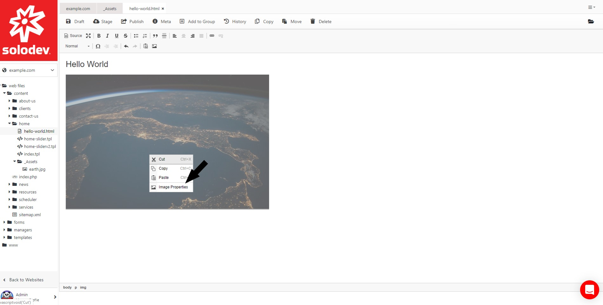

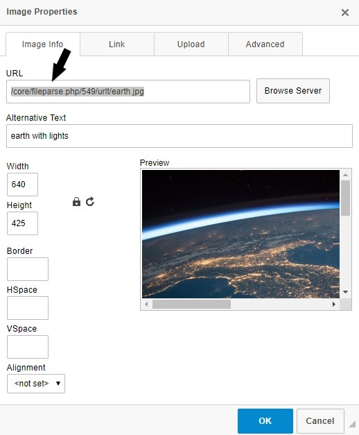

The reference "fileparse.php" is simply a built-in script that gets the URL of a specific folder ID. In this example, the folder has an ID of 549. The fileparse.php script returns the path to the specified folder and then finds the asset name.

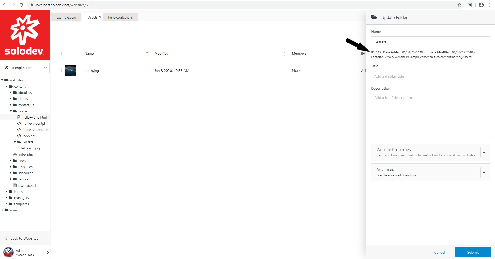

The user can reference the earth.jpg image elsewhere on the Solodev site in an image tag by using the source path listed above: 

```html

```
There are situations where the user needs to upload an image or asset outside of the WYSIWYG editor (for example, .tpl files or modules). For these situations the user can upload the files directly to an _Assets folder using Add File or Upload in the toolbar and use the fileparse.php method to create the asset’ source path. 

---

## Intranets

Intranets are a major part of enterprise websites. In some cases, organizations use intranets for a majority of their workload, while their public facing website is informal in nature. Intranets serve a multitude of purposes from document, sharing task management, workflows, digital asset management, content authoring and storage -- accessible to the organization and its authorized users. This tutorial shows the user how to create an intranet using Solodev. 

Prior to building an Intranet in Solodev users should be able to: 

- Use shortcodes.


**Step 1: Create an intranet folder**

- Open the web files -> content folder. 

- Click Add Folder. 

- Enter the Name, Title, and Description. 

- Click Submit.

**Step 2: Create the login template (index.tpl file)**

- With the intranet folder open, click Add File.

- Enter the Name and Title of the file (append '.tpl' to the end of the name. For example, index.tpl).

- Choose 'Code' for the Type.

- Click Submit.

- The user is directed to the file.

- Enter the code block provided below: 

```html

<div class="row mt-4 mb-5 align-items-end">
	<div class="col-md-6">
		<h3 class="text-fourth font-weight-bold">Welcome</h3>
		[form_login secure_area="/intranet/secure/"][form_error_messages]
			<input class="form-control rounded-0 mt-4 p-2 w-100" id="mail" name="mail" placeholder="you@mail.com" type="email"  />
			<input class="form-control rounded-0 mt-3 p-2 w-100" id="solodevpassword" name="solodevpassword" placeholder="password" type="password" />
			<div class="mt-3 d-flex justify-content-between align-items-center">
				<div class="w-50 d-flex align-items-center">
					<input id="sys_chk_news" type="checkbox" /><span class="pl-2">Remember me</span>
				</div>
				<div class="w-50 text-right">
					<a class="lost-pass ml-auto" href="/intranet/forgot-password.stml">Forgot password?</a>
				</div>
			</div>
			<div class="pt-5">
				<button class="btn btn-tertiary w-100" id="loginBtn" type="submit">Login</button>
			</div>
		[/form_login]
	</div>
	<div class="col-md-6 text-center mt-4 mt-md-0">
		<a href="/intranet/register.stml">
			
		</a>
		<p>Not a member? Don’t worry</p>
			<a class="btn btn-primary-dark w-100" href="/intranet/register.stml">Create an account</a>
	</div>
</div>

```

- Click Publish. 

**Step 3: Create a sign-up template(register.tpl file)**

- With the intranet folder open, click Add File.

- Enter the Name and Title of the file (append '.tpl' to the end of the name. For example, register.tpl).

- Choose 'Code' for the Type.

- Click Submit.

- The user is directed to the file.

- Enter the code block provided below: 

```html 

<div class="row mt-4 mb-5 align-items-end">
	<div class="col-md-12">
		<h3 class="text-fourth font-weight-bold">Welcome</h3>
		<p>Sign up for access to the WebCorpCo Intranet. Please enter in an email and a password.</p>
        
		[form_register secure_area="/intranet/secure/" user_folder="122" ][form_error_messages]
			<label for="mail_create" class="font-weight-bold">Email</label>
			<input class="form-control rounded-0 p-2 w-100" id="samaccountname" name="samaccountname" placeholder="you@mail.com" type="email" />
            
			<label for="solodevpassword_create" class="font-weight-bold mt-3">Password</label>
			<input class="form-control rounded-0 p-2 w-100" id="solodevpassword" name="solodevpassword" placeholder="Password" type="password" />
			
            <div class="pt-5">
				<button class="btn btn-primary-dark w-100" id="createAccount" type="submit">Create an Account</button>
			</div>
		[/form_register]
	</div>
</div>

```

- Click Publish. 

**Step 4: Create a forgot-password template (forgot-password.tpl)**

- With the intranet folder open, click Add File.

- Enter the Name and Title of the file (append '.tpl' to the end of the name. For example, forgot-password.tpl).

- Choose 'Code' for the Type.

- Click Submit.

- The user is directed to the file.

- Enter the code block provided below: 

```html

<div class="row my-4">
	[form_forgot_password forward_to="/intranet/password-confirmation.stml" login_page="/intranet/" from_email="[site_email]"]
		<div class="col-md-4 py-2">
        	[form_error_messages]
			<label class="control-label" for="checkEmail">
				<strong>Please enter your email address</strong>
			</label>
		</div>
		<div class="col-md-4 py-2">
			<input class="rounded-0 form-control" id="checkEmail" name="checkEmail" type="text" />
		</div>
		<div class="col-md-4 py-2">
			<button class="btn btn-fourth w-100 mb-3" name="Insert" type="submit">Reset Password</button>
		</div>
  	[/form_forgot_password]
	<div class="col-md-12">
		<a href="/intranet/">Back to Login Page</a>
	</div>
</div>

```

- Click Publish. 

**Step 5: Create the password confirmation template (password-confirmation.tpl)**

- Open the intranet folder and click Add File.

- Enter the Name and Title of the file (append '.tpl' to the end of the name. For example, password-confirmation.tpl).

- Choose 'Code' for the Type.

- Click Submit.

- The user is directed to the file.

- Enter the code block provided below: 

```html

<div class="row my-4">
   <div class="col-md-12">
       <div class="alert alert-info rounded-0" role="alert">
           You will receive an email with instructions to reset your password...
       </div>
    </div>
</div>

```
- Click Publish.

**Step 6: Create a secure folder**

- Open the intranet folder and click Add Folder. 

- Enter the Name (‘secure’), Title and Description of the folder. 

- Click Submit.


Step 7: Create an account page template(index.tpl)

- Open the secure folder and click Add File

- Enter the Name and Title of the file (append '.tpl' to the end of the name. For example, index.tpl).

- Choose 'Code' for the Type.

- Click Submit.

- The user is directed to the file.

- Enter the code block provided below: 

```html

<div class="row">
	<div class="col-md-12">
		<p>The list below contains the files that are available to the current user. They are located in the User's folder under Documents.</p>
    	[user_documents]
	</div>
</div>

```
- Click Publish. 

**Step 8: Create an intranet folder in the www folder**

- Open the www folder and click Add Folder. 

- Enter the Name, Title and Description of the folder. 

- Click Submit. 

**Step 9: Create a login page (index.stml)**

- Open the www -> intranet folder. 

- Click Add Page.

- Enter the Name (index), Title and Description of the page.

- Choose your template. 

- Click Submit. 

- The user is directed to the page. 

- Click the empty dynamic div in the index.stml page. 

- Choose the index.tpl file located in web files - > content -> intranet folder. 

- Click Publish. 

**Step 10: Create a signup page**

- Open the www -> intranet folder. 

- Click Add Page.

- Enter the Name (register), Title and Description of the page.

- Choose your template. 

- Click Submit. 

- The user is directed to the register page. 

- Click the empty dynamic div in the register.stml page. 

- Click the register.tpl file located in web files -> content -> intranet folder. 

- Click Publish. 

**Step 11: Create a forgot password page**

- Open the www -> intranet folder. 

- Click Add Page.

- Enter the Name (forgot-password), Title and Description of the page.

- Choose your template. 

- Click Submit. 

- The user is directed to the forgot-password page. 

- Click the empty dynamic div in the forgot-password.stml page. 

- Click the forgot-password.tpl file located in web files -> content -> intranet folder. 

- Click Publish. 

**Step 12: Create a password-confirmation page**

Open the **www -> intranet** folder. 

Click **Add Page**.

Enter the **Name** (password-confirmation), **Title** and **Description** of the page.

Choose your template. 

Click **Submit**. 

The user is directed to the password-confirmation page. 

Click the empty dynamic div in the password-confirmation.stml page. 

Click the **password-confirmation.tpl** file located in **web files -> content -> intranet** folder. 

Click **Publish**. 


**Step 13: Create a secure folder in the intranet folder**

- Open the www -> intranet folder and click Add Folder. 

- Enter the Name (secure), Title and Description of the folder. 

- Click Submit. 

**Step 14: Create an account page for the users**

- Open the **www -> intranet -> secure** folder.

- Click **Add Page**. 

- Enter the **Name (index)**, **Title** and **Description** of the page.

- Choose your template. 

- Click **Submit**. 

- The user is directed to the index page. 

- Click the empty dynamic div in the index.stml page. 

- Click the **index.tpl** file located in **web files -> content -> intranet -> secure** folder. 

- Click **Publish**. 

**Note:** Any files placed in the "secure" folder will only be accessible to authorized users granted access to the Intranet.


---


## Marketing and SEO

Solodev comes with a number of tools out of the box to empower your marketing team and boost your SEO ranking and site visibility. This following resources will cover the pillars of the Solodev Marketing Toolbox.

**Meta Data**

- ***Website*** Solodev comes with a number of tools to boost your SEO ranking and site visibility and help better market your website organically.

- ***Page*** In addition to your website's meta information, you can add meta information to different pages within your site. On any given page in Solodev, simply toggle over from the Content tab to the Meta Information Tab and start adding meta data to your page.

***SEO Basics***

Solodev has a number of ways to create SEO-friendly elements within your website. These components include SEO-friendly URLs, Title Tags, Alt Tags, and more.

***Scheduling***

Schedule content to publish to your web pages and set when certain pieces of content go live or are removed from pages throughout your website. Solodev will automatically publish and remove content according to your schedule, serving up different pieces of content based on the date and time.

***Experiments***

Solodev Experiments is a powerful tool to add to your Marketing Toolbox. You can experiment with different pieces of content on a page, the copy on a page, images on a page, different hero iterations, sliders, you name it. With such A/B testing, you can empower your marketers to create content that consistently delivers.

***Forms***

Use our drag and drop form builder to create forms for placement across your website and connect your forms to a datatable that collects all form submissions, allowing you to capture leads and trigger actions on form submission such as email automation, asset downloads, [tickler emails](https://cms.solodev.net/workspace/modules/custom-modules/#adding-an-email-tickler), and more.


***Configuring your website's meta information***

Solodev offers a number of tools to boost SEO ranking, site visibility, and help better market websites organically. In order to configure a website's meta information, open the root of the desired website by clicking the globe icon next to its domain name. Click Update Website.

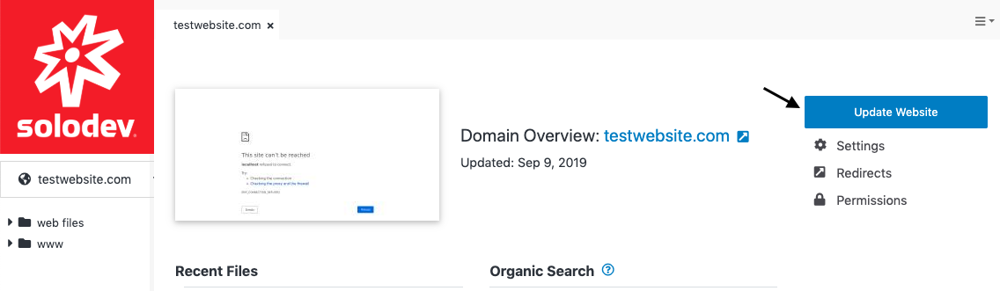

Note: In the fields below users can add meta information that will dynamically render across every page of their website. When managing multiple websites, users can rank the order in which websites appear. Users can add a site title that will appear on all pages of their site.

 

Underneath the site title field are two social media fields intended for social meta information. When populated, Solodev dynamically creates Twitter and Facebook meta information for each and every page of the website, furthering SEO visibility beyond search and into the social stratosphere. Users can add Global HTML tags along with header inserts to be included on every web page.

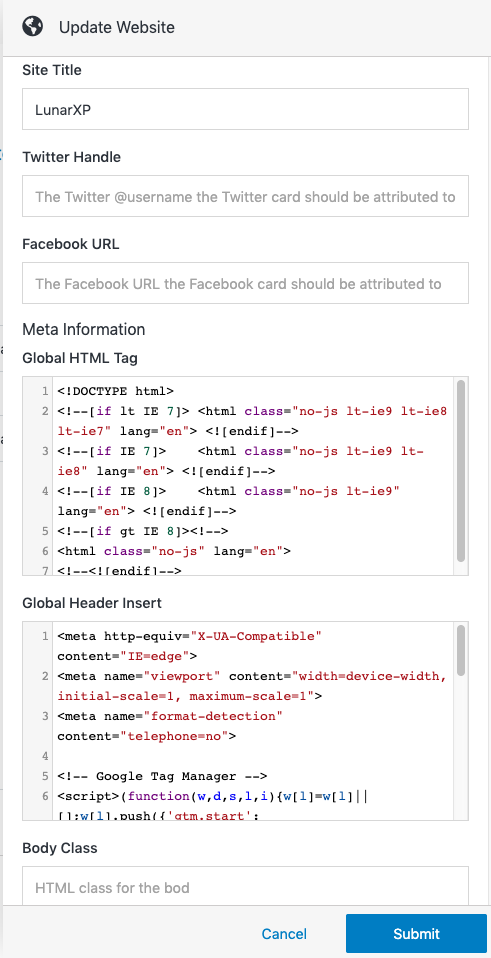


***Page meta data***

In addition to the website’s meta information, Solodev users can add meta information to different pages within the site. Open any given page (.stml file) and click the Meta button (the information icon) and expand the Meta accordion to start adding meta data to the Meta entry form.


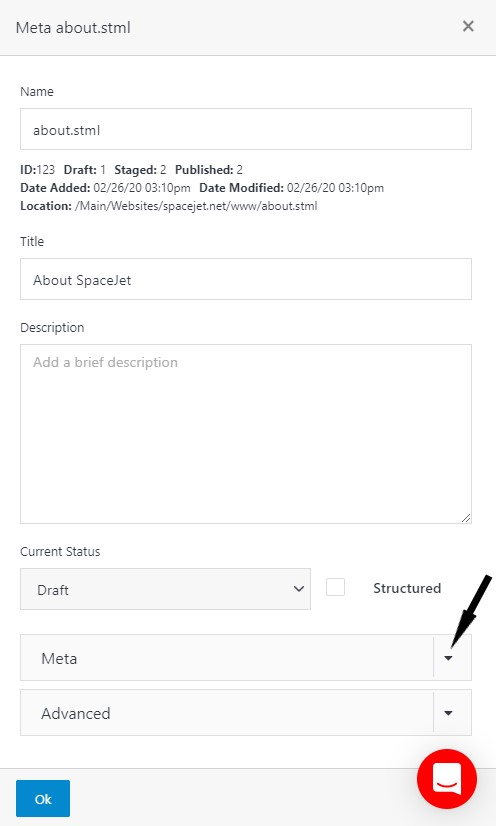

The Meta tab allows the user to add a Menu Name, Rank, H1 Title, Meta Description, and Meta Keywords. Solodev also dynamically pulls the form fields and text areas and populates the meta information you place in these fields on a page-by-page basis. This document will show the user how to add meta descriptions, meta keywords, and change the meta titles of the page.

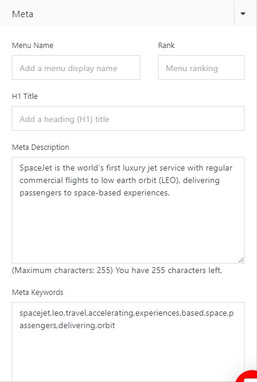


*Changing the Meta Title*

The meta title, distinct from the headline on the page itself, is an important part of Search Engine optimization. Meta titles are seen by visitors searching the web and read by search engine robots.  

- Open the .stml page.

- Click the Meta button (the information icon) to bring up the meta window.


- Enter the Title.

- Click Ok.

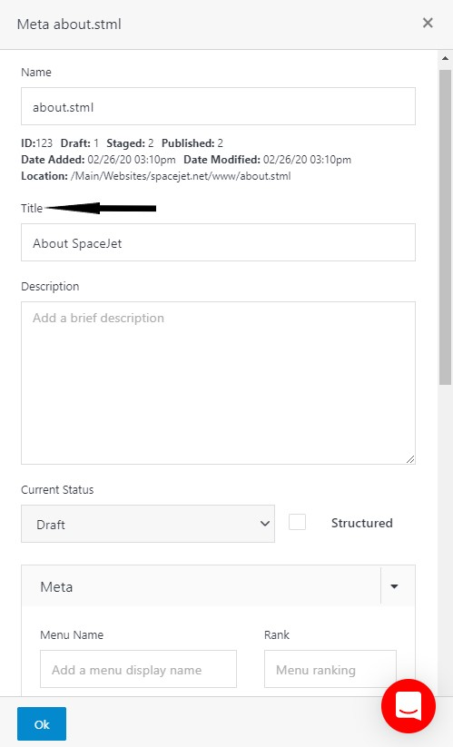

- Click Publish.

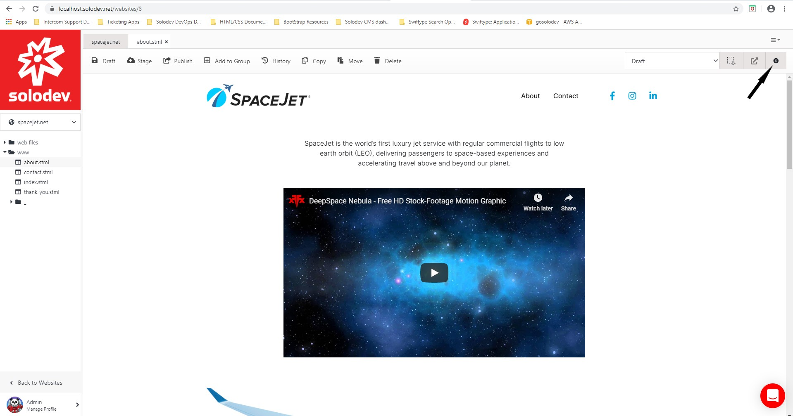


*Add a menu Name*

Users that are leveraging a dynamic and programmatic menu can submit the name of the menu in this field. If the website has a long title, users can use the menu name to ensure that visitor’s search terms will point to the site’s URL.

- Open the .stml page.

- Click the Meta button (the information icon) to bring up the meta window.


- Expand the Meta accordion.


- Fill out the Menu Name field.

- Click Ok.

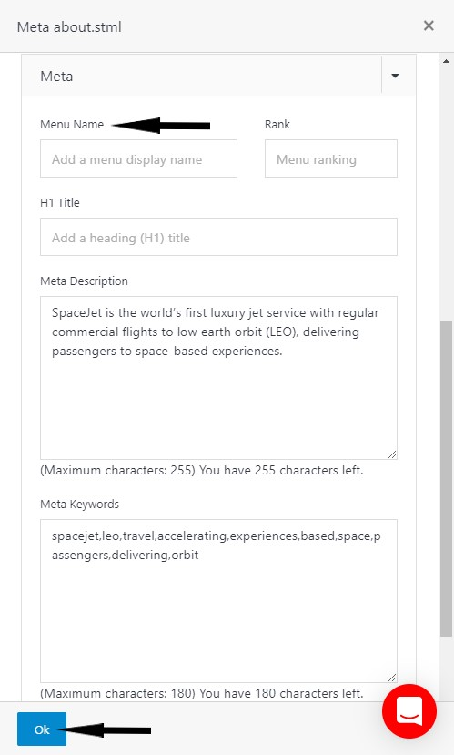

- Click Publish.


*Add a Rank*

The rank is used to rank the items in the programmatic menu. This does not impact SEO results. 

- Open the .stml page.

- Click the Meta button (the information icon) to bring up the meta window.


- Expand the Meta accordion.


- Fill out the Rank field.

- Click Ok.

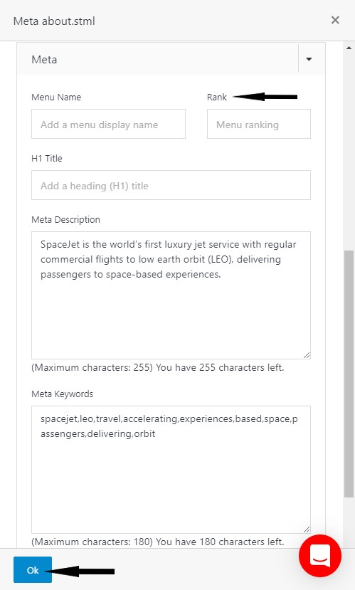

- Click Publish. 


*Adding an H1 Title*

The user can add an H1 title to the meta form to ensure that the list of search results matches a visitor’s key search terms. The steps for adding an H1 title are listed below:  

- Open the .stml page.

- Click the Meta button (the information icon) to bring up the meta window.


- Expand the Meta accordion.


- Enter the H1 Title.

- Click Ok.

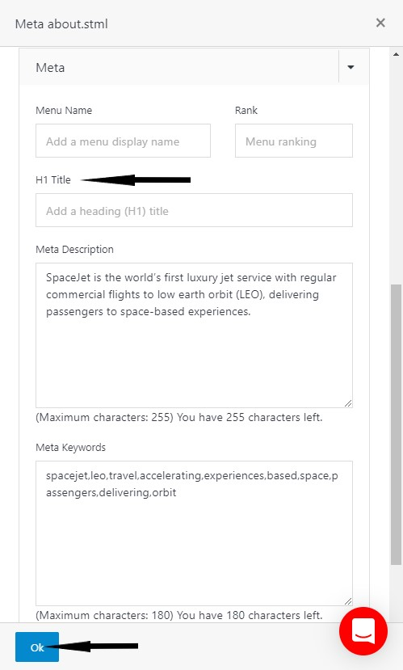

- Click Publish. 


*Adding a Meta Description*

Search engines help visitors distinguish between results by adding about the individual pages next to their URLs. Some search engines allow the developer to specify the description that appears next to the page. Solodev recommends that the list of links matches a visitor’s key search terms. To do this, take the first couple sentences of the body copy from the web page and use it as the content for the Meta Description.

- Open the .stml page.

- Click the Meta button (the information icon) to bring up the meta window.


- Expand the Meta accordion


- Fill out the Meta Description Field.

- Click Ok.

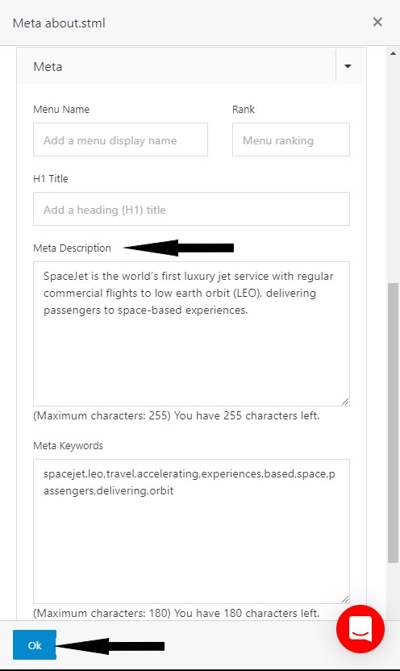

- Click Publish. 


*Adding meta keywords*

Meta Keywords are a specific type of meta tag that appear in the HTML code of a Web page and tell the search engines the topic of the page. Users can explicitly tell search engines exactly what their page is about by specifying a list of relevant keywords in the Meta Keywords field of the STML file. Solodev recommends using a combination of very unique and more general words to describe the contents of your page. 

However, using a greater number of words is not necessarily better. The closer Solodev users match what a prospective visitor types (with no extra words), their pages will achieve a more prominent ranking in the search results.

- Open the .stml page.

- Click the Meta button (the information icon) to bring up the meta window.


- Expand the Meta accordion


- Enter the keywords in the Meta Keywords field.

- Click Ok. 

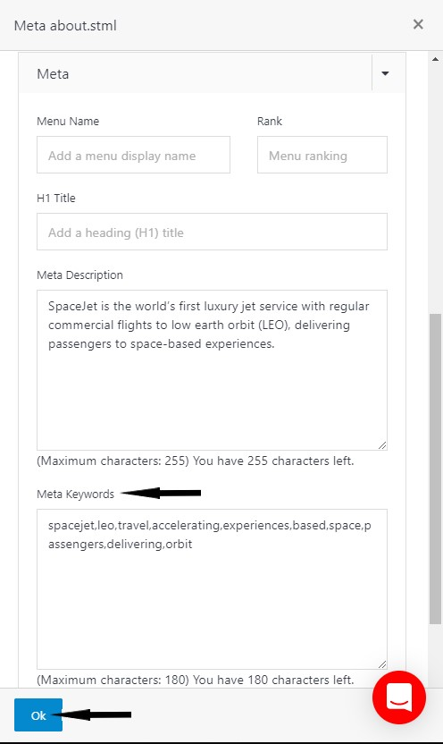

- Click Publish. 


**Note:** Don’t use keywords where they don’t make sense. It is their natural and consistent use that is rewarded. Don’t repeat keywords endlessly and meaninglessly, as it is considered spamming and results in the page being banned from search engine results. 

 

**Note:** Although all files contain meta properties, Solodev recommends adding and changing the meta properties of .stml files to improve Search Engine Optimization. 


***Scheduler***

Solodev provides the ability to schedule publication of content to a live website in advance. Users can leverage the Scheduler tool to remove and replace the content of a webpage based on a predefined schedule. For example, users can create five different variations of the web page content, upload them to Solodev Scheduler, and set the dates to replace the content along with the frequency of replacement. After setting these parameters, Solodev automates the entire process. 

Schedulers can be used for two main purposes: 

- Set specific dates and times for the publication of content. 

- Display a series of announcements on a web page at a given time. 


*Creating a scheduler*

- Open the folder that will contain the schedule. 

- Click Add Scheduler to bring up the Add Scheduler modal. 

- Enter the Name, Title, and Description. 

- Click Submit. 


*Modifying a scheduler*

- Open the newly created schedule. 

- Click Modify to bring up the Modify modal.

- Make the required changes to the Name, Title, and Description.

- Click Submit. 

*Deleting a scheduler*

- Open the schedule.

- Click Delete to bring up the Delete modal. 

- Review the warning and click Submit. 

*Creating a scheduler entry*

- Open the scheduler.

- Click Add Entry to bring up the Add Entry modal window.

- Enter a Name for the scheduler entry. 

- Click Browse to select a file from the workspace. This example selects the home-slider.tpl file located in web files -> content -> home.

- Enter a Start Date.

- Click Submit. 

Note: If there is one scheduler entry for an asset file, the asset file will remain published on the page until the entry is removed or another entry is created. When another entry is created within the same scheduler, the previous entry will be removed on the start date of the most recent entry.

*Modifying a scheduler entry*

- Open the scheduler. 

- Click the document icon next to open the desired entry.

- The entry appears in a new tab, where the user can change the name of the entry, preview the file selected, change the selected file, and change the start date. 

- Once the desired changes are made, click Save.  

*Deleting a scheduler entry*

- Open the scheduler. 

- Click the document icon next to open the desired entry.

- Click Delete to bring up the Delete modal window. 

- Review the warning and click Submit. 

*Adding a scheduler to a page*

- Open the page that will contain the scheduler and select the dropzone.

- Click on the scheduler to insert it into the dropzone.

- Click Publish. 


***A/B Testing***

A/B Testing is the most essential tool marketers can use to target visitors by testing their responses to varying content. Experiments allows users to test different iterations of content on different pages and track the iterations receiving the most conversions and engagement. 

With Solodev Experiments, users can experiment with different pieces of content on a page, the copy on a page, images on page, different hero iterations, and sliders. This article shows the user how to create and modify experiments and their entries. 

**Note:** Prior to conducting experiments in Solodev, users should arrange the different iterations to be tested. Given that visitors can see the different iterations of content on the website, Solodev recommends ensuring that the correct iterations are tested. Content cannot be a page itself, but a file in the web files directory with an .HTML or .TPL extension. 


*Add an Experiment*

- Open the web files -> content -> experiments directory. 

- Click Add Experiment to bring up the Add Experiment window.

- Enter the Name. 

- Click Submit. 

Note: Name and describe your experiments so that at first glance, collaborators know the intent of the experiment, in this case, the intent is to see which performs better, a static hero image or a hero slider. 

*Add an entry to an experiment*

- Click on the beaker icon next to the experiment name to open the experiment.

- Add content to the experiment by clicking the Browse button.

- Select home-slider.tpl (Solodev’s slider), located in the web files -> content -> home directory, for the first iteration of the experiment and click Choose.

- The first iteration of the experiment is displayed to the left of the Browse button.

- To configure the content, enter the name adjust the frequency, and click the checkbox located under the Active column.

- Click Save.

- Scroll to the right and click the orange + button to populate a new row.

- Follow the steps 1 – 6 to add the second iteration. For this iteration, select home-video.tpl located in the web files -> content -> home directory. 

*Add an experiment to a page*

- Open the page that will contain the experiment and select the dropzone for the experiment.

- Select the experiment from the web files directory and click Publish.

**Note:** 50% of site visitors will see the Video iteration of the homepage and the remainder will see the Hero Slider iteration. 


*Changing the frequency of iterations in an experiment*

If an iteration in an experiment does not perform well, users may want to increase the frequency to gain more data. Alternatively, users may want to decrease the frequency or remove the iteration altogether in which that content is displayed.  

- Open the experiment to display the iterations. 

- Adjust the frequency sliders. 

- Click Save.

**Note:** As you can see above, the slider entry has a higher conversion rate than the video entry does. We'll increase the frequency of the slider and decrease the frequency of the video.


*Removing iterations/entries from an experiment* 

- Open the experiment to display the iterations. 

- Scroll to the right and click the grey – button.

- Click Save.


*Adding iterations*

In the previous example, this document guided the user through creating an experiment with two iterations. Suppose that the user would like to test more than one slider and more than one video image. In this case, the user can add content to the web files folder to add further iterations to the experiment.  

- Open the experiment to display the iterations.

- Click the orange + button on the far right of the Slider to add a new row. 

- Click Browse, select the desired content from the file tree, and click Choose.

- Enter the name of the frequency, click the checkbox in the Active column and adjust the frequency slider. 

- Click Save to save the iteration.

*Disabling an iteration*

- Open the experiment to display the iterations.

- Click the checkbox to remove the check mark from the Active column.

- Click Save. 

*Deleting an Experiment*

- Open the folder containing the experiment. 

- Select the checkbox next to the experiment.

- Click Delete to bring up the modal window.

- Review the warning and click Submit.


**Note:** While Solodev Experiments tracks conversion rates locally, users can send conversion data to google optimize, which is integrated with google analytics, for granular tracking. To leverage Google Optimize, create a new experiment that mimics the variations configured in Solodev and place the Google Optimize key in the **Google Experiment ID** field.

---

## Page templates

Solodev pages consist of a collection of HTML content. Pages contain Dynamic divs or dropzones throughout the page that specify where HTML content is inserted throughout the page. With Pages, users can create Page Templates – pages that can be re-used to build out more pages. This tutorial shows the user how to convert a page into a template and use page templates to build out the website. 

**Step 1: Creating a template from a page**

- Expand the www folder and open the desire page.

- Open the page that will be transformed into a template. 

- Click Meta. 

- In the modal window, click the arrow to expand the Advanced section.

- At the bottom of the Advanced section, click the checkbox next to Is Template.

- Click Submit.

**Step 2: Creating a page with the newly created template**

- Open the www folder. 

- Click Add Page.

- Enter the Name, Title and Description in the modal window. 

- Under Template section select the arrow in the checkbox to choose the newly created template (all-pages.stml).

- Click Submit. 

- The user will be directed to the new page automatically. 

**Step 3: Adding HTML content to the new page**  

- With the new page open, select the empty Dynamic Div.

- Choose the appropriate html file to insert. 

- Click Publish. 

---

## Shortcodes

Shortcodes allows the user to enhance the functionality of their site and gives them the ability to create special features that will distinguishes their site from the competition. Solodev shortcodes are the contextual templating language of Solodev. With a templating language, users are able to code directly against their site content – allowing developers and content editors to work in tandem. 

 

Similar to other templating, Solodev uses double brackets `[]` to open and close templated expressions and double curly braces for HTML fields `{{ }}`. Inside these brackets a developer can use shortcode functions and reference content schema properties. These templating expressions are written alongside standard HTML. 

 

This framework enables developers to create special kinds of content and functionality that users can attach to certain pages by adding the corresponding shortcode into the page text. Shortcodes handle all of the tricky parsing eliminating the need for writing a custom regular expression for each shortcode. Helper functions are included for setting and fetching default attributes. This framework supports both self-closing and enclosing shortcodes. 

---

### Basic shortcodes

**Admin Only:** This shortcode specifies that the content inside of the `[admin_only] [/admin_only]` code should be shown on the backend. Developers may use this shortcode in conjunction with `[non_admin_only] [/non_admin_only]` shortcode to partition frontend and backend content and prevent them from interfering with one another. This shortcode has no attributes. 

 


***Shortcode:***

`[admin_only]`

***Code Example:*** 

``` 
[admin_only]
 hello backend
[/admin_only]

```

---


**Non Admin:** This shortcode specifies that the content inside of the `[non_admin_only] [/non_admin_only]` should be shown on the frontend. Developers may use this shortcode in conjunction with `[admin_only] [/admin_only]` shortcode to partition front end and backend content and prevent them from interfering with one another. This shortcode has no attributes.

***Shortcode:***

`[non_admin_only]`

***Code Example:***

```
[non_admin_only]
  hello frontend
[/non_admin_only]

```

---

**Get Asset File URL:** This self-closing shortcode returns the URL path to the specified asset file in the database. Typically, this shortcode is used within an entry or repeater shortcode.

***Attributes:***

| Attributes | Description |
| ----------- | ----------- |
| `[id]`(required) | The file's asset file ID. |


***Shortcode:***

`[get_asset_file_url]`

***Code Example:***

```html
[entry]
<div class="blog-wrapper">
<h1>{{article_title}}</h1>

<p>{{article_content}}</p>
</div>
[/entry]

```

---

**Get Asset File Name:** Returns the name of the specified asset file. 

***Attributes:***

| Attributes | Description |
| ----------- | ----------- |
| `[id]`(required) | The file's asset file ID. | 

***Shortcode:***

`[get_asset_file_name]`

***Code Example:***

```html
<div class="row">
  <div class="col-md-8">
    
  </div>
</div>

```

---

**Print Date:** Returns the date formatted according to PHP's [date function](https://www.php.net/manual/en/function.date.php).

***Attributes:***

| Attributes | Description |
| ----------- | ----------- |
| `[format]`(required) | The date format to be returned. A list of date functions can be found [here](https://www.php.net/manual/en/function.date.php). |
| `[datestring]`(optional) | Preformatted date that needs to be changed into another format. |
| `[timestamp]`(optional) | Epoch timestamp (default: Today's Date). |

***Shortcode:***

`[print_date]`

***Code Example:***

```html
<div class="col-sm-8">
  <h2>{{event_title}}</h2>
  <span class="news-date">[print_date format="F d, Y g:ia" timestamp="{{start_time}}"]</span>
</div>

```

---

**Lower Case:** Returns lowercased version of the string value within the enclosing shortcode. This shortcode has no attributes.

***Shortcode:***

`[lower_case]`

***Code Example:***

```html

<a class="[lower_case]{{event_title}}[/lower_case]">
  
</a>

```

---

**Report Errors:** Enables PHP error messages and warning for development purposes. This self-closing shortcode contains no attributes. 

***Shortcode:***

`[report_errors]`

***Code Example:***

`[admin_only] [report_errors] [/admin_only]`

**No Spaces:** Removes spaces from the content within the enclosing shortcode to make it database friendly. This shortcode contains no attributes. 

***Shortcode:***

`[no_spaces]`

***Code Example:***

```html

<a class="[no_spaces]{{event_title}}[/no_spaces]">
  
</a>

```

---

### Shortcodes for users

***Contact Form Login:** provides a form wrapper for users to login on the frontend of the website. 

***Attributes:***

| Attributes | Description |
| ----------- | ----------- |
| `[forward_to]`(required) | URL of the account page that the user is directed to after submitting login credentials. |

***Shortcode:***

`[contact_form_login]`

***Code Example:***

```html
[contact_form_login forward_to="/my-account/" username_field="username" password_field="password"]
          <div class="form-group">
            <label for="username">Email</label>
            <input type="text" id="username"  name="username" class="form-control">
          </div>
          <div class="form-group">
            <div class="d-flex align-items-center justify-content-between">
              <label for="password">Password</label>
              <!--<a href="" class="text-underline mb-2">Show Password</a>-->
            </div>
            <input type="password" id="password"  name="password" class="form-control">
          </div>
          <div class="form-group mt-4">
            <input type="submit" class="btn btn-lg btn-sky-blue w-100 btn-rounded-lg" value="Sign in">
          </div>
[/contact_form_login]

```

---

**Contact Form Signup:** provides a form wrapper that enables users to register for an account. 

***Attributes:***

| Attributes | Description |
| ----------- | ----------- |
| `[forward_to]`(required) | URL of the account page that the user is directed to after signing up. |

***Shortcode:***

`[contact_form_signup]`

***Code Example:***

```html
[contact_form_signup forward_to="/my-account/" username_field="email" password_field="password"]
        <div class="form-group row">
          <label class="col-md-3 control-label" for="email">Email</label>  
          <div class="col-md-9">
            <input id="email" name="email" class="form-control input-md required validate" required="" type="text">
          </div>
        </div>
        <div class="form-group row">
          <label class="col-md-3 control-label" for="email">Password</label>  
          <div class="col-md-9">
            <input id="password" name="password" class="form-control input-md required validate" required="" type="password">
          </div>
        </div>

        <div class="form-group row">
          <label class="col-md-3 control-label" for="email">Confirm Password</label>  
          <div class="col-md-9">
            <input id="password_confirm" name="password_confirm" class="form-control input-md required validate" required="" type="password">
          </div>
        </div>

        <div class="form-group text-center">
          <input class="btn btn-primary" value="REGISTER" name="image" type="submit" width="164" height="27" />
        </div>
[/contact_form_signup]

```

---

**Contact Form Update:** provides a form wrapper that allows users to update their accounts. This shortcode has no attributes.

***Shortcode:***

`[contact_form_update]`

***Code Example:***

```html

[contact_form_update username_field="accountname" password_field="password" email_field="email"]
<div class="row">
  <div class="col-sm-12">
      <div class="form-group">
         <h2>Login Information</h2>
      </div>
      <div class="form-group">
          <label class="control-label" for="oldaccountname">User Name</label>
          <input id="=accountname" disabled readonly name="accountname" class="form-control" type="text" value="<?=$contact->accountname?>">
      </div>
      <div class="form-group">
          <label class="control-label" for="password">New Password</label>
          <input id="password" name="password" class="form-control" type="password" value="">
      </div>
      <div class="form-group">
          <label class="control-label" for="password_confirm">Confirm Password</label>
          <input id="password_confirm" name="password_confirm" class="form-control" type="password" value="">
      </div>
      <div class="form-group">
          <input type="submit" class="btn form-control btn-primary" name="Submit" value="Update User">
      </div>
  </div>
</div>

[/contact_form_update]

```
---

**Contact Form Forgot Password:** Populates a forgot password utility linked to the Solodev form.

***Attributes:***

| Attributes | Description |
| ----------- | ----------- |
| `[forward]`(required) | URL of the page that the user is directed to after submitting the form. |

***Shortcode:***

`[contact_form_forgot]`

***Code Example:***

```html

[contact_form_forgot forward_to="/password-confirm.stml" username_field="username" password_field="password" email_field="mail"]
          <div class="form-group row">
            <label class="col-md-3 control-label" for="email">Email</label>  
            <div class="col-md-9">
              <input id="username" name="username" class="form-control input-md required validate" required="" type="text">
            </div>
          </div>
         <div class="form-group text-center">
          <input class="btn btn-primary" value="Reset" name="image" type="submit" width="164" height="27" />
        </div>
[/contact_form_forgot]

```

---

**Contact Form Reset Password** provides a form wrapper that allows users to reset their password.

***Attributes:***

| Attributes | Description |
| ----------- | ----------- |
| `[forward_to]`(required) | URL of the page that the user is directed to after resetting their password. |


***Shortcode:***

`[contact_form_reset]`

***Code Example:***

```html

[contact_form_reset forward_to="/my-account/"]
         <div class="form-group">
          <input class="form-control input-lg rounded-0" id="password" name="password" placeholder="Password" type="password" required >
        </div>
        <div class="form-group">
          <input class="form-control input-lg rounded-0" id="password_confirm" name="password_confirm" placeholder="Confirm Password" type="password" required>
        </div>
         <div class="form-group text-center">
          <input class="btn btn-primary" value="Reset" name="image" type="submit" width="164" height="27" />
        </div>
[/contact_form_reset]

```

---

### Shortcodes for pages & sectionals

**Page Title:** Retrieves the current title of a page.

***Attributes:***

| Attributes | Description |
| ----------- | ----------- |
| `[exclude]`(optional) | When this option is set the function does not search for the specified title. |

***Shortcode:***

`[page_title]`

***Code Example:***

`<h1>[page_title]</h1>`

---

**Page Description:** Retrieves the description of the page from the fields in the Meta tab of the corresponding page. This self-enclosing shortcode contains no attributes.

 ***Shortcode:***

 `[page_description]`

***Code Example:***

```html
<h1>[page_title]</h1> --> Services
<p>[page_description]</p> --> The Best Services on the Web!

```

---

**Parent Folder Title:** Retrieves the current title of the parent folder. This self-enclosing short code contains no attributes. 

***Shortcode:***

`[parent_title]`

***Code Example:***

```html
<h2 class="aside-header">[parent_title]</h2> 
<a class="btn btn-arrow btn-motive" href="/contact-us.stml"><span>Contact Us</span>
  
</a>

```

---

**Parent Description:** Retrieves the current description of the parent folder. This self-enclosing short code contains no attributes. 

***Shortcode:***

`[parent_description]`

***Code Example:***

`<p>[parent_description]</p>`

---

**Section Title:** Retrieves the folder title that contains a page but reverts to the page title if the parent folder of the page is the site root. This self-enclosing shortcode has no attributes.

***Shortcode:***

`[section_title]`

***Code Example:***

```html
<section class="ct-page_title">
  <h1>[section_title]<h1>
</section>

```

---

**Section Description:** This retrieves the folder description that contains a page but refers to the page description if parent folder of the page is the site root. This self-enclosing shortcode has no attributes.

***Shortcode:***

`[section_description]`

***Code Example:***

```
<div class="ct-page_title-content">
   <h1>About Us</h1>
   <p>[section_description]</p>
</div>

```

---

**Solodev Nav:** Displays the structured folders in the navigation (left or main). 

***Attributes:***

| Attributes | Description |
| ----------- | ----------- |
| `[parent_category_id]`(required) | The ID of the www folder. |
| `[levels]`(optional) | How deep the navigation should display(numeric value). |
| `[nav_class]`(optional) | Classes can be added. |

***Shortcode:***

`[solodev_nav]`

***Code Example:***

```html
<div class="nav main-nav">
  [solodev_nav parent_category_id="14742" levels="2" nav_class="navbar-nav navbar-right"]
</div>

```

---

**Breadcrumb:** Returns the formatted breadcrumb tail for the current page. This shortcode creates dynamic breadcrumbs on every web page to which it is added. Breadcrumb refers to a navigation element that displays the path in which the current page resides. The breadcrumb displays all parent folders up to the www folder. 

***Attributes:***

| Attributes | Description |
| ----------- | ----------- |
| `[delimter]`(optional) | Sets the delimiter between folders. Supports font awesome and text. | 
| `[home_overwrite]`(optional) | Overrides the home link to replace the word home with an icon. Supports font awesome and text. |

***Shortcode:***

`[breadcrumb]`

***Code Example:***

```html

<div class="breadcrumb-container">
  <ul class="breadcrumb">
   [breadcrumb home_overwrite='<i class="fas fa-home fa-lg"></i>' delimiter="-"]
  </ul>
</div>

```

---

**Social Share:** Adds social share buttons that link to social media accounts using images or Font Awesome icons.

 ***Attributes [social_share_img]:***

| Attributes | Description |
| ----------- | ----------- |
| `[domain]`(required) | "www.yourdomain.com". |
| `[protocol]`(required) | HTTP or HTTPS. |
| `[facebook]`(required) | Boolean (true or false). |
| `[twitter]`(required) | Boolean (true or false). |
| `linkedin`(required) | Boolean (true or false). |
| `[image_location]`(optional) | Path to the image folder. If not set, the default is /assets/portal/images/solodev. |
| `[image_extension]`(optional) | Extension of the social media image. If not set the default is .jpg. |


***Attributes  [social_share_fa]:***

| Attributes | Description |
| ----------- | ----------- |
| `[domain]`(required) | "www.yourdomain.com". |
| `[protocol]`(required) | HTTP or HTTPS. |
| `[facebook]`(required) | Boolean (true or false). |
| `[twitter]`(required) | Boolean (true or false). |
| `linkedin`(required) | Boolean (true or false). |

***Shortcode:***

```
[social_share_img] 
[social_share_fa]

```

***Code Example using Font Awesome:***

```html
<div class="col-md-4">
  [social_share_fa domain="www.webcorpco.com" protocol="http" facebook="true" twitter="true" linkedin="true"]
</div>

```

***Code Example using Images:***

```html

<div class="col-md-4">
  [social_share_img domain="www.webcorpco.com" protocol="http" facebook="true" twitter="true" linkedin="true"]
</div>

```

---

**Page Path:** Retrieves the URL path to a page. This self-enclosed attribute has no attributes. 

***Shortcode:***

`[page_path]`

***Code Example:***

```

<ul>
  <li><a href="[page_path]">Home</a></li>
<ul>

```

---

**URL var:** returns the name of the $_REQUEST variable that is set. Developers can use this to dynamically populate confirmation or thank you form submission pages. 

***Attributes:***

| Attributes | Description |
| ----------- | ----------- |
| `[name]`(required) | name of the $_REQUEST variable being used. |

***Shortcode:***

`[url_var]`

***Code Example:***

```

[url_var name = "firstname"]
Code block here
[/url_var]

```

---

### Shortcodes for modules

**Repeater:**  refers to the user interface template, printing fields in the form of PHP variables through an $item array.

***Attributes:***

| Attributes | Description |
| ----------- | ----------- |
| `[id]`(required) | ID of the module from which the data is pulling. |
| `[limit]`(required) | 0 starting at the first entry and the second integer specifying the number of entries to display on the page. |
| `[order]`(optional) | Specifies how the repeater will organize the data such as by “start_time desc” which will organize entries by the latest start time first. |
| `[type]`(optional) | Specifies the type of manager that provides the data (default: calendar). |
| `[display_type]`(optional) | Changes the date filter (Options: “news”, “events”). |
| `[category_filter]`(optional) | Filter list of entries by category. |
| `[tag_filter]`(optional) | Filter list of entries by tags selected in a textbox. |
| `[pages]`(optional) | Paginate list of entries. |
| `[offset]`(optional) | Skip entries at the start of the query. (For example, offset = “5” skips the first five entries in the list. |
| `[where]`(optional) | Perform a SQL query on the database. |
| `[website_filter]`(optional) | Filter list of news items by website. |
| `{{field_name}}` | Insert the names of your HTML fields inside these curly braces to print out the appropriate variable. You can find the field_name on your Table Schema. |


***Shortcode:***

`[repeater]`

***Code Example:***

```

[repeater id="23" limit="0,4"]
  <h2>{{event_title}}</h2>
  <p>{{blog_intro}}</p>
[/repeater]

```

---

**Detail:** shows the specifics of an individual entry from a repeater template. 

***Attributes:***

| Attributes | Description |
| ----------- | ----------- |
|`[id]`(optional) | Used to reference a specific entry or map the list of repeater entries to detail page entries. | 

***Shortcode:***

`[entry]`

***Code Example:***

```html
[entry]
  <h1>{{name}}</h1>
  <p>{{blog_content}}</p>
[/entry]

```
---

**Sub Entry:** Queries a specific entry within a detail page.

***Attributes:***

| Attributes | Description |
| ----------- | ----------- |
| `[id]`(required) | Used to query a specific entry. |

***Shortcode:***

'[sub_entry]`

***Code Example:***

```html

[entry]
  <h1>{{name}}</h1>
  [sub_entry id="###"]
    <p>{{name}} - {{blog_content}}}</p>
  [/sub_entry]
[/entry]

```
---

***Category Filter:** Provides users with the ability to filter module entries by category.

***Attributes:***

| Attributes | Description |
| ----------- | ----------- |
| `[category_group_id]`(required) | Specifies the ID of the datatable category group from which to pull the module’s categories. | 
| `[calendar_id]`(optional) | Specifies the ID of the calendar from which to pull its categories. |
| `[all_value]`(optional) | Enables Bootstrap Selectize to function, improving the UI of the category dropdown. When set to “ ” it uses the first option in the select box as the all value. |
| `[all_text]`(optional) | Sets the All value. |
| `[input_class]`(optional) | Adds classes to the category filter. |
| `[input_id]`(optional) | Adds an ID to the category filter. |

***Shortcode:***

`[category_filter]`

***Code Example:***

`[category_filter category_group_id="32" all_value=" "]`

---

***Date Filter:** Provides users with the ability to filter module entries by date.

***Attributes:***

| Attributes | Description |
| ----------- | ----------- |
| `[class]`(optional) | Add classes to the date filter. | 
| `[id]`(optional) | Add an ID to the date filter. |
| `[years]`(optional) | Comma separated years(2001, 2002, 2005), or two years separated by dash (2000-2010). | 
| `[years_format]`(optional) | Accepts “range,” “simple”(default: range). |
| `[show_all_option]`(optional) | Show all dates. | 
| `[all_value=””]` | Enables Bootstrap Selectize. |
| `[label]`(optional) | Generates the label for the select box. |

***Shortcode:***

`[date_filter]`

***Code Example:***

```html

<div class="row">
  <div class="col-md-4">
   [date_filter years="2010-2015" all_value=" "]
  </div>
</div>

```

---

**Month List:** Loops through the months of the year starting with current month.

***Attributes:***

| Attributes | Description |
| ----------- | ----------- |
| [class](required) | Specify a class for CSS styling. |
| [start_year](optional) | The default start year (default: current year). |
| [start_month](optional) | The default start month(default: current month). |


***Shortcode:***

`[month_list]`

***Code Example:***

`[month_list class="month_list"]`

---

**Search Filter:** Allows the user to search module entries using strings or integers.

***Attributes:***

| Attributes | Description |
| ----------- | ----------- |
| `[id]`(optional) | Specify an id for CSS styling. Applies to the search bar. | 
| `[class]`(optional) | Specify a class for CSS styling. Applies to the search bar. |
| `[button_id]`(optional) | Specify an id for CSS styling. Applies to the button. |
| `[button_class]`(optional) | Specify a class for CSS styling. Applies to the button. |
| `[button_text]`(optional) | Set the text for the search button. |

***Shortcode:***

`[search_filter]`

***Code Example:*** 

`[search_filter]`

---

**Tag Filter:** Provides users with the ability to filter module entries by tags. 

***Attributes:***

| Attributes | Description |
| ----------- | ----------- |
| `[id]`(optional) | Specify an id for CSS styling. | 
| `[class]`(optional) | Specify a class for CSS styling. | 


***Shortcode:***
`[tag_filter]`

***Code Example:*** 

`[tag_filter id="my-select-id" class="my-select-class]`

---

**Entry Tags Repeat:** Retrieves the tags to be displayed.

***Attributes:***

| Attributes | Description |
| ----------- | ----------- |
| `[id]`(required) | id of the manager where the data is pulling from. |
| `[type]`(optional) | Specifies what type of manager the data is pulling from (default: calendar). |


***Shortcode:***

`[entry_tags_repeat]`


***Code Example:*** 

```html
[entry_tags_repeat id="{{calendar_entry_id}}"]
      <a class="text-capitalize" href="/blog/tags/{{{name}}}.stml"><u>  {{{title}}}</u></a>
[/entry_tags_repeat]

```

---

**Category Repeat:** Retrieves the categories to be displayed.

***Attributes:***

| Attributes | Description |
| ----------- | ----------- |
| `[parent_id]`(optional) | Allows the user to create subcategories. |
| `[order]`(optional) | | 

***Shortcode:***

`[cat_repeat]`

***Code Example:*** 

`[cat_repeat parent_id = "###"]`

---

**Repeat Entries Exist:** Checks to see if blog entries exist. 

| Attributes | Description |
| ----------- | ----------- |
| `[id]`(required) | id of the manager where the data is pulling from. |
| `[type]`(optional) | Specifies what type of manager the data is pulling from (default: calendar). | 
| `[order]`(optional) | Specifies how the repreater will organize the data such as by "start_time desc" which will organize entries by the latest start time first. |
| `[display_type]`(optional) | Changes the date filter (Options: “news”, “events”). |
| `[category_filter]`(optional) | Filter list of entries by category. |
| `[tag_filter]` (optional) | Filter list of entries by tags selected in a textbox. |
| `[pages]` (optional) | Paginate list of entries. |
| `[offset]` (optional) | Skip entries at the start of the query. (For example, offset = “5” skips the first five entries in the list. |
| `[where]`(optional) | Perform a SQL query on the database. |
| `[website_filter]`(optional) | Filter list of news items by website. |
| `{{field_name}}` | Insert the names of your HTML fields inside these curly braces to print out the appropriate variable. You can find the field_name on your Table Schema. |

***Shortcode:***

`[repeater_entries_exists]`

***Code Example:*** 

`[repeater_entries_exists id = '###' type = "calendar" limit="0,4"]`

**Calendar Entry Attachments:** Gathers the attachments of a module and prints them, much like a repeater, onto a single web page. This is used in the photo gallery modules and document share. 

***Note:*** The photo gallery option must be activated on the module. The steps to do so are outlined below.

***Activating Photo Gallery***

- Open the blog module and click Modify.

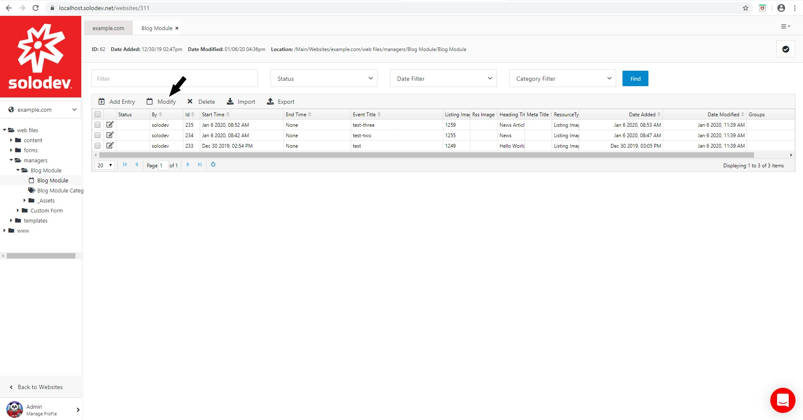

- Click the arrow in the Advanced accordion in the modal window to expand it.

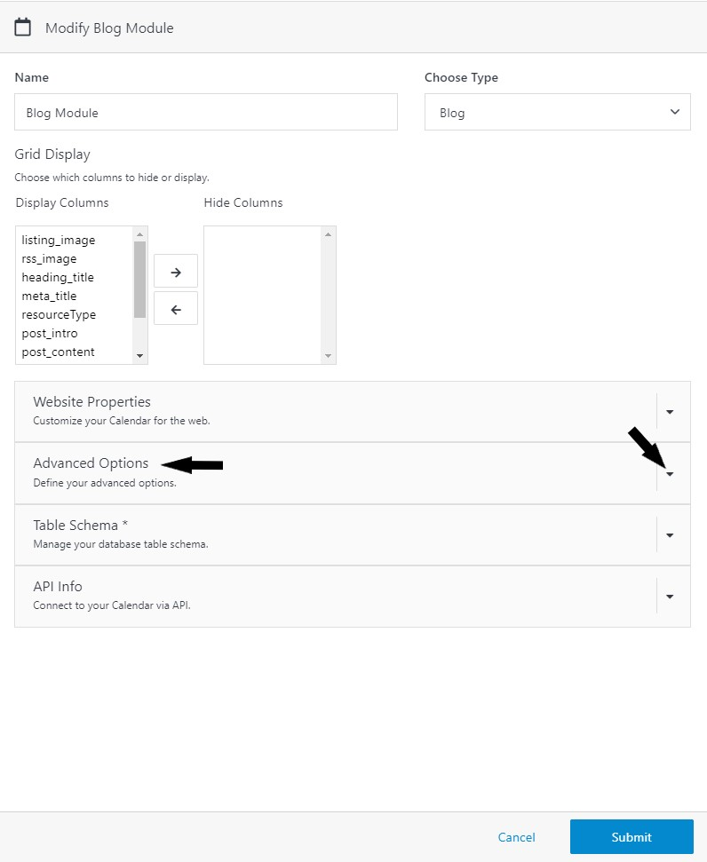

- Scroll down and click the checkbox beside Enable Attachments / Gallery.

- Click Submit. 

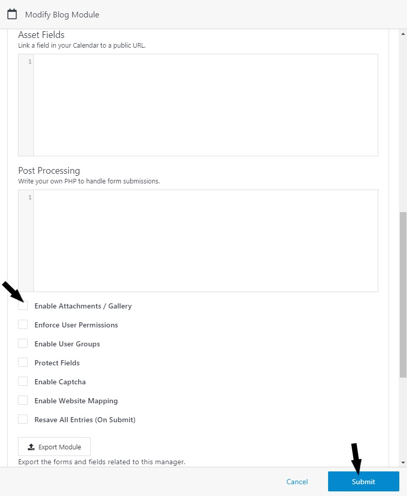

| Attributes | Description |
| ----------- | ----------- |
| `[id]`(required) | ID of the module from which the data pulling. |

***Shortcode:***

`[calendar_entry_attachments_repeat]`

***Code Example:*** 

```html

[calendar_entry_attachments_repeat id={{calendar_entry_id}}]
  <div class="item">
    <a data-gallery="multiimages" data-toggle="lightbox" href="{{{attachment_url}}}">
      
    </a>
  </div>
[/calendar_entry_attachments_repeat]

```

---

**Calendar Entry Categories:** Gathers the categories of a module and prints them onto a single web-page.

***Attributes:***

| Attributes | Description |
| ----------- | ----------- |
| `[id]`(optional) | ID of the module from which the data is coming. |

***Shortcode:***

`[entry_categories_repeat]`

***Code Example:*** 

```html

<div class="services">
  <h3>Services Included</h3>
  [entry_categories_repeat id="{{calendar_entry_id}}"]
    <p>{{{title}}}</p>
  [/entry_categories_repeat]
</div>

```

---

**Full Calendar:** This shortcode creates a representation of the full calendar plugin and retrieves calendar entries using the calendar ID of the module in question 

**Full Calendar Includes:** Returns libraries for a full calendar fullcalendar.io/ This is used on the events modules. This shortcode has no attributes. 

  
***Note:*** 

- [js_full_calendar_includes] and [js_full_calendar] work together. You will need to include both codes in the page in order for it to work.

- Add [js_full_calendar_includes] at the top of the page.

- You need to choose Events as the calendar type.

***Attributes [js_full_calendar]:***

***Attributes:***

| Attributes | Description |
| ----------- | ----------- |
| `[calendar_id]`(required) | ID of the calendar. |


***Shortcode:***

```
[js_full_calendar_includes]
[js_full_calendar]

```

***Code Example:*** 

`[js_full_calendar calendar_id="110"]`

---

**Event Date:** Prints the event end date, typically along with the event’s start date and end time according to [PHP’s date function](https://www.php.net/manual/en/function.date.php). This is used in the events module.

***Attributes:***

| Attributes | Description |
| ----------- | ----------- |
| `[format]`(required) | The date format to be returned. | 
| `[separator]`(optional) | Separates the month, day, and year. | 

***Shortcode:***

`[print_event_end]`

***Code Example:*** 

```html

[entry]
  <h2>{{name}}</h2>
  <div class="media">
    [print_date format="F j, Y g:ia" timestamp="{{start_time}}"] [print_event_end format="F j, Y g:ia"]
  </div>
[/entry]

```

---

**Solodev Form:** Populates the form from a module by a specified datable ID. 

***Attributes:***

| Attributes | Description |
| ----------- | ----------- |
|`[id]`(required) | ID of the datatable where to GET and POST entries. |
| `[title]`(optional) | Name of the folder to display on the frontend. |


***Shortcode:***

`[form]`

***Code Example:*** 

`[form id="40"]`

---

**Landing Page Form:** place a form in blog entries and landing pages.

***Attributes:***

| Attributes | Description |
| ----------- | ----------- |
| `[id]`(required) | id of the form. | 


***Shortcode:***

`[landing_page_form]`

***Code Example:*** 

`[landing_page_form id="40"]`

---

**CAPTCHA:** Generates a CAPTCHA code image with input field to be included on a form to limit computer-generated form entries. This shortcode has no attributes. 

***Shortcode:***

`[captcha]`

***Code Example:*** 

```
[captcha]

<input type="submit" class="btn btn-primary" value="Submit">

```

---

###  Miscellaneous shortcodes

**Google Search with Ads:** Embed Google Custom Search with ads on the website.

***Attributes:***

| Attributes | Description |
| ----------- | ----------- |
| `[google_cse_id]`(required) | Specify Google Custom Search ID. | 


***Shortcode:***

`[google_search]`

***Code Example:*** 

`[google_search google_cse_id="XXXXXXXXXXXXXXXXXX"]`

---

**Google Search No Ads:** Embeds Google Custom Search without ads on the website.


***Attributes:***

| Attributes | Description |
| ----------- | ----------- |
| `[google_cse_id]`(required) | Specify Google Custom Search ID. |
| `[google_api_key]`(required) | Google Custom Search ID. |


***Shortcode:***

`[google_website_search]`


***Code Example:*** 

`[google_website_search google_cse_id="XXXXXXXXXXXXXXXXXX" google_api_key="XXXXXXXXXXXXXXXXXX"]`

---

**YouTube:** Embed YouTube videos to your website. The YouTube video shortcode has two attributes, one required and one optional, listed below.


***Attributes:***

| Attributes | Description |
| ----------- | ----------- |
| `[youtube id]`(required) | Specify YouTube video id. |
| `[youtube aspect_ratio]`(optional) | Specify YouTube video aspect ratio. Default is 16:9. |


***Shortcode:***

`[youtube id="fg_O2cdOQxA"]`

***Code Example:*** 

To obtain the video id: 

- Browse to the YouTube page where your video is hosted.

- Click the Share button on the right just below the vldeo.

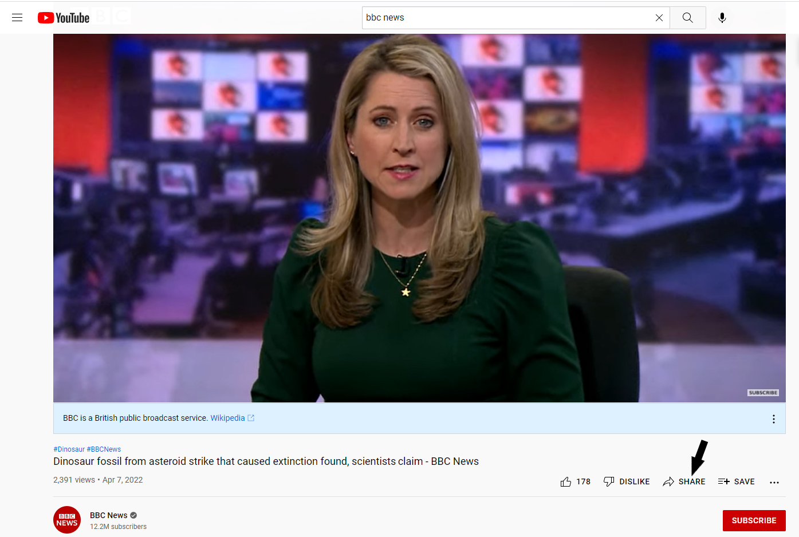

- Select the Embed Link and copy the video's YouTube ID[^1]. 

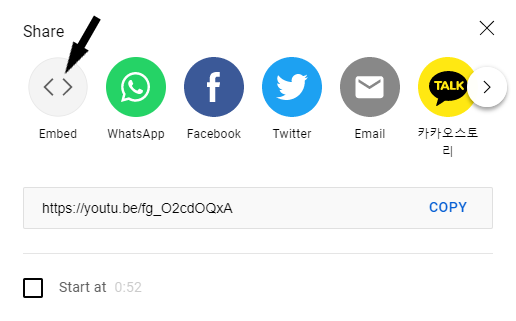

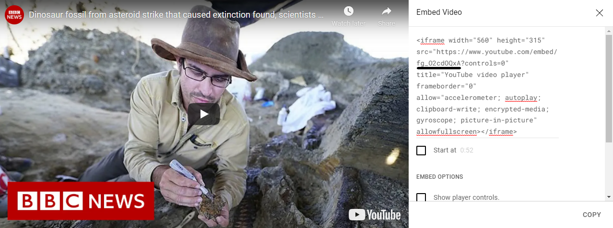

- Insert the shortcode at the appropriate place in the tpl or html file associated with your page. 

- `[youtube id="fg_O2cdOQxA"]`

- Review and click Publish to save your changes.

**Note:** In terms of the best practices, we don't recommend uploading any videos to the CMS due to file size and playback performance. For alternate streaming options such as Wowza, Vimeo, or Wistia, please ==[contact us](help@solodev.com)==.


[^1]: For example, if the link reads https://www.youtube.com/embed/fg_O2cdOQxA?controls=0, you only need to copy the fg_O2cdOQxA after the forward slash.

---

**Conditionals:** Provides functionality to add a conditional statement to the template. Much like standard if/else statements, the `[cond]` shortcodes allows the user to create conditional statements with little coding knowledge.

***Attributes:***

| Attributes | Description |
| ----------- | ----------- |
| `[type]`(required) | is, is_not, greater_than, less_than. |
| `[subject]`(required) | The thing being compared. A subject is typically a variable. For example: `[contype=is_not subject=”start_time” || [value=”end_time”] The event has not started yet…[/cond]`. |
| `[value]`(required) | What to compare it to. |


***Shortcode:***

`[cond]`

***Code Example:*** 

`[cond type=is subject="{{index}}%3" value=0] code goes here… [/cond]`

---

**Sub Conditional:** Operates much like an if/else or else statement. It is the child of the parent conditional statement. 

***Attributes:***

| Attributes | Description |
| ----------- | ----------- |
| `[type]`(required) | is, is_not, greater_than, less_than. | 
| `[subject]`(required) | The thing being compared. A subject is typically a variable. For example: `[contype=is_not subject=”start_time” || [value=”end_time”] The event has not started yet…[/cond]`. |
| `[value]`(required) | What to compare it to. |


***Shortcode:***

`[sub_cond]`

***Code Example:*** 

```html
[cond type=is subject="{{index}}%3" value=0] 
  [sub_cond type=is_not subject="{{index}}" value=0]
    </div>
    <div class="row">
  [/sub_cond] 
[/cond]

```

---

**Is Set:** Verifies that a given variable is set. For example, is_set can be used to verify if a user variable is set, such as active, and execute functions accordingly. 

| Attributes | Description |
| ----------- | ----------- |
|`[value]`(required) | Value of the object set. |

***Shortcode:***

`[is_set]`

***Code Example:*** 

```html

[is_set value="{{image}}"]
   
[/is_set]

```

---

**Is Empty:** Verifies that a given variable is empty. For example, is_empty can be used to verify is a user variable empty and execute functions accordingly. 

***Attributes:***

| Attributes | Description |
| ----------- | ----------- |
| `[value]`(required) | Value of the object set. |


***Shortcode:***

`[is_empty]`

***Code Example:*** 

```html
[is_empty value="{{image}}"]
   
[/is_empty]

```

---

**Value Set:** Verifies that a specified value set. 

***Attributes:***

| Attributes | Description |
| ----------- | ----------- |
| `[override]`(required) | Used if the default being passed as an argument is not set. |
| `[default]`(optional) | Default attributes. | 

***Shortcode:***

`[value_isset]`


***Code Example:*** 

```html

<div landing-section-firstContent">
  <h1 class="landing-h1">[value_isset default="{{name}}" override="{{h1_title}}"]</h1>
</div>

```

---

**Random:** Returns a random number.

***Attributes:***

| Attributes | Description |
| ----------- | ----------- |
| `[min]`(optional) | The lowest value to return(default: 0). | 
| `[max]`(optional) | The highest value to return (default: 50000). |

***Shortcode:***

`[random]`

***Code Example:*** 

`[random min = 3 max = 7] (prints a random number between 3 and 7 that includes 3 and 7).`

--- 

**Month Filter:** Month filter from January to December.


***Attributes:***

| Attributes | Description |
| ----------- | ----------- |
| `[id]`(optional) | Specify an id for CSS styling. | 
| `[class]`(optional) | Specify a class for CSS styling. |
| `[label]`(optional) | Specifies a label for the select box. |


***Shortcode:***

`[month_filter]`

***Code Example:*** 

```html
<div class="row">
  <div class="col-md-4 form-group">
    [month_filter class="month_filter"]
  </div>
</div>

```

---

**Login/Logout:** Creates a link to log in or log out of a given session.

***Attributes:***

| Attributes | Description |
| ----------- | ----------- |
| `[logout_redirect]`(optional) | Where to send the user after they are logged out (default: /). | 
| `[login_page]`(optional) | Page where the user can log in (default: /login.stml). |


***Shortcode:***

`[login_logout_link]`

***Code Example:*** 

```

[login_logout_link logout_redirect="/contact/" login_page="/welcome/"]

```

### Building custom shortcodes

With Solodev CMS, users can utilize shortcodes to build dynamic, feature rich applications with maximum functionality and little coding knowledge. Solodev CMS 9 allows developers to create their own custom shortcodes that can be leveraged to create custom modules inside Solodev. This article teaches developers how to build custom shortcodes in Solodev 9. For example, this document will build a hello world short code. 

 

**Step 1: Create a PHP short code file** 
 

- Open the www folder and create a shortcodes folder. 

- Open the shortcodes folder and create a shortcodes.php file. 

- Select Code under the File Type section of the Add File modal and append the .php extension to the file name. 

- In the shortcodes.php file create a shortcode function called ‘hello’ The name of the function is the name of the shortcode. In the code below, attributes are passed to the function as arguments and the required Solodev function is called.  

```php
<?php
function hello($atts, $content = null){

notify_solodev_shortcode();

}
?>

```

- Create a PHP variable called $hello to store the string value “hello world” and return the contents of the variable: 

```

$hello = "Hello world!";

return $hello;

```

- After creating a function to return the contents of the $hello variable, add this function to create the shortcode: 

`add_shortcode('hello', 'hello');`

- Click Publish.

- The full code block for the hello shortcode is listed below: 

```php

<?php
function hello($atts, $content = null){

notify_solodev_shortcode();

$hello = "Hello world!";

return $hello;

}

add_shortcode('hello', 'hello');

?>

```

**Note:** Every shortcode function should be written in the following format -- passing the variables $atts and $content as arguments and assigning $content to a null value.

```php
function foo_bar($atts, $content = null) {
  notify_solodev_shortcode(); }

```

**Step 2: Mapping the shortcode file to the website**

- To map the shortcode created, open the website and click Settings to bring up the Settings modal. 

- Expand the Advanced accordion. 

- Under the ‘Custom Shortcodes File’ section click Browse.

- Select the shortcodes.php file. 

- Click Submit. 


**Step 3: Adding the shortcode to a .tpl file**

- Expand the web files -> content directory and open the folder that will contain the .tpl file. 

- Create the .tpl file. Select Code under the File Type and append .tpl to the filename. 

- Open the .tpl file and type: `hello`

- Click Publish.


**Step 4: Displaying the contents of the shortcode on the website**

- Open the page that will contain the .tpl file with the shortcode.

- Select the dropzone.

- Click the .tpl file to insert it into the dropzone. 

- Click Publish.

- The contents of the string are displated on the page.

**Note:** When the $content value is set to null, users can set the content within the shortcode using the following format: 

```

[hello]

My content goes here

[/hello]

```

An example of this is reflected in the repeater shortcode:

```html

[repeater id="##" limit="0,2"]
<h2>{{event_title}}</h2>
<p>{{blog_intro}}</p>
<a href="{{path}}">{{event_title}}</a>
[/repeater]

```

**Note:** Note: The $atts variable allows users to set strings and variables when using shortcodes. With the following print_date shortcode,

 ```php
<?php

function print_date($atts, $content = null){
notify_solodev_shortcode();
if(!isset($atts['format']))
    return "format is required";
  if($atts["datestring"])
    $timestamp = strtotime($atts["datestring"]);
  else if($atts["timestamp"])
    $timestamp = $atts["timestamp"];
  else
    $timestamp = time();
  return date($atts["format"], $timestamp);
}
add_shortcode('print_date', 'print_date');
?>

 ```
 
 users can print the date and time by entering the following short code into a .tpl file and adding it to a page: 

 `[print_date format="F j, Y, g:i a"]`

## Uploading documents and images via the WYSIWYG editor

The WYSWYG editor allows users to capture and format HTML data without the requirement of coding knowledge. 

Users commonly encounter the WYSIWYG when editing an HTML file or adding an entry in the prebuilt Solodev modules on the backend. 

In this section, we will document adding images and documents via the WYSIWYG editor. 

**Adding images via the WYSIWYG**

- Open a specific HTML file

- When the file is opened, the user should see the WYSIWYG toolbar below the file action buttons (Draft, Stage, Publish, etc). 

- Use the cursor to select an empty space in the document.

- Click the photo icon in the WYSIWYG toolbar to bring up the image properties modal window. 

- Next to the URL textbox, click Browse Server to bring up a file manager modal window. 

- Next to the Search textbox, click Upload to bring up the Upload Files modal window.

- Click Browse in the Upload Files modal window. 

- Choose the file and click Upload. 

- Click Choose File.

- The user is taken to the Image Properties modal window where they can add Alternative text, set the width, height, border, HSpace Vspace and Alignment. 

- Enter the desired values (if any) and click OK.

- Click Publish. 

**Note:** Solodev does not accept files greater than 50MB in size.

**Uploading document files via the WYSIWYG**

- Open a specific HTML file.

- When the file is opened, the user should see the WYSIWYG toolbar below the file action buttons (Draft, Stage, Publish, etc). 

- Use the cursor to select an empty space in the document or, conversely, highlight the text you want to turn into a link to a document file.

- Click the link icon in the WYSIWYG toolbar to bring up the Link modal window. 

- Beneath the Protocol textbox, click Browse Server to bring up a file manager modal window. 

- Next to the Search textbox, click the Upload button to bring up the Upload Files modal window.

- Click Browse in the Upload Files modal window. 

- Choose the file and click Upload. 

- Click Choose File.

- The user is taken to the Link modal window where they can add a Display Text. 

- Enter the Display Text and click OK.

- The Display Text appears in the document.

- Click Publish. 


**Note:** Solodev does not accept files or images greater than 50MB in size.

---

## Web libraries

With Solodev CMS, users can import any web library or framework that can be included from a script or a CDN. Solodev recommends that users utilize simple web libraries or frameworks (for e.g. jQuery, Bootstrap, or Google Fonts) when creating websites in the CMS system. This article shows the user how to include the jQuery library from a script file and CDN. 

**Including web libraries via script file**

- Open the website. 

- Expand the **www -> _** folder (Create a _ folder if one does not exist).

- Open the **script** folder.

- Click the **Upload** button. 

- Drag the **jquery-3.4.1.min.js** file into the dropbox and click **Upload**.

- Click the tab with the website url to open the website

- Click the **Update Website** button.

- Scroll down to the **Global Header** Insert text area.

- Use script tags and enter the file path as the value of the src attribute to load the **jquery-3.4.1.min.js** file.

```html

<script src="/_/script/jquery-3.4.1.min.js"></script>

```

- Click **Submit**.

**Including web libraries via CDN**

- Open the Website.

- Click the Update Website button.

- Scroll down to the Global Header Insert text area.

- Use script tags and enter the url of the CDN as the value of the src attribute to load the jQuery library.

```html

<script src="https://ajax.googleapis.com/ajax/libs/jquery/3.4.1/jquery.min.js"></script>

```

- Click **Submit**. 


Note: In the example below, an html file (about-us.html) with a simple animation script is created and inserted in the about-us.stml file. The code block is listed below. 

```html

<script src="https://ajax.googleapis.com/ajax/libs/jquery/3.6.0/jquery.min.js"></script>
<script> 
$(document).ready(function(){
  $("button").click(function(){
    $("div").animate({
      left: '250px',
      height: '+=150px',
      width: '+=150px'
    });
  });
});
</script>  
<button>Start Animation</button>

<p> Here is an example of a simple animation using jQuery</p>
<div style="background:#98bf21;height:100px;width:100px;position:absolute;"></div>

```