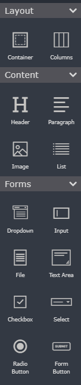

# Forms
*Create forms with Solodev's graphical form interface.* 

--

## What is Solodev Form Builder?

Form Builder serves as the gateway for capturing and sending data from one location to another. Form builder is a dynamic drag-and-drop templating system that simplifies the creation of website forms with little or no code.

 

With this graphical user interface users can create and style custom forms with custom labels and input fields or choose from pre-built forms to quickly collect user data.

### Types of forms in Solodev

Solodev Forms are used for two main purposes: 

 

- Website Forms – these are forms found on the front-end of a website, the most common being a “Contact Us” form that captures site visitors’ data and sends it to its Solodev Module. 

- Module Forms – these are forms found on the back-end of Solodev to add, edit and delete module entries for display on user-facing websites. 

### Accessing Solodev Form Builder

**Prerequisites**

Before accessing Form Builder, developers should:

- Create a website.

- Create a page to host the form.

- Create a redirect on submit page. Examples include a thank you page or confirmation page.

From the Solodev Dashboard, click Forms to access Form Builder. 

## Add a form

Solodev developers can create a new form module that can be edited using Solodev's dynamic drag and drop graphical user interface known as Forms. 

### Prerequisites

Before adding a new form module, developers should: 

- Create a new website.

### Adding a form

- Click Forms from the Solodev dashboard.

- Click Add Form.

- The developer is directed into a visual drag-and-drop editor. 

- Enter a Name for the form module. 

- After setting a name, click Browse to choose the form's location in the Solodev filesystem. 

- Click Save. 

### Creating a pre-built form

In Solodev Forms, graphical elements are organized into three categories: 

- Elements: HTML elements such as headers, containers, columns, images, and paragraphs are located here.

- Templates: Pre-built forms with the appropriate form fields are found here.

- Form/Inputs: All form input fields and form buttons are located here.

Developers can leverage the graphical elements in each category to create stunning web forms to capture customer or lead data. 

 
From the visual drag and drop editor:

- Drag a container onto the blank document template

- Drag a header into the container.

- Edit the header text.

- Drag another container below the header.

- Drag the form template of your choice into the container below the header.

- Enter the Name of the Form.

- Click Browse and choose the appropriate directory for the form.

- Click Save. 

### Building a custom form

Developers can leverage the graphical elements from the Elements and Form/Input categories to build dynamic custom forms. This document will guide the user through building a simple contact form using the graphical elements from these categories. 

## Form Builder Tools

### Introduction

Solodev Form Builder provides developers and content creators with the tools to build, test, and style dynamic forms. This document will provide an overview of the Form Builder dashboard and discuss each property in further detail. 

### Form Builder Dashboard

**Graphical Elements**

In Solodev Form Builder, the graphical elements that provide the HTML in the templating system are located in the left navigation pane and organized into three categories: 

 

- Elements: HTML elements such as headers, containers, columns, images, and paragraphs are located here.

- Templates: Pre-built forms with the appropriate form fields are found here.

- Form/Inputs: All form input fields and form buttons are located here.

Graphical elements from each category, possess element settings that developers can use to customize the HTML to their liking. 

**Elements**

| Properties | Description | Element Settings |
| ----------- | ----------- | ----------- | 
| Container | Bootstrap containers provide the developer with a means to center and horizontally pad their form's contents. | Add links to the container. Choose between fluid and non-fluid options. |
| Columns | HTML elements, form templates, and form inputs must be placed within columns. As a best practice columns should be embedded in containers. | Add links to the columns. Set the number of columns. Add padding. |
| Header | The header element represents a container for introductory content. | Add links to the header. Set heading size. |
| Image | The graphical analog to the `` tag used to embed an image in an HTML page. | Add links to the image. Add an image. Add alt text. Set image shape. Set image width and height. |
| Paragraph | The graphical analog to the `
` tag that defines a paragraph on an HTML page. | No settings. |

**Templates**

| Properties | Description | Element Settings |
| ----------- | ----------- | ----------- | 
| Contact Form | A form template that contains First Name, Last Name, Email address, Phone number, Message fields, and a Submit button.  | Set the Form Tag, Form Name  Form Action, Form Method, and Enctype. | 
| Subscribe Form |  A form template that contains First Name, Last Name, Address, City, State, Zip fields, and a Submit button. | Set the Form Tag, Form Name  Form Action, Form Method, and Enctype. | 

**Forms**

| Properties | Description | Element Settings |
| ----------- | ----------- | ----------- | 
| Input |  The graphical analog to the `<input>` element. | Set the name, input type, label, helper text, placeholder text, ID, prepend icon, append icon. Toggle between required and optional. |
| File | The graphical analog to the `<input type="file">` that defines a file-select field and a "Browse" button for file uploads | N/A | 
| Text Area | The graphical analog to the <text-area> tag that defines a multiline input control. | Set the label, helper text, placeholder text, Name, ID. Toggle between required and optional. Hide/show the label. | 
| Checkbox |  The graphical analog to the `<input type="checkbox">` that defines a checkbox. |  Set the label, Name, and ID. | 
| Select |  The graphical analog to the `<select>` element that defines a drop-down list. | Set the item and values. Arrange the hierarchy of select values. Add select values. Add helper text. Add placeholder text. Set the label. Add a Name. Set the ID. Toggle between required and optional. Hide/show the label. | 
| Radio Button | The graphical analog to the `<input type ="radio">` that defines a radio button -- which lets a user to select only one of a limited number of choices. | Set the label. Add a Name. Set the ID. Set the Value. |
|Form Button | The graphical analog to the button element that defines a clickable button. | Add links. Select a button style, set the button size, set the button text. | 

**Form Views**

Developers can preview their forms from the form builder in different screen sizes. Form views are located in the top navigation pane in Solodev Form Builder. Preview forms in a desktop view, tablet view, mobile landscape view, and mobile portrait view. 

 

**Element Styling**

Developers can style all graphical elements in each category, including form templates, using Element Styling. Element Styling allows the developer to apply CSS styling to each graphical element with little or no code. Below is a description of the CSS properties that can be styled. 

| Properties | Description | 
| ----------- | ----------- |
| Position | Set pixel, em, or % values and colours for margins, borders, and padding for all sides. Developers can apply styling to all sides of margins, borders, and padding with the padlock icon. Developers can also center margins, borders, and padding. |  
| Border Radius | Adjust the radius for each or all corners of the border in pixels, em, or % of the display. |
| Layout | 	Set the values for the display, float, overflow, position, text-align, and clear properties. |
| Size | Set the height and with of an element in pixels, em, or % of the display. |
| Typography | Set the font, font-size, color of the text. Align, bold, italicize, underline and set the line-height of the text. |
| Background | Set the background colour and background image. |

## Drag and drop designer

Solodev's Form Builder leverages a drag-and-drop, hierarchical templating system to allow developers to create stunning front-end and back-end forms with little to no code. This document will outline the best practices for using Solodev Form Builder's drag and drop system. 

### Best practices

Developers should follow the guidelines below when using Form Builder's templating system:

- Embed form and HTML elements in containers and columns. 

- To confirm successful embedding inside a container or column, make sure that the blue line appears at the top of the container or column.

- Structure form and HTML elements from top to bottom in order of importance -- with the most important elements listed at the top of the page. 

## Styling your form

After creating a form, developers can style each item that falls under the Elements, Forms, and Templates categories. Style settings are  found in the Element Styling tab defined below: 

- Element Styling: apply CSS styling to each form element – adjusting the position, border, layout, size, typography, and background of each element.

For a detailed description of the CSS styles available to developers, please refer to the Form Tools article.  

 

### Style form elements 
To style your form elements:

- Select the element in the drag and drop designer. 

- Select the Element Styling tab. 

- Set the position, typography, etc for the element. 

- Click Update.

## Publishing your form

After creating a form, developers can publish forms created in Solodev Forms to their website via shortcodes or using the module directly. This document will outline both steps. 

### Prerequisites

Before publishing a form, developers should: 

- Create a form module and a form.

- Create a submission page and activate the redirect on submit button.

- Capture the ID number of the form module.

### Publishing the form

**Publishing forms with the form module**

- From the Solodev dashboard, click websites.

- Expand the www folder.

- Open the page that is supposed to contain the form.

- Select the dynamic div that will house the form.

- Open the directory that contains the form datatable.

- Click the datatable to place it into the dynamic div.

- Click Publish.

**Publishing forms with shortcodes**

To publish forms with shortcodes, please refer to the following steps: 

- From the Solodev dashboard, click websites.

- Expand the web files folder.

- Open the folder that will contain the form content. 

- Open the HTML or .tpl file or create the HTML or .tpl file that will contain the form content. 

- Enter the shortcode with the ID number of the form module adhering to the syntax below: `['form id = #']` where the # is the form module ID#. 

- Click Publish.

- Expand the www folder.

- Open the page that is supposed to contain the form.

- Select the dynamic div that will house the form.

- Click the HTML or .tpl file that contains the form content to place it into the dynamic div. 

- Click Publish.

