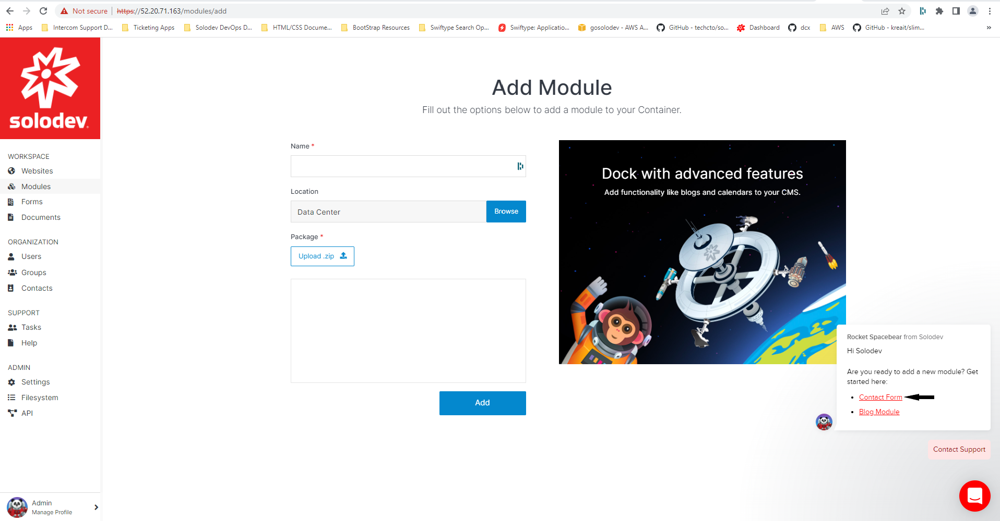
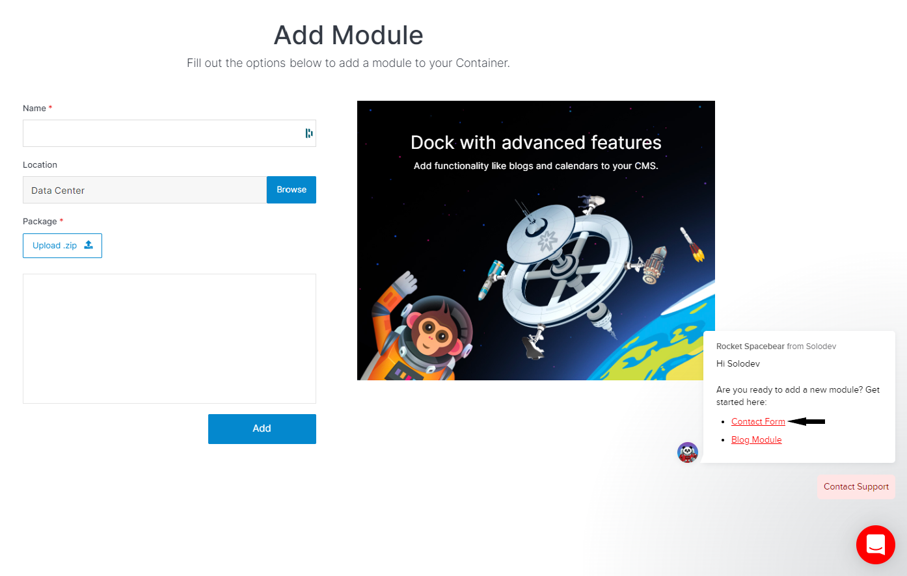
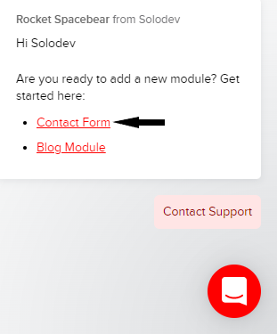
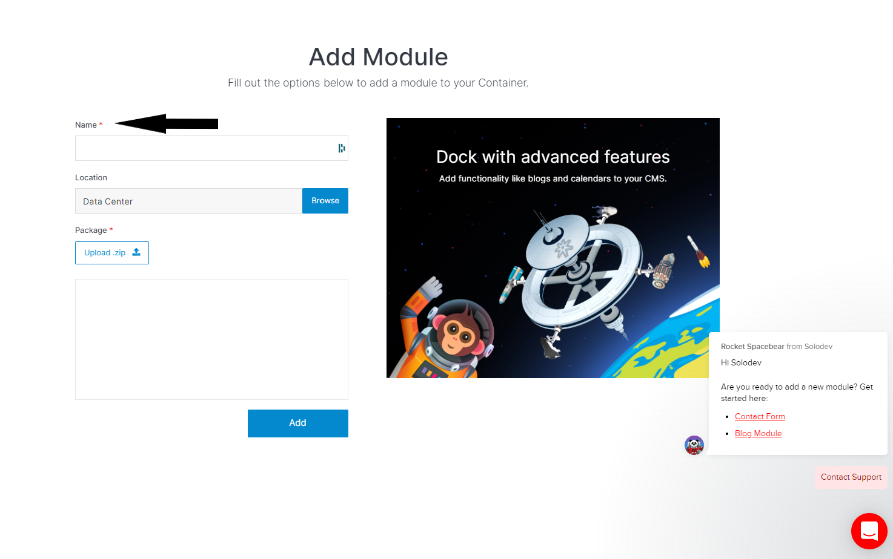
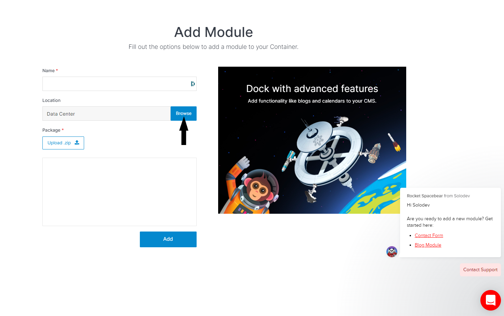
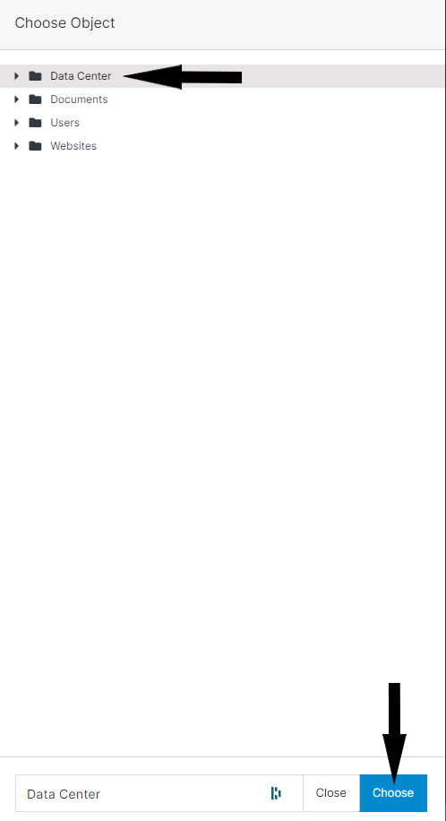
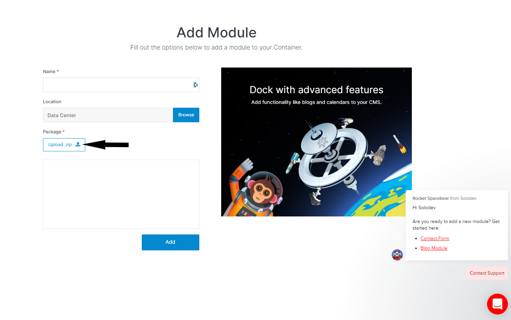
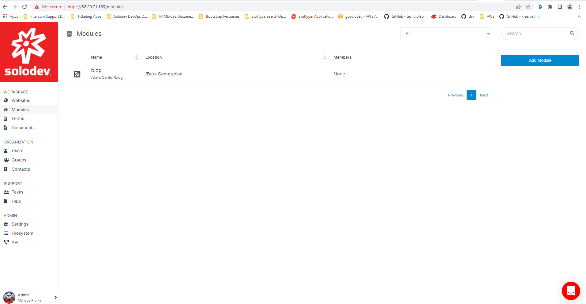

# Modules

Modules designed to make content management easier and streamline content operations. Modules can be added, customized, or built from scratch. 

---


## What are modules? 

What do image galleries, blogs, calendars, forms have in common? They all store data such as images, blog entries, dates, and contact information. In Solodev, modules are leveraged to manage this data. Modules allow the user to manage any type of data. Modules are one of the most powerful objects in Solodev CMS; they can be as simple or complex as necessary. They can be used to power:

- Web Forms

- Contact Lists

- Employee Listings

- News or Blog Feeds

- Events Calendars

- Photo Galleries

- Landing Pages for Marketing Purposes

- And More!

**There are two types of Modules:**

- ***Calendars:*** a type of module that can be modified to create date-based customer facing applications. Use calendars to build an unlimited number of custom web and mobile applications to manage content. 

- ***Datatables:*** are database dependent applications that can be formatted for display in a variety of ways on several devices. 


**With Datatables, users can build:** 

- ***User Interface:*** Build custom user interfaces to interact with your data.

- ***Database Schemas:*** Define fields and Solodev CMS builds tables to store data.

- ***Categorization:*** Create a system of relationships and categorization for your data.

- ***RESTful APIs:*** Utilize a built-in API to expose datatable information to external publishing channels such as websites, mobile apps, intranets and other API enabled technologies.


**Solodev supports the following Calendar Types:**  

- ***Events:*** A calendar that shows events that have a specific start and end date.

- ***Blog:*** The blog is suited for article feeds, news entries, and other sets of data where end dates are optional. 

- ***Photos:*** A photo calendar is great for displaying photos or creating a gallery. 

- ***Landing Page:*** Create landing pages for marketing purposes. 

- ***Custom:*** a custom calendar gives you the ability to tailor a calendar type to your needs – using some or all the of functionality in the aforementioned calendar types. 

:::

---

## Managing modules and their entries

The previous section provided you with an introduction to Modules and the web applications built with them. We will now discuss leveraging modules to manage your content. 

**Step 1: Creating a module**

- Click Modules located in the Workspace section of the Solodev Dashboard.

- Click Add Module.

- You are directed to the add module page.



- Select the preferred module from the intercom help chat to download it to your local machine.





- Enter the Name of the module.



- Click browse. 



- Select the location of the module from the Choose Object modal window and click Choose.



- Click upload .zip. 



- From your local machine, select the previously downloaded module package.

- Click Add. 


- You are redirected to the modules page where your module is listed. 




**Note:** The module folder reflects the name of the module. 

**Step 2: Adding a module entry**

- Click Modules located in the Workspace section of the Solodev Dashboard. 

- Click on the Blog Module to open it. 

- Click the Add Entry button to bring up the Add Entry Blog Module. 

- Enter the Name and choose the Status of the Blog. 

- Under the Image Uploads section, select the Image Type and upload the appropriate the Listing Image.

- Enter the title, introductory paragraph and blog content in the Heading Overwrite, Intro/Subtitle and Body Content fields located in the Post Content Section. 

- Under the META Data section, enter the Meta Title, Meta Description, and Meta Keywords. 

- Under the Advanced section, enter any custom JavaScript

- Enter a Start and End Date for publication. 

- Select the predefined categories or create a custom category for the post.  

- Select the Groups that can access the entry.

- Click Submit. 


**Note:** To save your entry without publishing it to the front end click Draft. To save your changes and make them publicly available on the front end click Publish. 

**Note:** Leaving the End Date blank makes a blog entry permanent. Leaving the End Date blank on an event based calendar entry removes the entry 24 hours after the Start Date. 


**Step 3: Viewing entry details**

- Click Modules located in the workspace section of the Solodev dashboard. 

- Click Blog Module to open it.

- Click the pen and paper icon to open the entry in a new tab.

**Step 4: Exporting module entries**

- Click Modules located in the workspace section of the Solodev dashboard. 

- Click Blog Module to open it.

- Click the checkbox to the left of the Status column to select all entries or the checkbox next to each entry to select specific entries. 

- Click Export.

- A .csv  file with all the entries and their corresponding columns will be downloaded to your machine.


Note: You can export up to 250 module entries at once. Click the select box below all the entries and choose the desired number entries per page before selecting all entries.  


**Step 5: Deleting module entries**

- Click Modules located in the workspace section of the Solodev dashboard. 

- Click Blog Module to open it.

- Click the checkbox to select the desired entry.

- Click Delete to bring up the Delete window for the module.

- Review the warning and click Submit. 


**Step 6: Modifying a module** 

- Click Modules located in the workspace section of the Solodev dashboard. 

- Click Blog Module to open it.

- Click Modify to bring up the module window.

- You can hide columns from the module schema, define advanced options, modify the table schema, or change the name and type of module. 

- After making the desired changes click Submit.


**Step 7: Delete a module**

- Click Modules located in the workspace section of the Solodev dashboard. 

- Click the checkbox to select the Blog Module. 

- Click the Delete to bring up the Delete modal window. 

- Click Submit. 

---

## Publishing module content 

The section titled Managing your content with modules demonstrated how to create and modify blog modules and their entries. We will now discuss publishing your blog modules to a page. 

Solodev recommends using short codes to add Modules to pages. This document will use the blog from the previous example. Before adding the Blog Module to a page, repeater and detail files must be created. 

**Step 1: Creating a repeater template**

The repeater template, although optional, displays all entries with a publish status in the module. The repeater is written in shortcodes and refers to the user interface template that prints fields in the form of PHP variables through an `$item` array.

**Shortcode**

 `[repeater]`

| Attributes (att$) | Description |
| ----------- | ----------- |
| [id] (required) | ID of the module from which the data is pulling. |
| [limit] (required) | 0 starting at the first entry and the second integer specifiying the number of entries to display on the page. |
| [order] (optional) | Specifies how repeater will organize the data such as by "start_time_desc" which will organize entries by the latest start time first. |
| [type] (optional) | Specifies the type of manager that provides the data (default: calendar). |
| {{field_name}} | Insert the names of your HTML fields in side these curly brces to print out the appropriate variable. You can find the field_name on your Table Schema. | 

- Open the desired folder that will contain the repeater file. 

- Click Add File and enter the Name, Title, and Description. 

- Select Code for the File Type.

- Click Submit.

- In the file enter the following code: 

```html
[repeater id="##" limit="0,2"]

<h2>{{event_title}}</h2>

<p>{{blog_intro}}</p>

<a href="{{path}}">{{event_title}}</a>

[/repeater]

```

- Click Publish.

**Step 2: Creating a detail template**

The detail template shows the specifics of an individual entry from a repeater template. An example would be clicking on an individual blog entry from a list of entries to see the entire blog post. The detail page is a subpage of its parent page on the repeater template. 

 

**Shortcode:**

` [entry] `

- Open the desired folder that will contain the detail file. 

- Click Add File and enter the Name, Title, and Description. 

- Select Code for the File Type.

- Click Submit.

- In the file enter the code: 

```html 
[entry]

<h1>{{name}}</h1>

<p>{{blog_content}}</p>

[/entry] 
```
- Click Publish


**Step 3: Create a page to house the repeater template**

- Expand the www folder and open the folder that will contain the repeater page. 

- Click Add Page. 

- In the Add Page modal and enter the Name, Title, and Description for the page. 

- Click Submit.

- Open the page and click the dropzone that will contain the repeater template file. 

- Select the repeater template to insert into the dropzone.

- Click Publish.


**Step 4: Create a page to house the detail template**

- Expand the www folder and open the folder that will contain the detail page. 

- Click Add Page. 

- In the Add Page modal and enter the Name, Title, and Description for the page. 

- Click Submit.

- Open the page and click the dropzone that will contain the detail template file. 

- Select the detail template to insert into the dropzone. 

- Click Publish. 


**Step 5: Linking the repeater page to the detail page**

- Click Modules located in the workspace section of the Solodev dashboard.

- Click the Blog Module to open it.

- Click Modify. 

- In the Modify Blog modal click the arrow located to the right of Website Properties. 

- Click Browse in the Detail Page Template section. 

- Select the .stml page that contains the detail template. 

- Click Choose.

- Click Browse in the Detail Folder Location. 

- Click Choose to select the folder that contains the news detail page. 

- Click Submit. 

**Note:** Solodev recommends creating the detail and repeater templates and pages before adding entries to the blog. If the user had added entries before doing so, the user must open and save each entry for the linking process to take effect. 

---


