# The Basics of a Page

*Learn how to create and structure webpages in Solodev.*

In Solodev CMS, all pages are given an ".stml" extension. STML files are HTML files that contain server side includes (SSI); which is used to generate dynamic content for the page. When you create a page in Solodev, it will automatically have the ".stml" extension but if you're creating a page with a code editor, you need to manually give it an extention of ".stml" before you upload the file on Solodev.


---

## Content Blocks

Pages are comprised of “drop zones” that allow you to insert content blocks into a given area. Traditional content blocks (given an “.html” extension) can easily be edited either inline or through a WYSIWYG editor. `Code blocks (traditionally with a “.tpl” extension) can be edited in the system directly.

***The difference between .html files and .tpl files in Solodev:***

.html files should be used to manage content devoid of complex markup. If a content block just contains text elements, images, links, etc then .html is appropriate.

.tpl should be used if you're creating complex HTML synxtax such as nested divs.

Previously, we talked about the [two main folder structures](https://cms.solodev.net/workspace/websites/#website-file-structure-in-solodev) in Solodev. There are two main folders: **web files** and **www**. Both directories, **web files** and **www** mimic one another with the web files folder displaying folders filled with HTML content and your www folder housing the same folder structure with one difference, instead of HTML content they are composed of web pages. Let's explain this further:

Pages in Solodev have a different structure than regular web pages. Regular web pages are HTML files with an ".html" extension such as index.html, about.html etc. Inside these pages, there's HTML code. Web pages in Solodev have an ".stml" extension and inside they store multiple HTML files as content. 

So what is the main difference between content and pages in Solodev?

- Content is stored in HTML files.

- Pages are public facing web pages composed of multiple HTML files and have an ".stml" extension.

To give an example, let's say you have a block of text with an image that you'd like to put on a page. Under the web files folder, you'd create an HTML file, put the content in it:


Here's how it looks when you click on Source to display the source code:


Then you'd go to the **www** folder and and insert that HTML file in the .stml file:


## Create components based upon sections of your HTML

Before you can build your website you first need to deconstruct your designs into common elements that can then be turned into theme templates. This process involves identifying common areas of the site that will be present across all pages of a website as well as design elements which are unique to specific pages. In identifying these components, you will be able to clearly structure your theme.

 

In Solodev, there are three kinds of templates:

 

Base Template: The base template is the most important template in that it contains the essential resources that will be included in every web page on your website. A base template typically consists of a header and footer, references to asset files, and dynamic divs to place content. Note that any changes you make the base template will reflect your entire website. 

Interior Template: The interior template is typically placed in the base template and serves as the interior of a "Section" of your website. The benefit in a content template is it can be re-used for sections of your website that require multiple pages, allowing you to re-use your content template to build out your web pages.

Sectional Template: A sectional template is a high level overview page with links to different sections of your website. Sectional templates can be used "at will" and there are 1,000s of iterations of what a sectional template should look like. For example, recent blog posts, recent news and testimonials sections on a homepage are sectional templates.

You can find more detailed information about the templates over here: 
Create a Base Template
Create an Interior Template
Create a Sectional Template 

 

Before you begin putting HTML components into templates, you need to identify which components will appear on all pages and which components will be unique to some pages. Components such as header and footer go into the base template since every page needs a header and a footer but some components such as team member sections, product descriptions etc. need to be in a sectional template.

 

Next, we will talk about how to construct each type of templates.

### Create a base template

The base template is the most important template in that it contains the essential resources that will be included in every web page on your website. A base template typically consists of a header and footer, references to asset files, and dynamic divs to place content. Note that any changes you make the base template will reflect your entire website. In this article we will show you how to build a base template and demonstrate its value in a real world situation.

 

Below is a screenshot of a base template in Solodev:

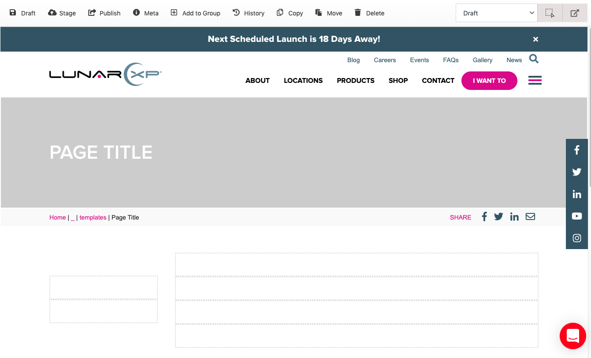

**Note:** Your base template contains your core includes (CSS, JavaScript, Fonts, Images), a header and footer, and dynamic divs (drop zones) in between to insert HTML content.

**Create a Base Template File**

Open the templates folder and on the right side, click on Add File. Name the file "baseTemplate.tpl" and click Submit.

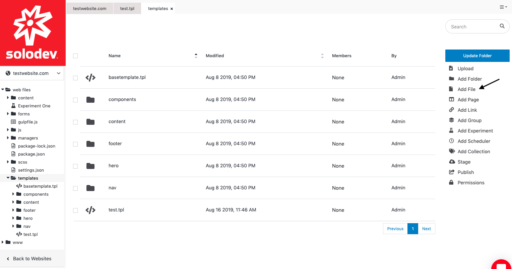

Below is the code of a sample base template. It includes the code for Google Analytics (Google Analytics code need to be on every page), a dynamicDiv class for the top navigation, hero, breadcrumbs, content, footer contact form and footer. 

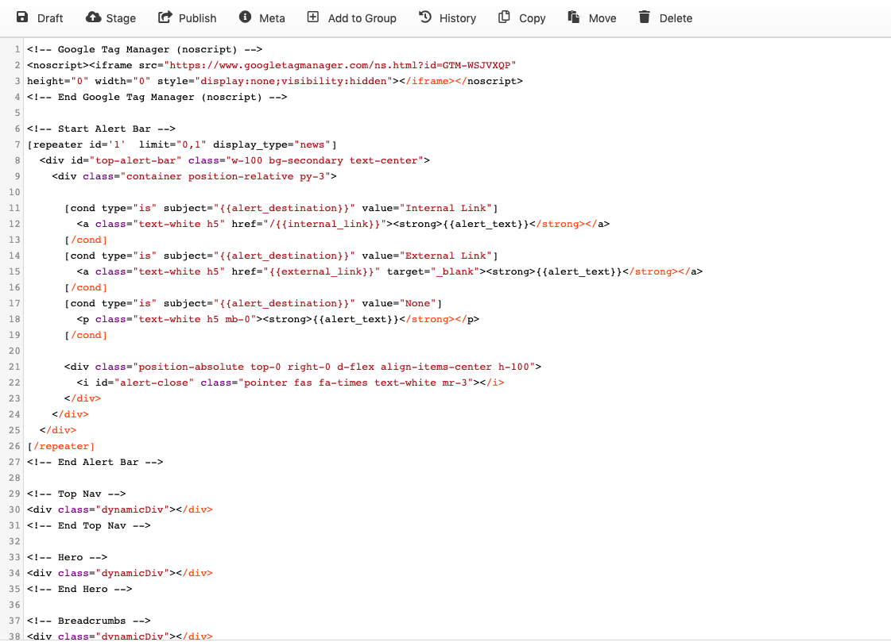

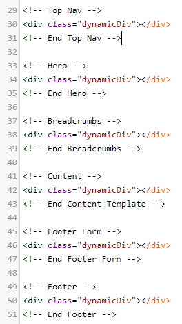

We'll talk in detail about the Dynamic Divs  in the next article. In Solodev, Dynamic Divs make laying out web pages easy and completely customizable while removing the need to duplicate HTML. Dynamic Divs allow you to use HTML markup to create drop zones where you can insert content onto a web page. 

**Create a page using baseTemplate.tpl**

We created a base template and added code in it but in order to get it to display on the website, we actually need to create a page to put the template in. As an example, let's create a homepage. Since the homepage is the first and the default page when the website is opened, we will create an *index.stml* right inside the **www** folder. The homepage shouldn't be inside any subfolders.

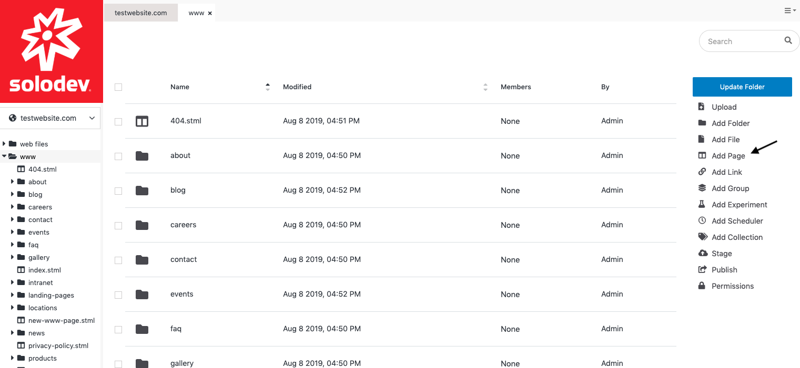 

- Go to the www directory and on the right-side menu, click on **Add Page**.

- Name your page 'index' and set the title as 'Index Page.'

- Click Submit.

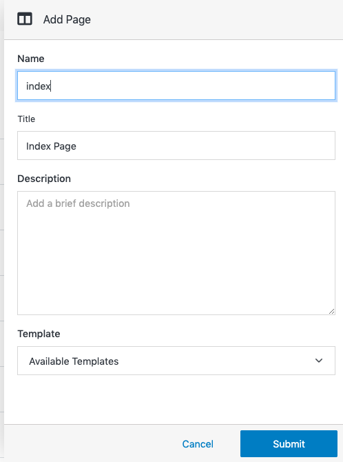

- On the tree, select the index.stml page you created, select the drop zone until it is blue as shown below.

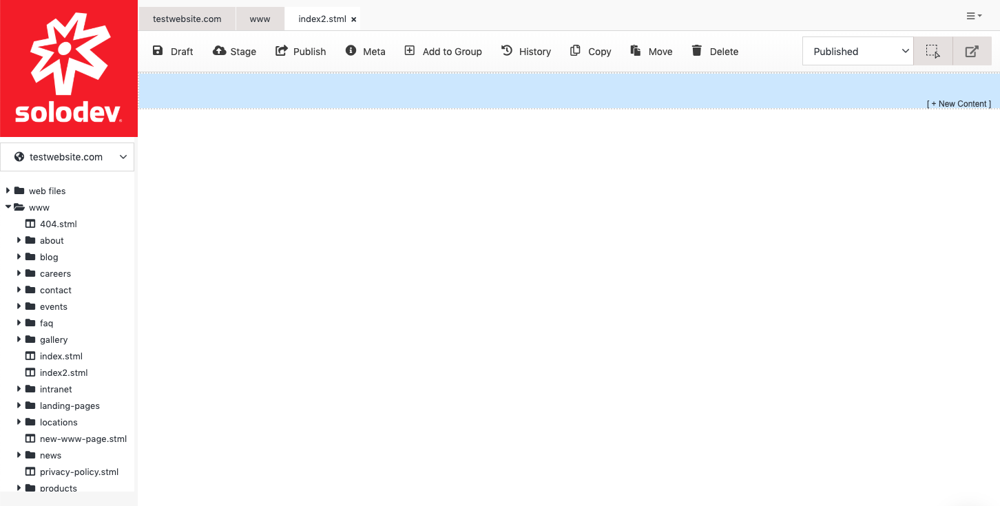

- To insert the baseTemplate.tpl in the new index page, find and click on the baseTemplate.tpl file. 

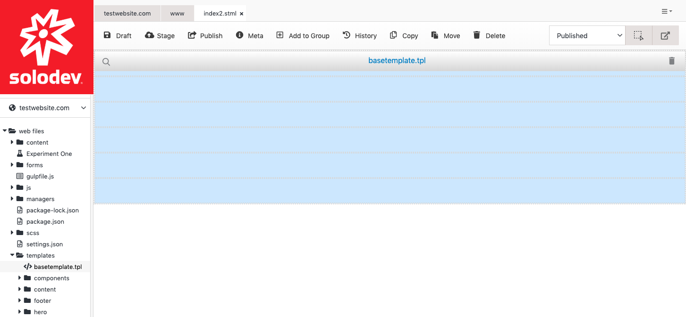

- Click Publish to begin adding content. 

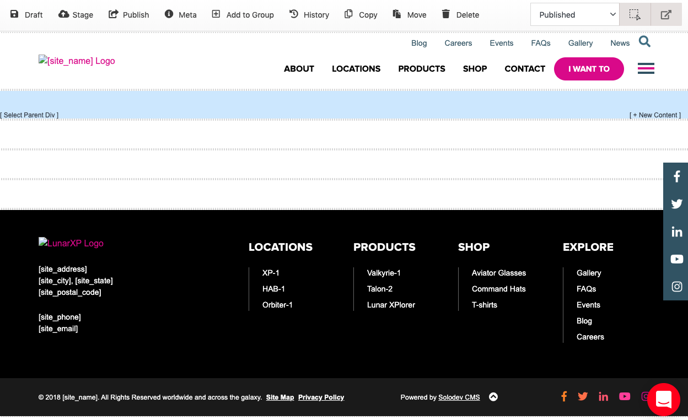

**Note:** The page we just created will be used on every page of the site as a template. Now let's insert some HTML content in the drop zones and publish our first page using our base template.

- Select the first dynamic div and select homeships.tpl from the left tree. 

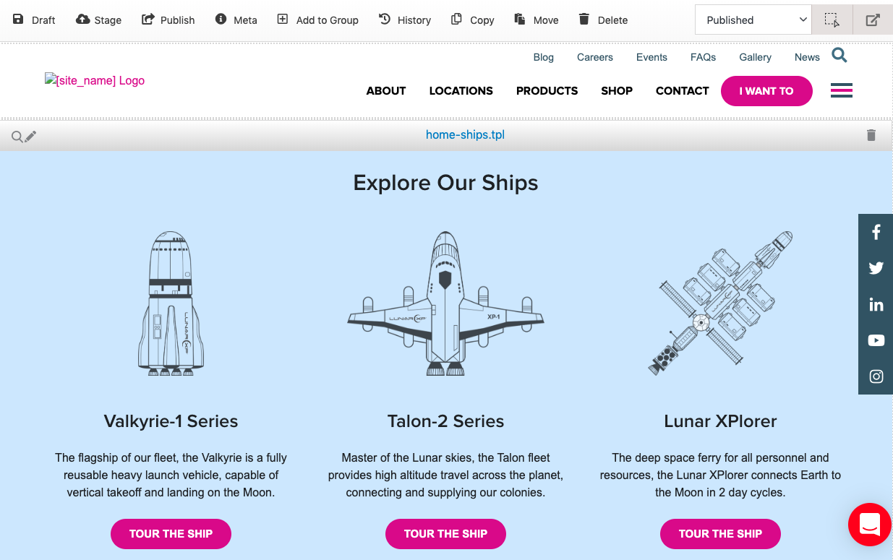

- Click Publish.


### Create an interior template

The interior template is typically placed in the base template and serves as the interior of a "Section" of your website. The benefit in a content template is it can be re-used for sections of your website that require multiple pages, allowing you to re-use your content template to build out your web pages. In this article we will show you how to create a content template that we will re-use to create pages for difference services.

Below is a screenshot of a two-column template in Solodev:


Note: In the screenshot above the base template is still in place and there are other templates added as well such as breadcrumbs. The interior and sectional templates are added inside the base template.

 

The two-column template we have has a left navigation and a content area on the right. It can be used for any page that has multiple links and descriptions.

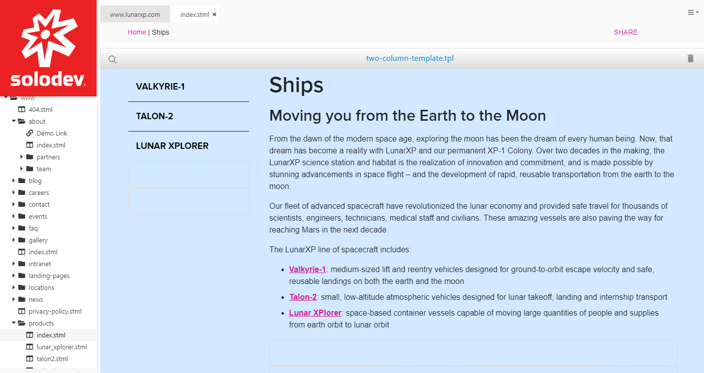 

Here's the code for the two-column template:

```
<section class="container py-5" id="maincontent">
  <div class="row">
    <div class="col-md-8 col-lg-9 order-md-1">
      <div class="dynamicDiv"></div>
      <div class="dynamicDiv"></div>
      <div class="dynamicDiv"></div>
      <div class="dynamicDiv"></div>
    </div>

    <aside class="col-md-4 col-lg-3 order-md-0 mt-3 mt-md-0 pr-4">
      <div class="dynamicDiv"></div>
      <div class="dynamicDiv"></div>
      <div class="dynamicDiv"></div>
    </aside>
  </div>
</section>

```

**Note:** We're using Bootstrap for the website so the template above also contains Bootstrap elements. 

Other interior template examples we have are the one-column template, full-width template and so on. 

**Creating an interior template**

An interior template is created the same way the base template is created. Even though it is not necessary, you can create a folder and organize the different kinds of templates over there. In our example, we created a folder titled content and put the interior templates inside that folder:

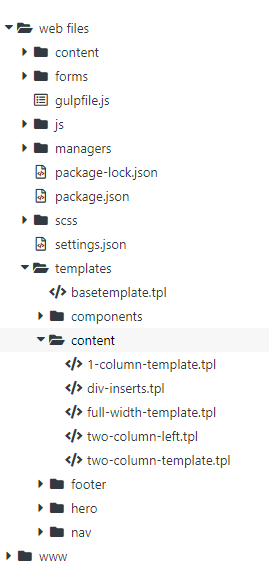


**Step 1: Create folder for the template**

- Go to the web files folder on the tree. Inside the web files folder
- Go to the templates folder. 
- Click *Add a folder* button. 
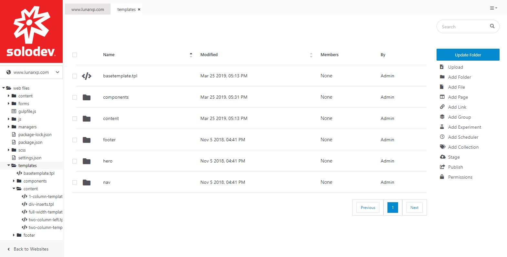
- Give a name to your folder and hit *Submit.*

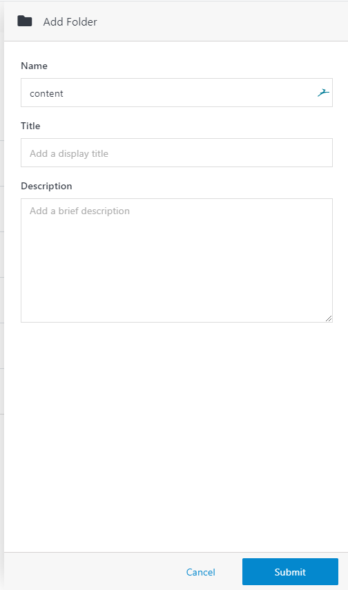

**Step 2: Create the file for the template**

- Go to the folder you created and on the menu to the right, click on ***"Add a file".***

- Name the file (for e.g. two-column-template.tpl)

- Hit the Submit button. 

- Click on the file and add your code. 

- Click Publish. 

**Step 3: Add A Page**

- Go to the **www** directory and on the menu to the right, click on *Add Page.*

 

- Name your page, add a description and click Submit. 


- Select the newly created index.stml page. 

- Select the dropzone until it is blue. 

- To insert the interior template, click on the template file from the left navigation page for it to appear in the dynamic div.

- Click Publish.

### Create a sectional template

A sectional template is a high level overview page with links to different sections of your website. Sectional templates can be used "at will" and there are 1,000s of iterations of what a sectional template should look like. For example, recent blog posts, recent news and testimonials sections on a homepage are sectional templates.

 

Below is a screenshot of a sectional template in Solodev:

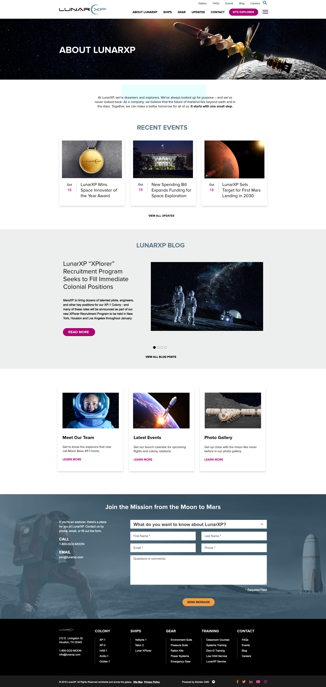

**Note:** As you can see, sectional templates contain a lot of content, most of which direct you to other sections of the website such as the Recent Events, Blog, Photo Gallery sections. Everything on this page lives somewhere else on the website and the sectional template is the page that users will likely use as a starting point to decide where to go next.

**Creating a sectional template**

In order to add a Sectional Template, we first need to add a page then insert the template into the page.

**Step 1: Add a page**

- Go to the www folder. On the menu to the right, click on "Add Page".

 

- Name the page and click Save.

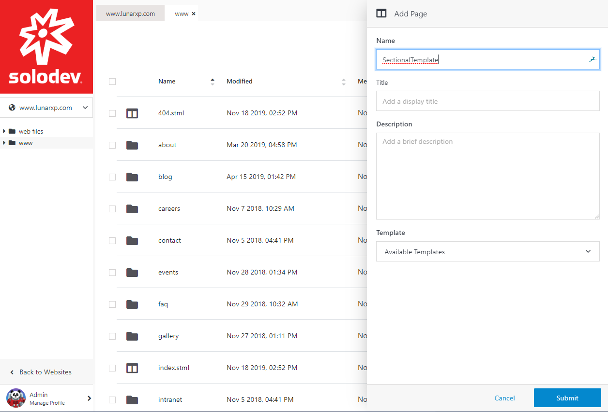

**Step 2: Add the base template to the sectional template page**

- On the newly created sectional template.stml page, select the dropzone until it is blue. 

- Got to the web files folder to find the basetemplate.tpl file. 

- Click on the basetemplate.tpl file to insert it into the sectional template page. 

- Click Publish. 

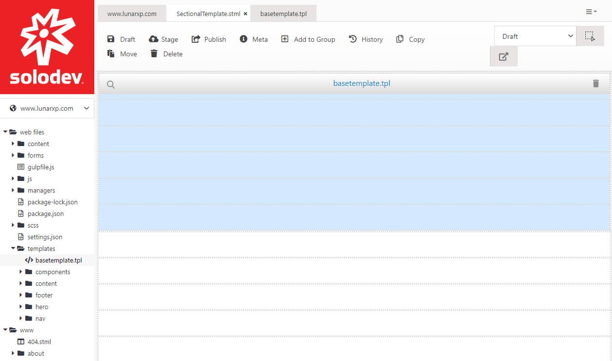

**Step 3: Add the top level templates**

- Since components such as the navigation, hero section etc. will be at the top of the page, begin by adding them first:

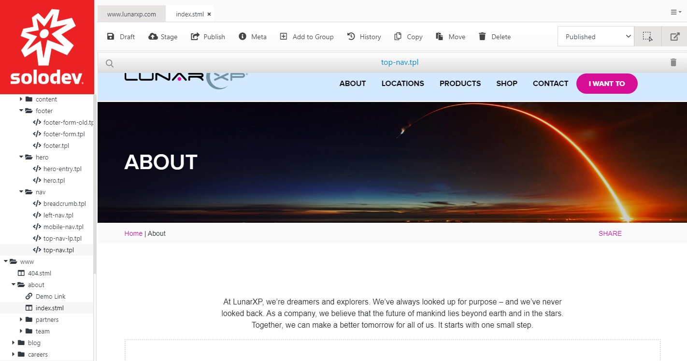

**Step 4: Add the sectional content templates**

In the screenshot above, we have sectional templates such as recent blog posts, recent news and the testimonials section. Let's see how we can select and them to the sectional page. 

Here is the list of the sectional template files we'd like to add by order: 

1. Recent news

2. Blog

3. About boxes (Meet Out Team, Latest Events, Photo Gallery)

- With the sectional stml page open, we go to the web files folder then select the template files and click on the blue zones inside the sectional page to place them inside the page respectively:

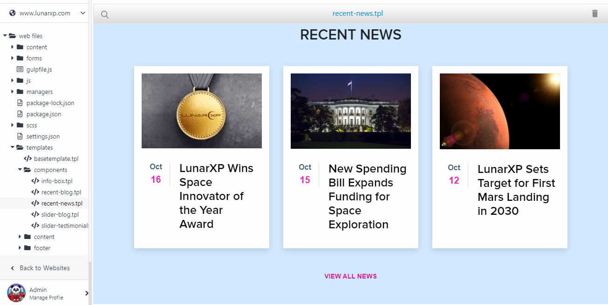

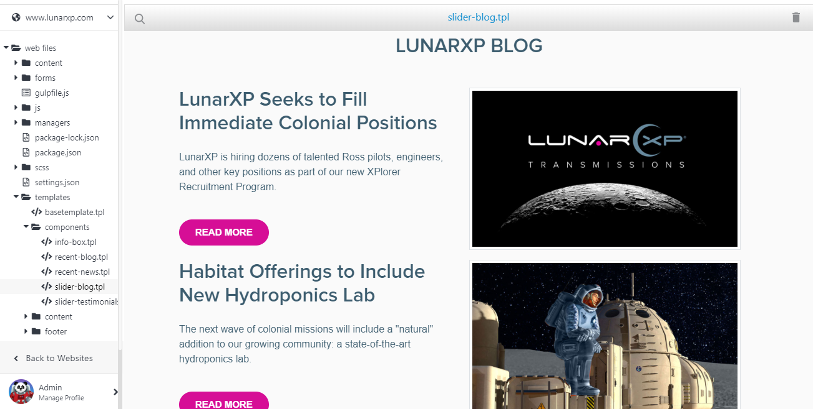

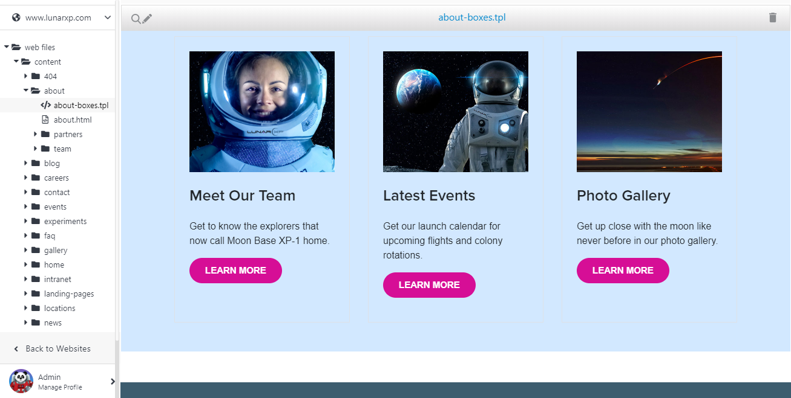

**Step 5: Add the Remaining templates**

- These templates will come after the sectional templates towards the bottom of the page such as a contact form at the end, the footer etc.

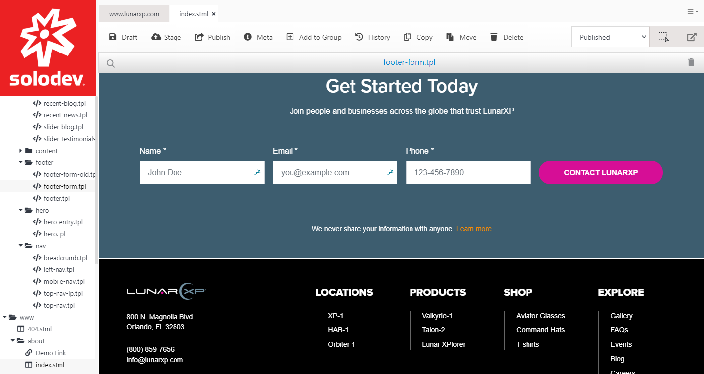


If you followed the instructions your sectional template should appear as below: 


Note: If you would like to insert more templates in a page and can't find enough blue zones to drop them into, you can create more DynamicDivs to increase the number of drop zones. In the next chapter, we'll talk about what DynamicDivs are and how to create them.

### Using DynamicDivs to create custom pages

**What are dynamic divs?**

Dynamic Divs are the connecting elements between your HTML content and STML pages. In Solodev, every component is placed inside a page by using the blue drop zones:

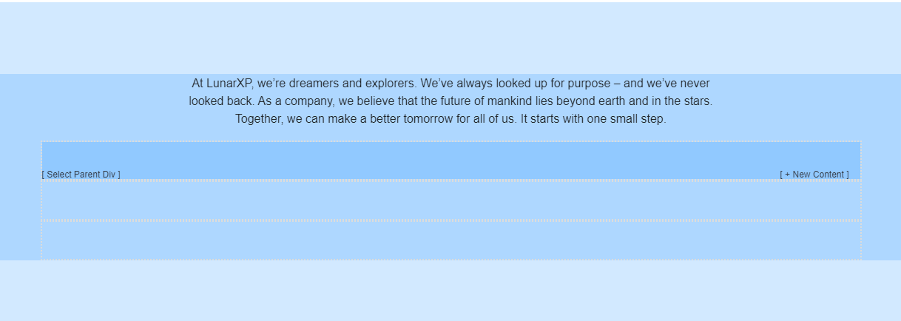

When you select and HTML file or a template file on the file tree, you hover over a blue drop zone and place the file inside the drop zone. All these drop zones are created by DynamicDivs. Dynamic Divs allow you to use HTML markup to create drop zones where you can insert content onto a web page. The Dynamic Div system works extremely well with the Bootstrap grid system as it allows developers to insert Dynamic Divs into the Bootstrap grid allowing you to easily insert content once the layout of the page has been created. Here is the simple HTML code to create a DynamicDiv:

`<div class="dynamicDiv"></div>`

As an example, let's take a look at a section inside a sample basetemplate file:

```

<!-- Top Nav -->
<div class="dynamicDiv"></div>
<!-- End Top Nav -->

<!-- Hero -->
<div class="dynamicDiv"></div>
<!-- End Hero -->

<!-- Breadcrumbs -->
<div class="dynamicDiv"></div>
<!-- End Breadcrumbs -->

<!-- Content -->
<div class="dynamicDiv"></div>
<!-- End Content Template -->

<!-- Footer Form -->
<div class="dynamicDiv"></div>
<!-- End Footer Form -->

<!-- Footer -->
<div class="dynamicDiv"></div>
<!-- End Footer -->

```

For each component area such as the top navigation, the hero section, breadcrumbs, the main content area, and footer there is a div container with a dynamicDiv class. This means that in the code above, since there are 6 dynamicDivs, when you insert the template on the page, there will be 6 empty blue drop zones available for you to insert your top navigation, the hero section, breadcrumbs, the main content area, and footer templates. You can create as many blue drop zones as you want by inserting dynamicDivs inside your templates. 

Each Dynamic Div is marked with dotted lines. Every time you select a Dynamic Div, it will highlight in blue.


You can add unique content to each Dynamic Div container. Adding content to the left navigation and right content block produces a page similar to below:

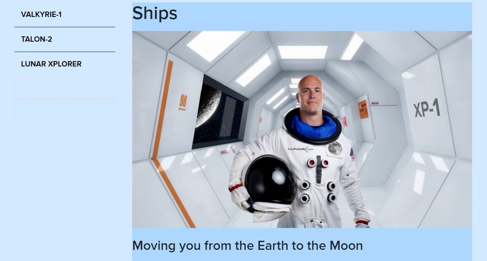

Generally speaking, your STML pages will contain several Dynamic Divs. These drop-zones allow you to easily drop HTML content into the page itself.

