# Websites

*From connecting your domain to mastering the file structure -- become a whiz with websites.*

Solodev is a multi-site platform. You can run as many websites and apps in one place with a single login and switch between websites easily. Each website is self-contained meaning they have separate sources such as files and folders. When adding websites, each website will be installed from scratch with their own theme resources but they can share resources . There is also no FTP, hidden files, or need to log into the server.

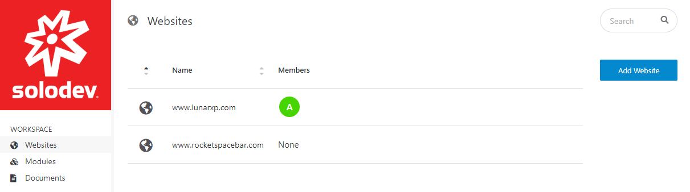

In order to switch between different websites, simply click on "Websites" on the Tree and click on the website you'd like to customize. 

---

## Connecting your domain

Prior to moving forward in Solodev, you must first buy a domain which you will eventually point to your Solodev deployment. Notable domain providers include GoDaddy.com, NameCheap.com, NetworkSolutions.com, or BlueHost.com.

 

Once you have your domain name, connect your domain to Solodev by following the instructions below.

**Step 1: Add your Domain to Solodev**

The first thing you will need to do, is to log into Solodev CMS. Enter your username and password and click Log In.

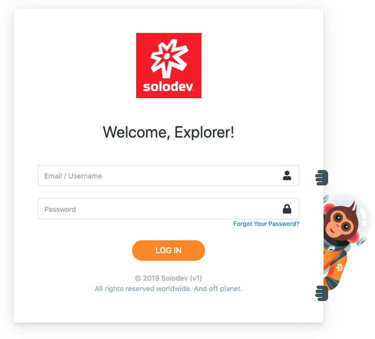

On the left side, click on Websites then click on Add Website button.

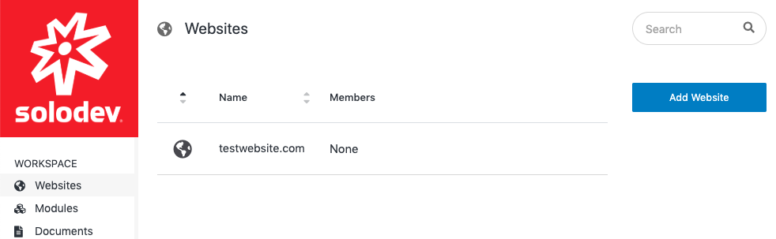

**Step 2: Fill out the Fields**

In Your **Website Address** section, type in your URL, the domain name of your newly added website. Then select your timezone. Once you're done, click **Next**.
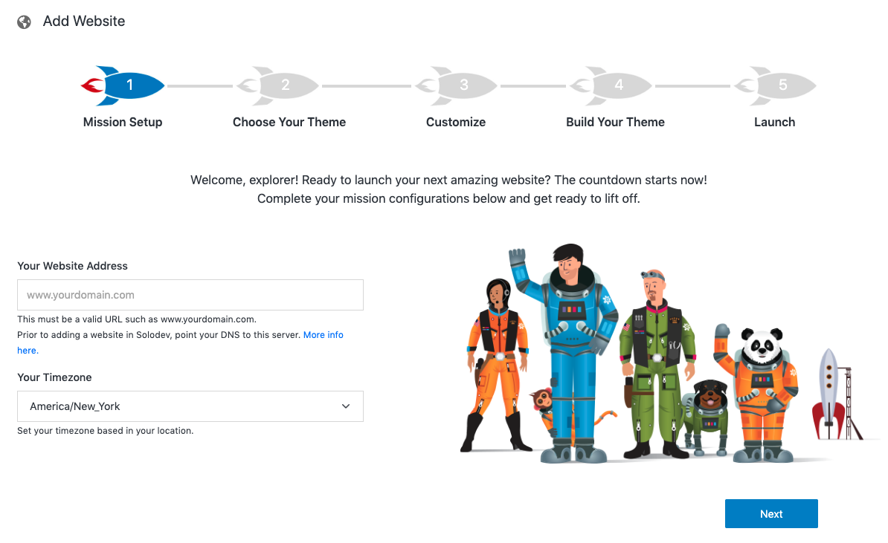

**Step 3: Choose your Theme**

You can choose the **LunarXP Theme** or under **Custom Theme**, you can choose to have a Blank Website or import your own theme from the dropdown menu. You can choose different themes for each different website you have. Once the installation is complete, each website will have their own different files and folders. Once you choose your theme, click **Next**.

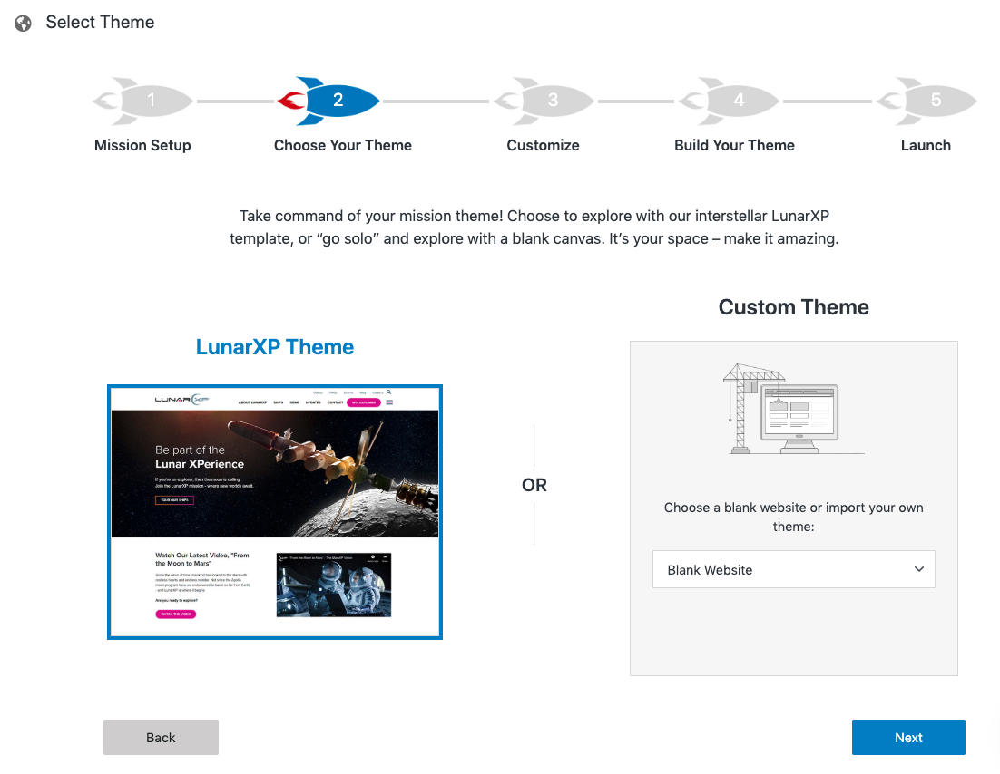

**Step 4: Specify Additional Domain Details**

This step is for customizing your website's color scheme and logo. There are also advanced settings below. Don't worry if you don't have your design and branding ready. You can always customize your site's branding later by going to settings.

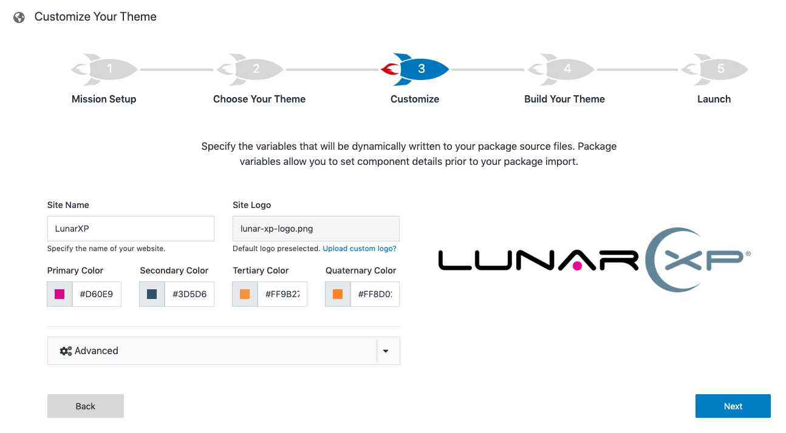

**Step 5: Finish**

Click Next and your website will be added:

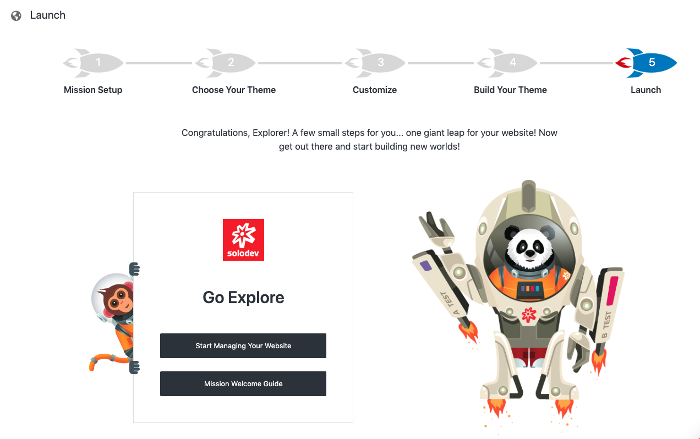

After that, log into your account and you'll see that the website is added to your websites folder:

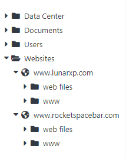

## Installing and configuring a theme

When adding websites, Solodev allows the user to import their own theme or choose from one of many themes in the Solodev Marketplace to customize each website created. Before adding a website, a domain name is required. Notable domain providers include GoDaddy.com, NameCheap.com, NetworkSolutions.com, or BlueHost.com. Once you have you can connect your domain to Solodev by following the instructions to add a website provided below: 

**Step 1: Add a Website**

After logging into Solodev CMS, click Websites on the Tree located in the menu to the left of the screen and click on the Add Website button.

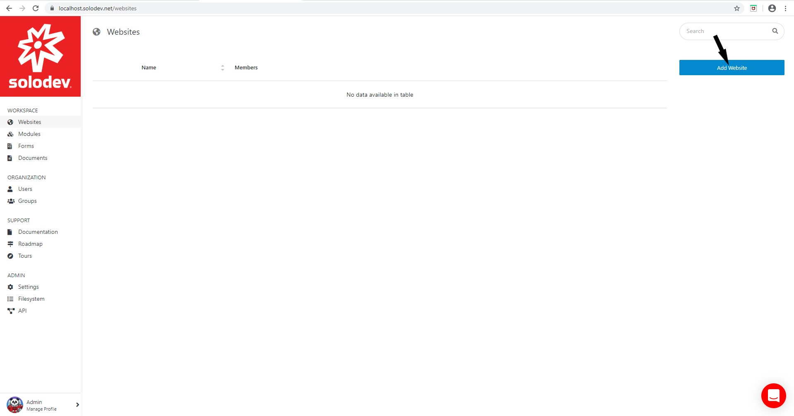

**Step 2: Choose your theme**

Solodev allows the user to choose the SpaceJet Theme. Under Custom Theme, the user can select a Blank Website or import their own theme from the dropdown menu. The user can choose different themes to customize each website created. Once the installation is complete, each website has their own files and folders. Choose the SpaceJet Theme and click Next.

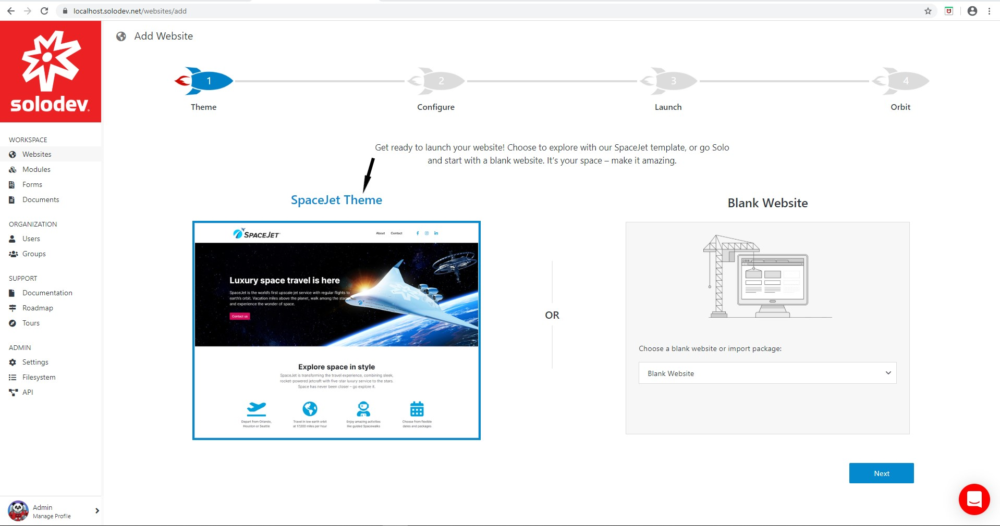

**Step 3: Specify Your Theme Variables**

At this step, the user can customize their website’s color scheme and logo, specify their domain, set their sitename and specify their timezone. The advanced settings allow the user to set the contact information associated with the website’s domain. The site’s branding and logo can be customized after the website has been installed by modifying the settings.json file located in the web files directory. Accept the default settings and click Next.

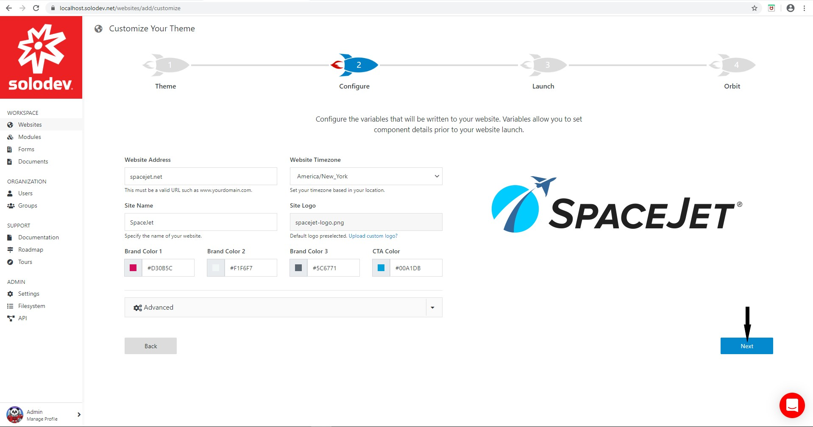

**Step 4: Import the Theme Package**

After customizing the color scheme and logo and populating the domain, sitename and timezone the user will be directed to the following screen:

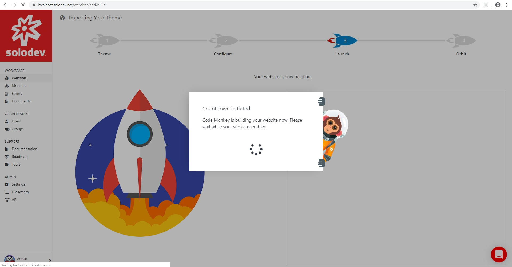

**Step 5: Navigate to your new website** 

Once Solodev CMS has built the website, click on the Start Managing Your Website button. The user will be taken to a screen where they can click the url in the Domain Overview section to view their newly created website. 

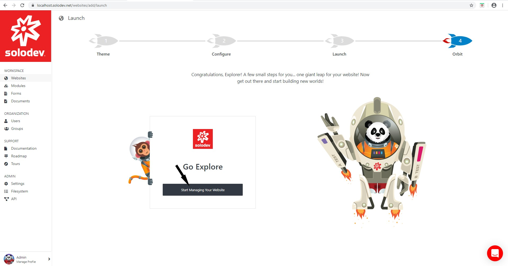

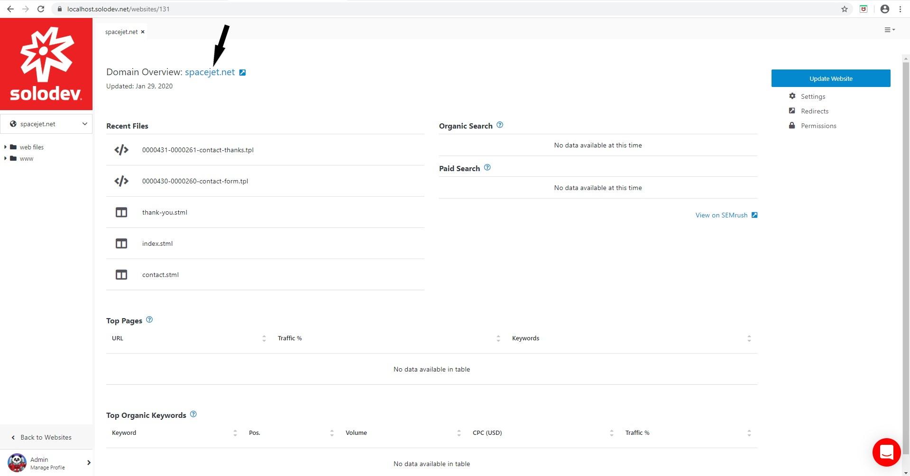

## Customizing your theme

After building a website with the Spacejet theme, users can customize the logos, color-scheme, and content to suit their organization’s design and branding needs. To start customizing the website, login to Solodev CMS and click on Websites in the menu located to the left of the screen. Then click on the newly created website to get started. 

**Step 1: Making CSS changes**

Users can make changes to the color scheme of their website by modifying the **_theme-variables.scss** file. 

 

- To access the file, open the web files folder located in the menu on the left side of the screen. 

- Open the scsss folder.

- Open the _theme-variables.scss file. 

- Modify the theme colors to meet the desired design and branding requirements

- Users can save the changes by clicking Draft, Stage, or Publish.

Users can modify the theme colors to meet their design and branding requirements. 

**Step 2: Customize the content**

Users can customize the website’s content and layout to their liking by modifying the .html and .tpl files located in the content folder. With Template (.tpl) files users can harness the power of nested layouts, using Dynamic Div technology to create additional drop zones for html content blocks that can be embedded into STML pages.

This example modifies the content for the about page. 

- To access the html and tpl files for the about page click the arrow to the left of the web files to open the folder. 

- Then open the content directory. 

- Open the about directory to view the list of files. 

- To modify the text on the about page click the about.html file.

- Users can add HTML content using our WYSWYG editor or using source code. The WYSWYG editor is the default option. 

- To edit or add html content using source code, users can click the source button. 

- Users can save the changes by clicking **Draft**, **Stage**, or **Publish**. 

**Step 3: Customize the layout**

With the web files, content and about folders open, users can change the layout on the about page. To do so:  

- Open the about-boxes.tpl file to bring up the text editor. 

- Users can add and remove html and dynamic divs to their liking.

- To save changes, click Draft, Publish, or Stage.
 
Users can view their changes by opening the .stml file associated with the about page. To do so: 

- Open the www directory.

- Then open the about directory.

- Click on the index.stml file to open the webpage and view the changes.

**Step 4: Adding Pages**

Users can further customize the prebuilt website to their needs by adding pages. A page in Solodev is a collection of HTML content that is inserted using Dynamic Divs or ‘drop zones’ throughout the page. Users can leverage the drop zones to specify where html content is inserted – further customizing the layout of the page. Pages in Solodev have the file extension .STML. Solodev recommends creating .stml pages in the www directory. This example will add a history page to the about folder. 

- Open the www folder.

- Click on the about folder to open a tab displaying the list of files and folders contained within.

- Click Add Page and a form will appear on the right.

- Type in the Name, Title and Description of the page.

- Choose from the available templates. The user can skip this step if they would like to build a custom template for the page and add it later. 

- Click Submit.

- The user is taken to the page to start adding content and the page is listed in the about directory.

Please note that the name functions as the url for the page. Solodev recommends using lower case letters for names and separating spaces with dashes or hyphens. The title is what customers will see in the tabs of their browser. Solodev recommends capitalizing titles of webpages. The description is used for internal purposes. 

**Step 5: Changing the Logo**

After building a website using prebuilt themes, users can change the logo after the fact using the settings.json file. To do so: 

- Upload a photo to the _/images directory located in the www folder.

- Once the upload is completed, open the web files folder.

- Click the settings.json file to open it in the text editor.

- Change the default path under site_logo or site_logo_2.

- To save changes, click **Draft**, **Publish**, or **Stage**.

**Note:** To save the changes without publishing it to the front end click Draft. To save and stage the changes, click Stage. To save the changes and make them publicly available on the front end click Publish. 

## Organizing files and folders for your websites

Solodev has a unique site structure that is designed for easily building efficient, well-organized websites. After your website has been setup in Solodev, your website will be broken into two folders: web files and www:

- The **web files** folder is where all of the individual elements that make up those pages are located. It stores your site templates, content blocks, individual modules, and other components

- The **www** folder is your public website folder; everything in this folder is publicly accessible. This folder is where all of the site's pages are located; the pages users see when they navigate to your website.

While it is entirely up to you how to name your files, a suggested way to do it is to have the **www** folder mirror your website's main navigation and your **web files** folder be made up of folders for content, navigation and templates.

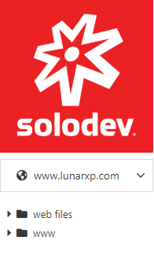

To see the contents of these folders, simply click on the triangle drop-down icon on the left and it will unfold all the contents inside that folder:

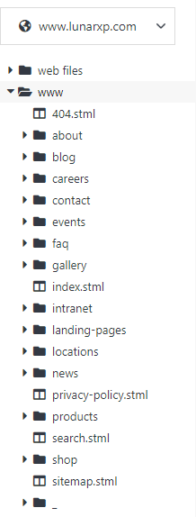

### Web Files Folder

The web files folder is the one that contains the elements that power your Solodev CMS website. It is typically structured in the manner shown below, with commonly used folders storing various website elements such as HTML and image content, datatable forms and managers, as well as navigational and layout templates for your site.

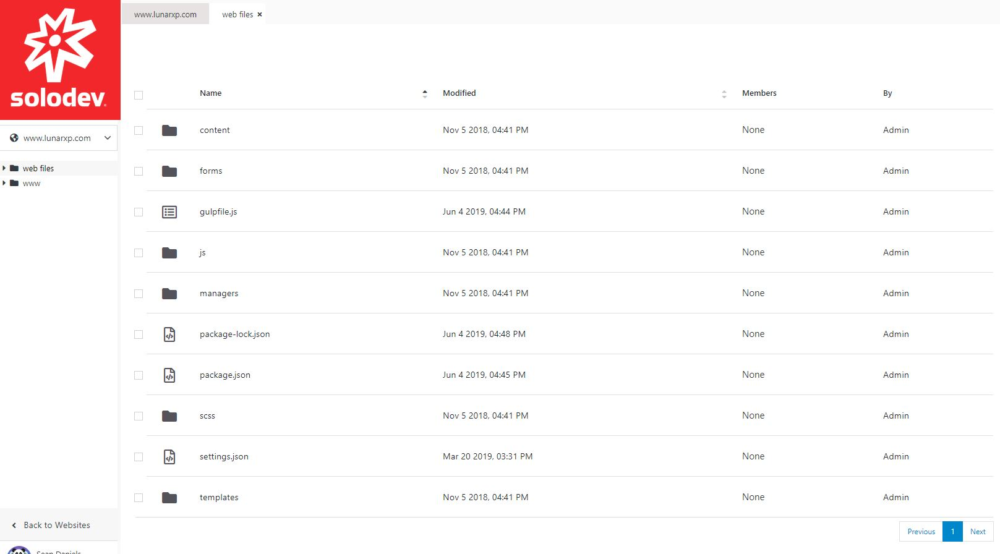

Although not required for your website to work in Solodev CMS, best practices suggest you build out your web files folders in this manner:

- **Content:** Used to store content (HTML files, images, text files, etc.)

- **Forms:** Used to store any datatables that power forms

- **Modules:** Used to store any managers related to your website(s) such as calendars (Events, Blog, News, etc.)

- **Templates:** Used to store the various templates that make up the structural foundation for the pages.

### www Folder

The **www** folder should reflect the site map. It should contain all of the root files of your website -- folders, .stml, assets, etc.

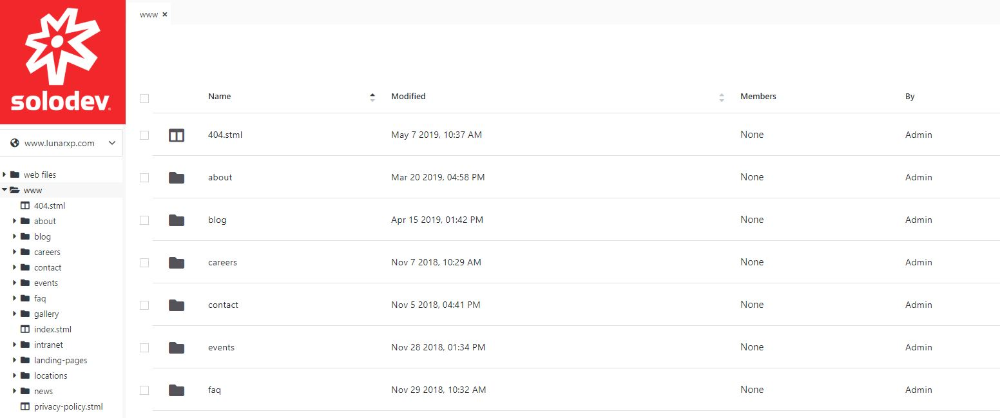

Generally speaking, the most important files in the www folder are your .stml files. These are your individual website files that are publicly visible and which get served up in a browser as a user visits your website.

These .stml files are built with templates that use Dynamic Divs. A template is used to import common elements to a page such as the header and footer. You then use the Dynamic Divs to include unique page content, such as specific text, images, sidebars, etc.

### The Dynamic between the Web Files and www Folders

The web files and www folders mutually reinforce one another and help each other power the content, code, and pages that make up a website. As such, it is important to understand how these two folders are intended to work with one another.

As has been mentioned, the web files folder is generally used to store all of your website's component pieces. Create HTML files, upload images, create forms, create datatable managers, and house your site's template and theme assets.

The www folder includes various .stml files which are your visible web pages and are where all of your disparate components get assembled together and make a complete web page.

Below is the web files folder for the "home" folder:

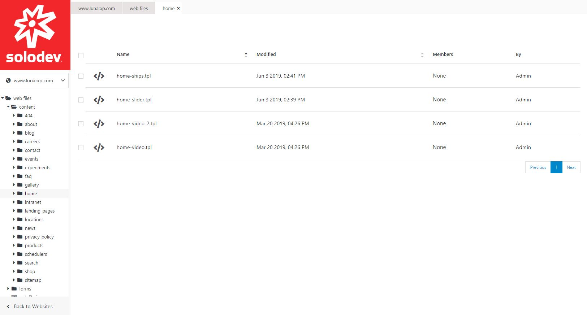

As you can see, the folder contains several different elements including a template file for a news widget, a template file for an image slider, an .html document containing the base content for the page, and an images folder containing all the graphics that go on the page.

Below is the "index.stml" file which is under the WWW folder and corresponds to the homepage of a website.

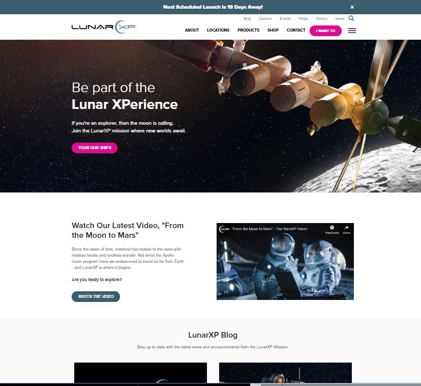

The index.stml page is comprised of the base template (the header and footer) and contains a number of Dynamic Divs. As in the example here, the Dynamic Divs are filled with the various elements from the corresponding "home" folder under the web files folder.

Most pages should follow this basic relationship, where content and page elements are under the web files folder and the WWW file contains .stml files that puts its all together.

