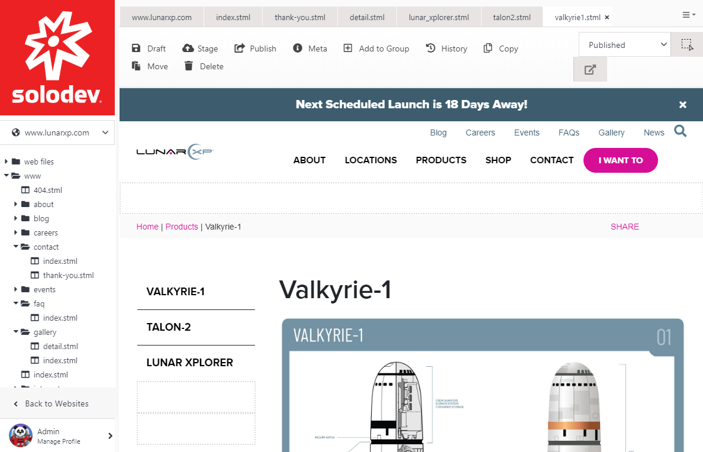
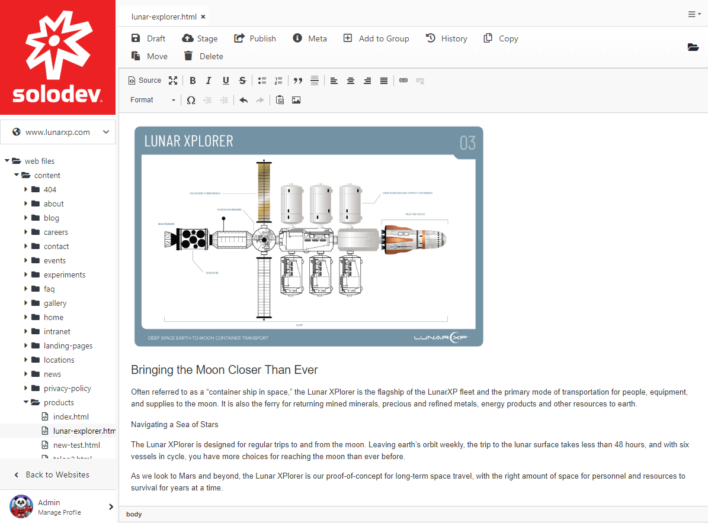
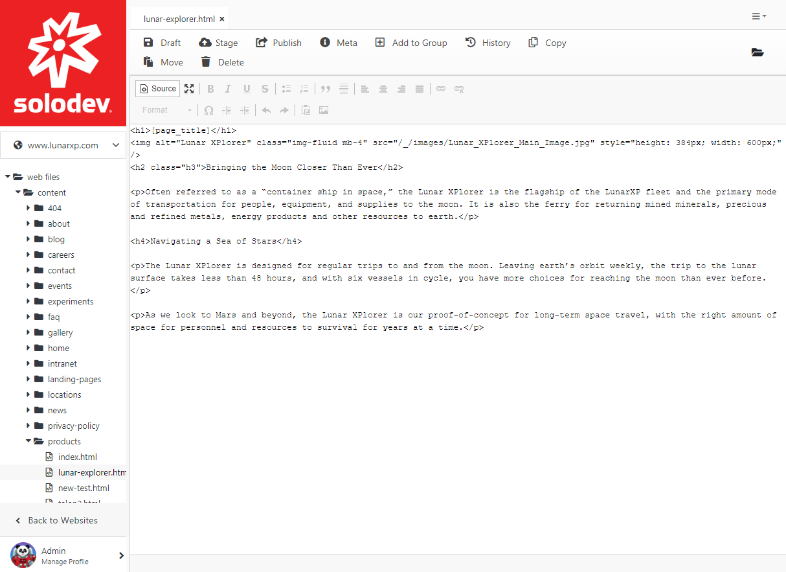
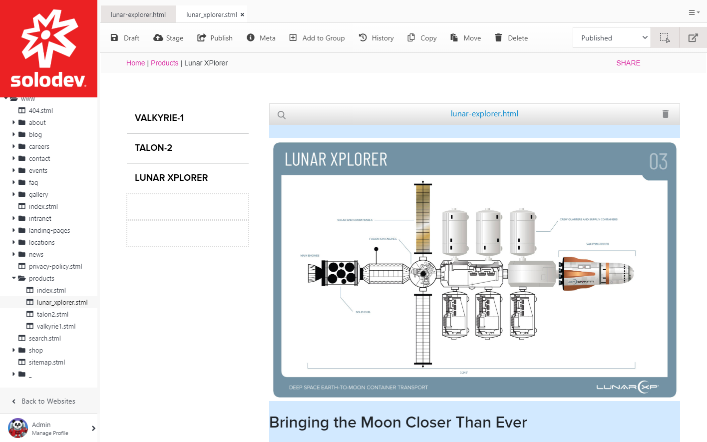

# Websites

## Introduction

Solodev is a multi-site platform. You can run as many websites and apps in one place with a single login and switch between websites easily. Each website is self-contained meaning they have separate sources such as files and folders. When adding websites, each website will be installed from scratch with their own theme resources but they can share resources . There is also no FTP, hidden files, or need to log into the server.

In order to switch between different websites, simply click on "Websites" on the Tree and click on the website you'd like to customize. 

 

Prior to moving forward in Solodev, you must first buy a domain which you will eventually point to your Solodev deployment. Notable domain providers include GoDaddy.com, NameCheap.com, NetworkSolutions.com, or BlueHost.com.

 

Once you have your domain name, connect your domain to Solodev by following the instructions below:

### Step 1 Add your Domain to Solodev

The first thing you will need to do, is to log into Solodev CMS. Enter your username and password and click Log In.

On the left side, click on Websites then click on Add Website button.

### Step 2 Fill out the Fields

In Your **Website Address** section, type in your URL, the domain name of your newly added website. Then select your timezone. Once you're done, click **Next**.

### Step 3 Choose your Theme

You can choose the **LunarXP Theme** or under **Custom Theme**, you can choose to have a Blank Website or import your own theme from the dropdown menu. You can choose different themes for each different website you have. Once the installation is complete, each website will have their own different files and folders. Once you choose your theme, click **Next**.

### Step 4 Specify Additional Domain Details

This step is for customizing your website's color scheme and logo. There are also advanced settings below. Don't worry if you don't have your design and branding ready. You can always customize your site's branding later by going to settings.

### Step 5 Finish

Click Next and your website will be added:

After that, log into your account and you'll see that the website is added to your websites folder:

## Website file structure in Solodev

### Introduction

Solodev has a unique site structure that is designed for easily building efficient, well-organized websites. After your website has been setup in Solodev, your website will be broken into two folders: web files and www:

- The **web files** folder is where all of the individual elements that make up those pages are located. It stores your site templates, content blocks, individual modules, and other components

- The **www** folder is your public website folder; everything in this folder is publicly accessible. This folder is where all of the site's pages are located; the pages users see when they navigate to your website.

While it is entirely up to you how to name your files, a suggested way to do it is to have the **www** folder mirror your website's main navigation and your **web files** folder be made up of folders for content, navigation and templates.

To see the contents of these folders, simply click on the triangle drop-down icon on the left and it will unfold all the contents inside that folder:

### Web Files Folder

The web files folder is the one that contains the elements that power your Solodev CMS website. It is typically structured in the manner shown below, with commonly used folders storing various website elements such as HTML and image content, datatable forms and managers, as well as navigational and layout templates for your site.

Although not required for your website to work in Solodev CMS, best practices suggest you build out your web files folders in this manner:

- Content - Used to store content (HTML files, images, text files, etc.)

- Forms - Used to store any datatables that power forms

- Modules - Used to store any managers related to your website(s) such as calendars (Events, Blog, News, etc.)

- Templates - Used to store the various templates that make up the structural foundation for the pages.

### www Folder

The **www** folder should reflect the site map. It should contain all of the root files of your website -- folders, .stml, assets, etc.

Generally speaking, the most important files in the www folder are your .stml files. These are your individual website files that are publicly visible and which get served up in a browser as a user visits your website.

These .stml files are built with templates that use Dynamic Divs. A template is used to import common elements to a page such as the header and footer. You then use the Dynamic Divs to include unique page content, such as specific text, images, sidebars, etc.

### The Dynamic between the Web Files and www Folders

The web files and www folders mutually reinforce one another and help each other power the content, code, and pages that make up a website. As such, it is important to understand how these two folders are intended to work with one another.

As has been mentioned, the web files folder is generally used to store all of your website's component pieces. Create HTML files, upload images, create forms, create datatable managers, and house your site's template and theme assets.

The www folder includes various .stml files which are your visible web pages and are where all of your disparate components get assembled together and make a complete web page.

Below is the web files folder for the "home" folder:

As you can see, the folder contains several different elements including a template file for a news widget, a template file for an image slider, an .html document containing the base content for the page, and an images folder containing all the graphics that go on the page.

Below is the "index.stml" file which is under the WWW folder and corresponds to the homepage of a website.

The index.stml page is comprised of the base template (the header and footer) and contains a number of Dynamic Divs. As in the example here, the Dynamic Divs are filled with the various elements from the corresponding "home" folder under the web files folder.

Most pages should follow this basic relationship, where content and page elements are under the web files folder and the WWW file contains .stml files that puts its all together.

## The Basics of a Page

### Introduction

In Solodev CMS, all pages are given an ".stml" extension. STML files are HTML files that contain server side includes (SSI); which is used to generate dynamic content for the page. When you create a page in Solodev, it will automatically have the ".stml" extension but if you're creating a page with a code editor, you need to manually give it an extention of ".stml" before you upload the file on Solodev.

### Content Blocks

Pages are comprised of “drop zones” that allow you to insert content blocks into a given area. Traditional content blocks (given an “.html” extension) can easily be edited either inline or through a WYSIWYG editor. `Code blocks (traditionally with a “.tpl” extension) can be edited in the system directly.

***The difference between .html files and .tpl files in Solodev:***

.html files should be used to manage content devoid of complex markup. If a content block just contains text elements, images, links, etc then .html is appropriate.

.tpl should be used if you're creating complex HTML synxtax such as nested divs.

Previously, we talked about the [two main folder structures]() in Solodev. There are two main folders: **web files** and **www**. Both directories, **web files** and **www** mimic one another with the web files folder displaying folders filled with HTML content and your www folder housing the same folder structure with one difference, instead of HTML content they are composed of web pages. Let's explain this further:

Pages in Solodev have a different structure than regular web pages. Regular web pages are HTML files with an ".html" extension such as index.html, about.html etc. Inside these pages, there's HTML code. Web pages in Solodev have an ".stml" extension and inside they store multiple HTML files as content. 

So what is the main difference between content and pages in Solodev?

- Content is stored in HTML files.

- Pages are public facing web pages composed of multiple HTML files and have an ".stml" extension.

To give an example, let's say you have a block of text with an image that you'd like to put on a page. Under the web files folder, you'd create an HTML file, put the content in it:

Here's how it looks when you click on Source to display the source code:

Then you'd go to the **www** folder and and insert that HTML file in the .stml file:

