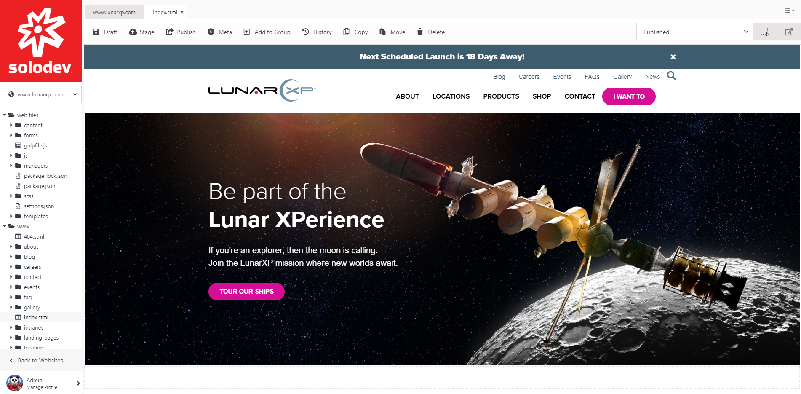
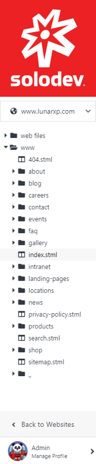
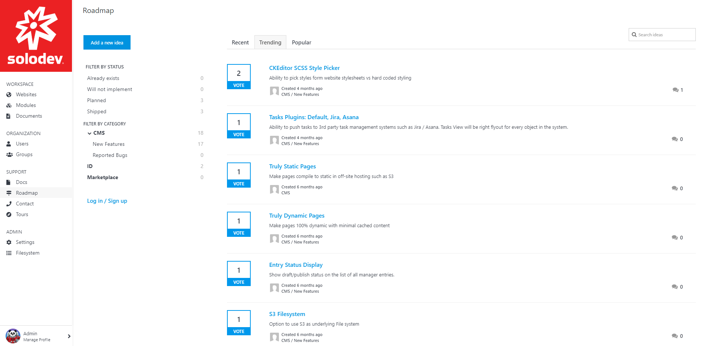
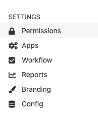

# Workspace

*Learn how to use the Solodev Dashboard*

The Solodev Dashboard was built to serve as your command center for building amazing websites and applications. From one central location, you can access all of the resources you need in your Solodev environment to build and manage content. 

 
The article below will go into further detail about each component of the User Interface and give you a more in-depth understanding of how Solodev works as well as how the Interface was designed to streamline the development and content management processes.

---

## Solodev UI

The Solodev Interface is divided into two columns. The left column contains the Tree and the right column contains the Workspace. This allows you to see and control all of the resources in your Solodev deployment.

### The Tree

The Tree is the main control area where you can access all your website tools and documents to customize your website. 

### Workspace
 

- Websites: Solodev is a multi-site platform where you can run as many websites and apps in one place with a single login. The Websites tab allows you to switch between multiple websites with a single click.

- Modules: Modules in Solodev store data and control how that data is displayed on your website. In other words, whenever you need a slideshow, a photo gallery, calendar, blog or any kind of list, modules will help you create and customize the data.

- Documents: This is a space where you can create folders and all kinds of files. Whether you want to store design files, images, marketing materials, you can do so with Documents.

### Organization

Organization
 

- Users: Users are the people who have access to Solodev and interact with its resources as determined by the permissions they have been assigned by the system administrator. 

- Groups: Users can be bundled together in groups based on criteria specified by the administrator i.e. design, marketing, sales.

### Support

- Docs: This is a direct link to the documentation here on Intercom.

- Roadmap: Here you can add new ideas for the website, develop strategies, share them with other people and vote on other people's ideas.

- Contact: This is a direct link to the Solodev contact form.

- Tours: Includes various tours of the Solodev CMS to help you get familiar with the interface.

### Admin

- Settings (Available to Administrators): The Settings section of the Solodev Interface allows you a wide range of functionality regarding your Solodev environment. You can view your branding, see current activity, add workflows to your site, view permissions, manage your apps, and view your configuration.

         -  Permissions: Displays system permissions for groups and users
         -  Apps: Displays all installed and available apps
         -  Workflow: Add technical workflows and tickets to your organization
         -  Reports: History of activity within your Solodev environment
         -  Branding: Displays your logo and custom CSS
         -  Config: Displays system config settings
- Filesystem: The Filesystem gives you access to all your files. Displays everything inside folders.

### Dashboard

The Solodev Dashboard adds a whole new level of Business Intelligence to Solodev with a stream of real-time site usage data and trends made possible by native Solodev Analytics or integration with Google Analytics. If you have multiple sites, you can toggle from site to site, allowing you to not only quickly glance at the analytics for each one, but to also easily manage them all from one dashboard. The Dashboard also allows users to see any open tasks they may have within the platform. 

When you first login to the site, your dashboard will display your content organized by recent activity. On the right side, there are tours to help you discover areas of the software and a broad search field above to find files and module entries across the entire system.

